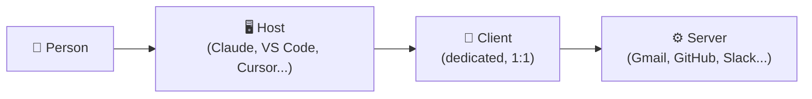
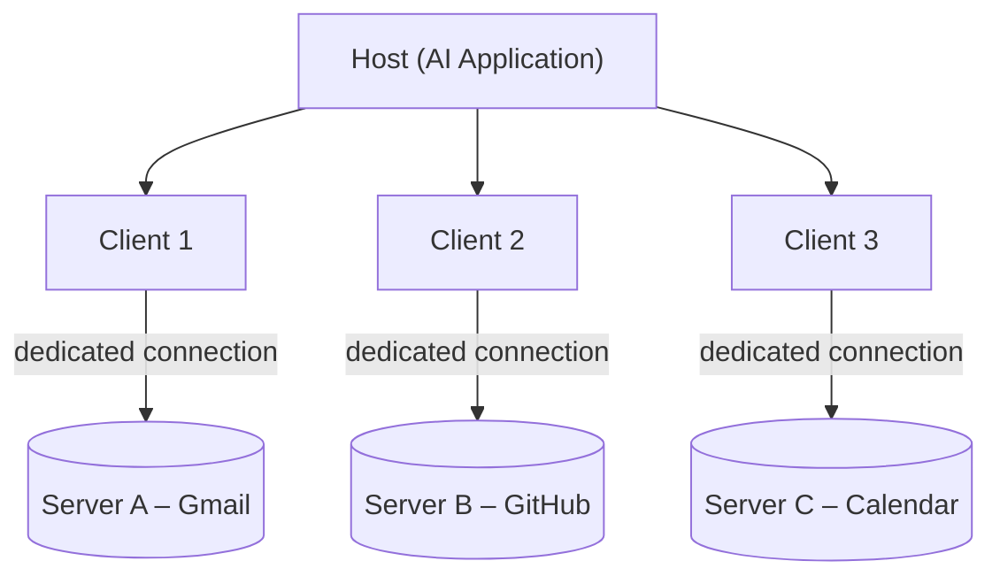
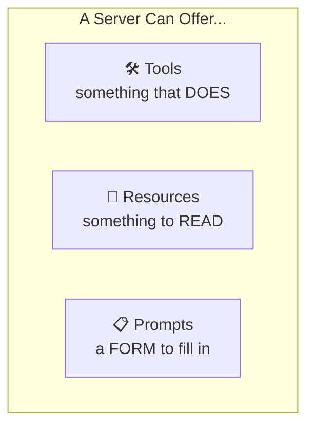
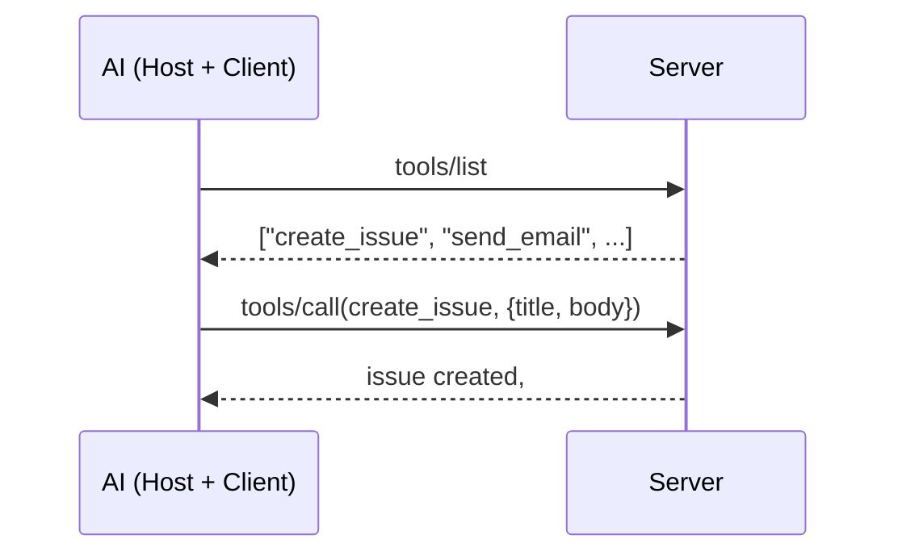
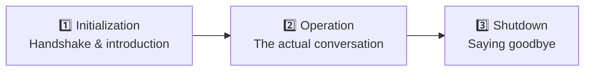
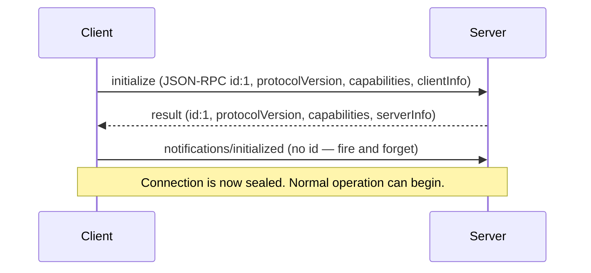
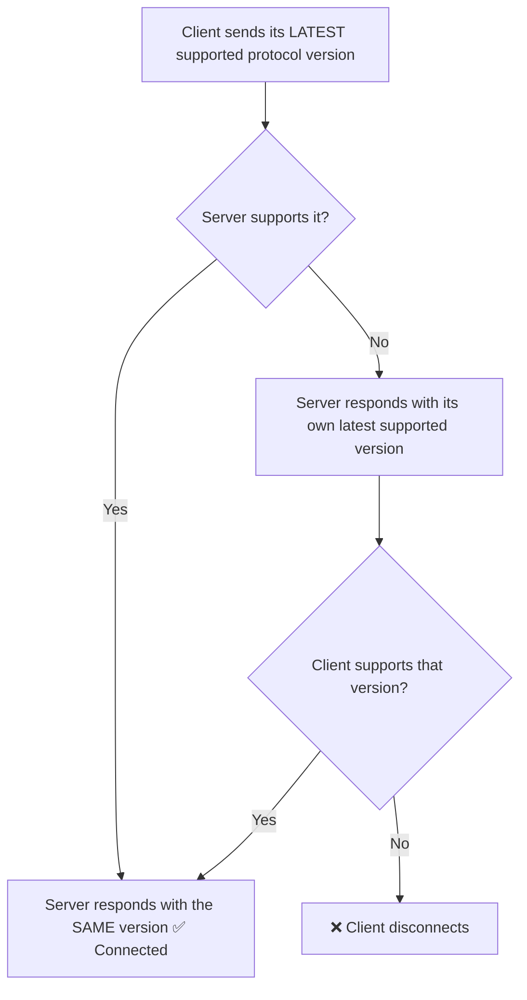
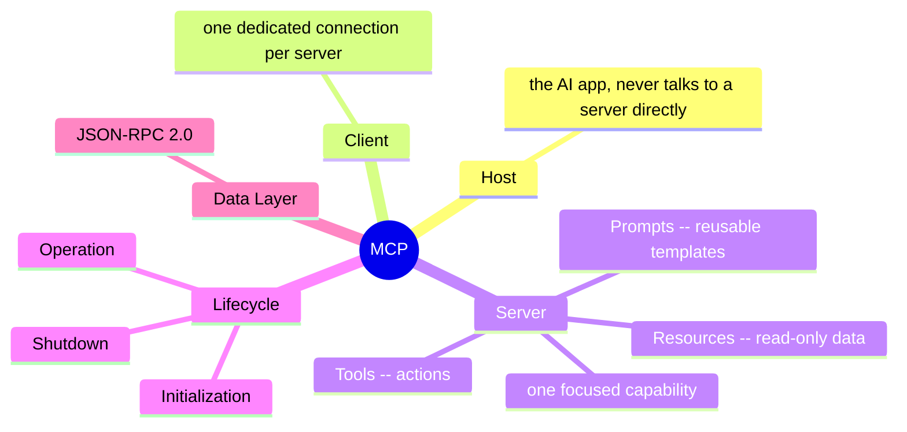

# MCP (Model Context Protocol) — Complete Study Guide
**Date:** :5 SEP 2026
> Built from two sources: a personal notebook on **MCP Architecture & Primitives**, and a full **lecture transcript** (Q&A included) that goes step-by-step through the protocol's internals.
> Goal of this README: be a **self-contained, interview-ready reference** — every concept explained with a real-world analogy first, then the technical definition, then how it actually looks on the wire.

---

## Table of Contents

1. [Why MCP Exists](#1-why-mcp-exists)
2. [The Big Analogy: A Universal Remote](#2-the-big-analogy-a-universal-remote)
3. [The Three Participants: Host, Client, Server](#3-the-three-participants-host-client-server)
4. [Why a Strict 1:1 Client–Server Relationship?](#4-why-a-strict-11-clientserver-relationship)
5. [MCP Primitives: What a Server Can Offer](#5-mcp-primitives-what-a-server-can-offer)
6. [Primitive Functions: How the Client Discovers & Uses Them](#6-primitive-functions-how-the-client-discovers--uses-them)
7. [The MCP Lifecycle](#7-the-mcp-lifecycle)
8. [The Data Layer: JSON-RPC 2.0](#8-the-data-layer-json-rpc-20)
9. [Version & Capability Negotiation](#9-version--capability-negotiation)
10. [Building a Server Yourself (FastMCP)](#10-building-a-server-yourself-fastmcp)
11. [FAQ — Real Questions From the Class](#11-faq--real-questions-from-the-class)
12. [Quick Reference Cheat-Sheet](#12-quick-reference-cheat-sheet)

---

## 1. Why MCP Exists

Before MCP, if you wanted an AI model to actually *do* something — send an email, query a database, create a GitHub issue — you had to hand-write a "tool" for every single API, for every single AI app, separately.

Picture 5 AI applications (Claude, VS Code, ChatGPT, Cursor, a custom chatbot) each needing to talk to 5 services (Gmail, GitHub, Slack, Calendar, Drive). Without a shared standard, that's **5 × 5 = 25 separate integrations** to write, test, and maintain — and the moment one API changes its parameters, you have to fix it in 25 places.

MCP (**M**odel **C**ontext **P**rotocol) turns that into an **N + M** problem instead of **N × M**: each service builds *one* official MCP server, each AI app builds *one* MCP client implementation, and any client can now talk to any server that speaks the same protocol.

> "It went back to the Gmail guys or the GitHub guys, because if they don't build the connector, their application might not get easily integrated with AI going forward."

MCP is a **free, open specification**, not a paid Anthropic product — it's now governed as a shared standard, which is why OpenAI, Google, and others support it too, even though Anthropic created it first.

---

## 2. The Big Analogy: A Universal Remote

Carry this picture through the *entire* guide — nearly every MCP concept maps onto it directly.

> A **universal remote** sitting in a house full of smart gadgets, with a dedicated **adapter** behind each gadget that translates button-presses into whatever signal that specific gadget expects.

| Smart-home piece | MCP equivalent |
|---|---|
| The person holding the remote | **You**, the user |
| The remote itself | **Host** (Claude, VS Code, ChatGPT...) |
| The dedicated adapter behind each gadget | **Client** (one per server) |
| The gadget itself | **Server** (Gmail, GitHub, Slack...) |
| A button that *does* something (turns on a light) | **Tool** |
| The gadget's small always-on status display | **Resource** |
| A manufacturer's built-in "movie night" preset routine | **Prompt** |

You never rewire the gadget yourself — you press a button, and something else handles the rest. That's exactly how a host never talks to a server directly.

---

## 3. The Three Participants: Host, Client, Server



### The Host
The AI application a person actually talks to. It receives your question, decides (using the LLM underneath) whether outside help is needed, and coordinates everything that follows. Examples: Claude Desktop, Cursor, VS Code, Codex, a custom chatbot.

**Key rule:** the host **never** talks to a server directly. It only ever needs to know *how to ask* — never *how any individual server does its job internally*. That's what lets an AI app use a tool it's never seen, built by a team it's never spoken to.

### The Server
A focused program that does one job (or a tight family of jobs) well, and exposes that capability in a shared format. A server doesn't need to be a general-purpose assistant — a *good* server is just reliably good at its one thing (e.g. "send email," "read a repo").

Because a server only has to do one thing well, it's usually best built by whoever owns the underlying service (Google builds the Gmail server, GitHub builds the GitHub server) — built once, usable by every AI application that speaks the protocol.

### The Client
The piece most explanations rush past — but it's the actual reason MCP's architecture looks the way it does.

The host doesn't talk to a server directly. Instead, it spins up a **dedicated client for every server it wants to use**, and that client maintains a **private, one-to-one connection** with exactly one server. A host connected to 5 servers is running 5 separate clients — never one shared pipe to all five.

> Client and server **speak the same language** (JSON-RPC 2.0 — see [Section 8](#8-the-data-layer-json-rpc-20)). The host doesn't need to speak that language at all; it delegates entirely to its clients.

---

## 4. Why a Strict 1:1 Client–Server Relationship?



Four concrete, non-negotiable benefits of "one client per server," instead of one shared connection to everything:

| Benefit | What it means |
|---|---|
| **Decoupling** | Changing how one server works never requires touching how the host talks to any other server. Each connection is fully independent. |
| **Safety** | A crash in one server's connection stays contained. Kill one MCP server and the host shows *that one* connection as broken — the other four keep working fine. |
| **Scalability** | If one server suddenly needs to handle heavier load, that growth is entirely local to that one client–server pair. |
| **Parallelism** | A host with 3 live connections can talk to all 3 servers *at the same time* — e.g. "check my calendar **and** send an email" can run in parallel instead of waiting in a queue. |

Extra rules worth remembering from the Q&A:
- It's always **1 : 1**, never N : 1 or 1 : N. Two Gmail accounts? You need **two servers** (and two clients), not one client juggling two accounts.
- If a server goes down, only *that* client's connection is affected — the host reconnects it independently; nothing else needs to restart.
- There's no hard limit on how many clients a host can run — these are lightweight connections, not heavy resource hogs.

---

## 5. MCP Primitives: What a Server Can Offer

Once a client and server are connected, the protocol defines **exactly three things** a server is allowed to give that client.



Going back to the universal-remote analogy: a gadget can do exactly three kinds of things — something it *does* when you press a button, something you can just *glance at* (a status display), and a *pre-built routine* the manufacturer set up for you (a "movie night" preset).

### 🛠️ Tools — something the AI *does*
An **executable action** with a real side effect — not just information coming back. `send_email`, `create_issue`, `add(a, b)` are all tools. Calling `add` didn't retrieve a pre-existing fact; it ran logic and produced a new result.

> Tools are the *one* primitive where the AI itself is "holding the wheel" — every other primitive is initiated by someone/something else first (the application, or the user).

Real example: a GitHub-connected server exposing `create_issue`. Nobody calls this by hand — the AI decides to, the moment it judges from the conversation that logging a bug is the right next step.

### 📄 Resources — something to *read*
**Read-only reference data**, with no side effects. Where a tool *does* something, a resource simply *is* something, sitting there for anyone connected to read. Normally **static in nature** — it doesn't change often (though it *can* change occasionally).

Good real-world homes for a resource:
- A GitHub repo's `README.md`
- A database server's **schema** file
- A travel-booking server's passport PDF, visa checklist, or country guidelines
- A team's shared style guide (Google Drive)

Why this matters: without one shared resource, every client that needs the same reference data would hard-code its own copy — and over time those copies quietly drift apart until something breaks. One resource, read fresh by everyone, never has that problem.

### 📋 Prompts — a *form* to fill in, not data and not an action
A **reusable, ready-made template** that shapes how a request gets phrased, so the AI produces consistent, complete output instead of improvising from scratch every time.

**Before/after example from the notebook:**

| Without a prompt template | With a prompt template |
|---|---|
| "customer unhappy, refund maybe" | **Issue Summary:** Order #4521 arrived damaged<br>**What Was Tried:** Emailed support once, no reply in 3 days<br>**Customer Sentiment:** Frustrated, considering refund<br>**Recommended Next Action:** Escalate to logistics, offer expedited replacement |

Nothing about the underlying model changed — only the *presence of a form* did. The value of a prompt is **consistency that survives who's asking**: every AI application that uses this prompt produces the same structure, because the structure lives once, on the server, instead of being reinvented (possibly differently) inside every app.

> **Why not just rely on tools + resources?** A tool's description tells the AI *what arguments it takes* — it doesn't tell the AI *the best way* to use it for a given situation. A `send_email` tool is one thing; "send a leave request to your manager" vs. "send a professional client update" are different *use cases* of that same tool. A prompt can encode "ask for leave" / "professional communication" / "customer escalation" as separate, reusable templates — that's a job tools and resources don't do.

---

## 6. Primitive Functions: How the Client Discovers & Uses Them

Every primitive exposes a small, symmetric pair (or trio) of operations. This is what lets a client, the very first time it connects, ask a server: *"what exactly can you do?"*

| Primitive | Discover | Fetch / Act | Watch for changes |
|---|---|---|---|
| **Tools** | `tools/list` | `tools/call` | — |
| **Resources** | `resources/list` (+ `resources/templates/list`) | `resources/read` | `resources/subscribe` |
| **Prompts** | `prompts/list` | `prompts/get` | — |



**How it plays out in practice:** the moment a client connects to a server, it immediately asks for the full menu (`*/list` for tools, resources, and prompts). From then on, whenever the AI decides an action, read, or template is needed, it uses the matching `call` / `read` / `get` operation — it never has to guess blindly what a server supports.

- `list` vs `get` (resources) — `list` tells you *what exists* ("I have a schema file, a README..."); `get`/`read` actually *fetches the content* of one specific item.
- **Templates** (for resources) let one definition answer for a whole *family* of things (e.g. one template covering every customer record) instead of listing each individually.
- **Subscriptions/Listen** let a client get notified the moment a resource *changes*, instead of re-reading it on a timer.

---

## 7. The MCP Lifecycle

Every MCP connection that has ever existed follows exactly these three stages, in exactly this order — just like real life, you can't skip straight to a conversation before anyone's been introduced.



| Stage | Analogy | What actually happens |
|---|---|---|
| **Initialization** | Meeting for the first time, agreeing what language you'll speak | Client and server agree on a protocol version, exchange capabilities, share implementation details |
| **Operation** | The actual conversation | Client discovers and calls tools, reads resources, fetches prompts — any number of times, in any order |
| **Shutdown** | Leaving the room | Either side closes the connection (usually the client, e.g. closing Claude Desktop) |

### Initialization, step by step (the exact handshake)



1. **Client speaks first** — sends exactly 3 things: protocol version it supports, its capabilities, and client info.
2. **Server answers**, matching the same request ID, with its own protocol version + capabilities (does it support tools? resources? prompts?) + server name/info.
3. **Client seals the handshake with a notification** — `notifications/initialized`. No ID, no reply expected. This is only possible because JSON-RPC supports "fire and forget" messages — a plain REST call always expects a response.

Two hard rules from the spec:
- The client must not send anything but a *ping* before the server responds to `initialize`.
- The server must not send anything but a *ping* or *log* before receiving `notifications/initialized`.

> This is exactly why, in Claude's "Connectors" panel, a broken MCP server shows a warning icon **even if you've never used it yet** — the host tried this handshake in the background at startup and it failed (expired auth, dead server, etc.), so it already knows something's wrong before you ever call a tool.

---

## 8. The Data Layer: JSON-RPC 2.0

**Data layer** = the rules and grammar client and server use to exchange information — just like two humans need a shared language (English, Hindi, whatever) *and* its grammar to actually understand each other.

MCP's shared language is **JSON-RPC 2.0**.
- **JSON** — JavaScript Object Notation, the familiar `{ "key": "value" }` format.
- **RPC** — **R**emote **P**rocedure **C**all: lets a program execute a function on another machine *as if it were a local call*, abstracting away the network/transport details. This is what makes it easy to build distributed applications.

> Important trivia: **JSON-RPC is not an MCP invention.** It's a pre-existing, general-purpose lightweight RPC spec used elsewhere in networking. Anthropic simply chose it as MCP's wire format because of the advantages below.

### Message shape

Every message, in either direction, shares this shape:

```json
// Client → Server (request)
{
  "jsonrpc": "2.0",
  "id": 1,
  "method": "initialize",
  "params": { "protocolVersion": "...", "capabilities": {...}, "clientInfo": {...} }
}
```

```json
// Server → Client (response)
{
  "jsonrpc": "2.0",
  "id": 1,
  "result": { "protocolVersion": "...", "capabilities": {...}, "serverInfo": {...} }
}
```

| Field | Meaning |
|---|---|
| `jsonrpc` | Always `"2.0"` — the shared format version. Must match exactly, or it errors out. |
| `id` | Uniquely identifies **which** request a response belongs to — critical because responses can arrive out of order or asynchronously. |
| `method` / `params` | What to do, and with what arguments (requests only) |
| `result` **or** `error` | The outcome (responses only) — never both |

**Notifications** are a special JSON-RPC message with **no `id`** — you fire it and expect nothing back (e.g. `notifications/initialized`). This is impossible in a plain REST call, where a request always implies a response.

### Why JSON-RPC over plain REST/HTTP?

| Reason | Explanation |
|---|---|
| **Lightweight** | Plain, human-readable JSON. No extra headers, no XML/SOAP-style bloat. |
| **Transport-agnostic** | Works the same whether the transport is local (STDIO) or remote (HTTP/SSE). |
| **Two-way by design** | Either side can send a request — not just client→server. A long-running server task can *proactively* tell the client "40% done," rather than the client having to poll repeatedly. Plain REST/HTTP is fundamentally one-way: only the client ever initiates a call. |
| **Notifications built in** | "Fire and expect nothing back" is a first-class message type — no such thing exists cleanly in REST. |
| **Standard error codes** | Just like HTTP has 404/500, JSON-RPC has its own small set of standard error codes, which MCP inherits wholesale. |

> **Bidirectional, clarified:** "two-way" doesn't mean "client calls server, server replies" (that's still one-way / unidirectional — the server never *initiates*). It means the **server can itself open a new request to the client**, unprompted — e.g. to report progress on a long task. That's the genuine difference from HTTP REST.

---

## 9. Version & Capability Negotiation

Happens right inside the `initialize` exchange, before anything else can proceed.

### Version negotiation — one counteroffer, then done



Analogy: like asking a stranger at a conference "do you work in tech?" — if the answer is no, you don't negotiate further, you just move on. Same here: it's **exactly one counteroffer**, not a retry loop. If versions still don't line up, the connection is dropped — that's the *only* fallback.

Another analogy used in class: it's like Windows supporting older software (an app built for Windows 7 still runs on Windows 11) — **backward compatibility is a deliberate design decision made by whoever builds the client or the server**, not something that happens automatically. If you're building a client that must support 2-year-old servers, *you* are responsible for handling every version's quirks — that's a real system-design question interviewers ask.

### Capability negotiation
Beyond just the version number, client and server also declare **what they can actually do**: does the server support prompts? Resources? Subscriptions? Does the client support sampling, elicitation, roots? This is exchanged in the same `initialize` request/response pair described in [Section 7](#7-the-mcp-lifecycle).

---

## 10. Building a Server Yourself (FastMCP)

### Setup

```bash
curl -LsSf https://astral.sh/uv/install.sh | sh        # macOS/Linux
powershell -ExecutionPolicy ByPass -c "irm https://astral.sh/uv/install.ps1 | iex"   # Windows

uv init mcp-warmup && cd mcp-warmup
uv add fastmcp
```

### A complete server — all three primitives, in ~25 lines

```python
from fastmcp import FastMCP

mcp = FastMCP("Warm-Up Server")

@mcp.tool
def greet(name: str) -> str:
    """Greet someone by name."""
    return f"Hello, {name}! Welcome to MCP."

@mcp.resource("file://server-notes")
def server_notes() -> str:
    """Read-only notes about this server, straight from a local file."""
    with open("server-notes.txt") as f:
        return f.read()

@mcp.tool
def add(a: int, b: int) -> int:
    """Add two numbers together."""
    return a + b

@mcp.prompt
def structured_escalation(issue_summary: str, what_was_tried: str, customer_sentiment: str) -> str:
    """Guides the AI to log a customer escalation with every required field, in order."""
    return f"""Log this customer escalation with the following structure:
Issue Summary: {issue_summary}
What Was Already Tried: {what_was_tried}
Customer Sentiment: {customer_sentiment}
Recommended Next Action: [determine this from the details above]
"""

if __name__ == "__main__":
    mcp.run()
```

Run it and inspect it live:

```bash
uv run fastmcp dev server.py
```

This opens **MCP Inspector** at `http://127.0.0.1:6274` — a browser tool that lets you connect to any MCP server and try its capabilities directly, without a full AI application involved. Note that the *description* shown for each tool is exactly the Python docstring — auto-generated, not hand-written.

> **The whole point of this demo:** going from a tools-only server to one offering all three primitives took exactly **two decorators** (`@mcp.resource`, `@mcp.prompt`). Most tutorials stop at tools because tools are the easiest thing to demo — resources and prompts are just as easy to build.

### Frameworks & SDKs
- **Official Anthropic MCP SDK** — the base library.
- **FastMCP** — the most widely used, higher-level wrapper on top of the base SDK.
- Analogy used in class: **FastMCP is to the official MCP SDK what Keras is to TensorFlow** — same underlying engine, much easier ergonomics.

---

## 11. FAQ — Real Questions From the Class

**Q: Why do I need MCP for my own small project?**
You might not, yet. One app, a handful of tools, nobody else reusing them? Plain function calling is genuinely fine. MCP starts paying for itself once more than one app, or more than one team, needs the same tool.

**Q: Is MCP an Anthropic product I have to pay for?**
No — it's a free, open, multi-company-governed specification.

**Q: Couldn't a company just build one great function-calling library instead of a whole protocol?**
That's basically what MCP is — except the key word is *"agreed."* A library only works if everyone adopts that one company's library. A protocol is a shared agreement multiple companies co-govern, which is why OpenAI and Google support MCP even though Anthropic built it first.

**Q: What's the difference between a tool description and a README-style resource?**
A tool description tells the AI what arguments a specific action needs. A resource (like a README) is separate, static reference material the AI can read for broader context. They solve different problems.

**Q: Are resources and prompts mandatory for a server?**
No. Only tools tend to be the "must-have" — resources and prompts are optional extras a server *can* offer.

**Q: How is MCP different from RAG?**
Totally different. RAG is about retrieving relevant chunks of a large knowledge base to ground a model's answer. A resource is simple, small, relatively static reference data (a schema file, a README) — not a retrieval system.

**Q: Can one MCP server call another MCP server?**
Yes — an MCP server is just a server; nothing stops it from acting as a client to another MCP server internally.

**Q: Can I have two clients connect to one server, or one client connect to two servers?**
No to both — it's strictly **1 : 1**. Two Gmail accounts need two separate servers (and two clients), not one client managing two connections.

**Q: Does a host cache the list of tools?**
In the current spec, yes — tool lists are cached rather than re-fetched on every single call.

**Q: If the client disconnects due to version mismatch, what's next?**
You simply can't use that MCP server until the mismatch is fixed via development (supporting the missing version, or upgrading).

**Q: Is JSON-RPC's "two-way" the same as WebSockets?**
Not discussed as equivalent — WebSockets are a constantly-open connection; MCP's bidirectionality is about *either side being able to initiate a request*, independent of the underlying transport being always-on.

---

## 12. Quick Reference Cheat-Sheet

| Concept | One-line definition |
|---|---|
| **Host** | The AI application you talk to (Claude, VS Code, Cursor). Never talks to a server directly. |
| **Client** | A dedicated, 1:1 connection the host spins up for each server. |
| **Server** | A focused program exposing one capability (or a tight family of them). |
| **Tool** | An action with a real effect — `tools/list`, `tools/call` |
| **Resource** | Read-only reference data — `resources/list`, `resources/read` |
| **Prompt** | A reusable request template — `prompts/list`, `prompts/get` |
| **Initialization** | Handshake: agree on protocol version + capabilities |
| **Operation** | The actual back-and-forth: calling tools, reading resources, fetching prompts |
| **Shutdown** | Closing the connection cleanly |
| **JSON-RPC 2.0** | The shared "language" client and server speak — lightweight, transport-agnostic, two-way, has built-in notifications |
| **Notification** | A JSON-RPC message with no `id` — fire and forget |
| **Version negotiation** | Client sends its latest version; server matches or counters once; mismatch → disconnect |



---

### Sources
- Personal course notebook: *"MCP Architecture: Who Talks, and What They Can Offer"* + *"MCP Primitives"* notebook (FastMCP code, diagrams, definitions).
- Full lecture transcript (live class recording) covering architecture recap, primitives, the complete lifecycle, JSON-RPC deep dive, and version/capability negotiation, plus live student Q&A.
