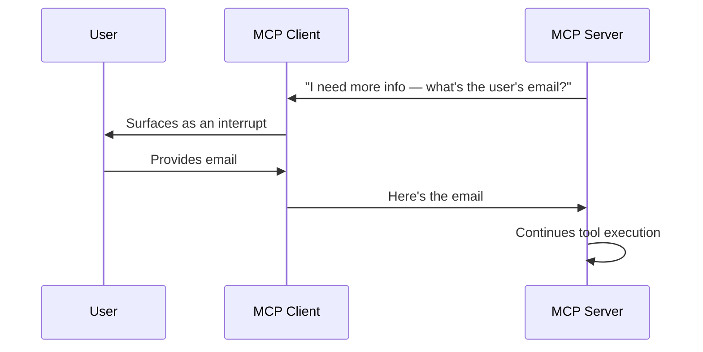
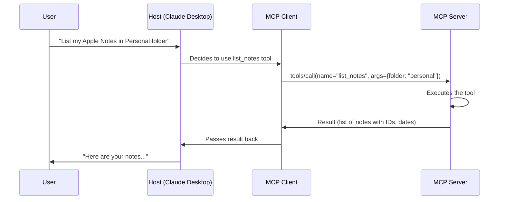
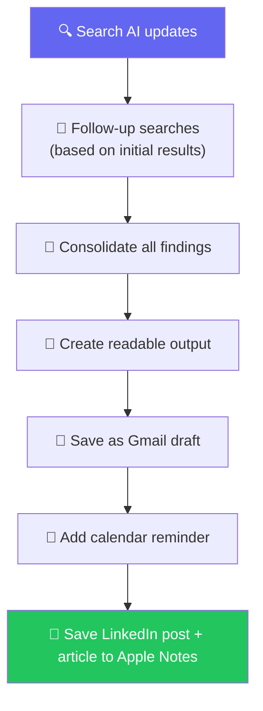

# 🧠 MCP Deep Dive — Operation Phase, Capability Negotiation & Real-World Project

**Author:** Pragati  
**Course:** Agentic AI Specialization  
**Date:** 6 September 2026

---

## 📋 Table of Contents
1. [Quick Recap — Where We Left Off](#-quick-recap--where-we-left-off)
2. [Capability Negotiation — The Honest Menu](#-capability-negotiation--the-honest-menu)
3. [Elicitation — When the Server Asks the User](#-elicitation--when-the-server-asks-the-user)
4. [The Operation Phase — Discovery & Calling](#-the-operation-phase--discovery--calling)
5. [Live Demo — Apple Notes via Claude Desktop](#-live-demo--apple-notes-via-claude-desktop)
6. [MCP Jam — Seeing the Logs in Real Time](#-mcp-jam--seeing-the-logs-in-real-time)
7. [The Shutdown Phase](#-the-shutdown-phase)
8. [Project — AI Newsletter & Updates](#-project--ai-newsletter--updates)
9. [Live Q&A Highlights](#-live-qa-highlights)
10. [Action Items](#-action-items)
11. [Key Takeaways](#-key-takeaways)

---

## 🔁 Quick Recap — Where We Left Off

**Analogy:** Think of the MCP lifecycle like a **three-act play**. Act 1 is the introduction (initialization), Act 2 is the main story (operation), and Act 3 is the curtain call (shutdown). Last week we covered Act 1; today we're deep into Act 2.

Previously covered:
- **Client** — what exactly is a client, and why it's always 1:1 with a server
- **Primitives** — Tools, Resources, Prompts (what a server can offer)
- **MCP Lifecycle** — Initialization, Operation, Shutdown
- **Version Negotiation** — ensuring client and server speak the same protocol version
- **JSON-RPC 2.0** — the shared language and grammar they use to exchange messages

Today's focus: **Capability Negotiation**, the **Operation Phase** (discovery and calling), and a **real-world no-code project**.

---

## 🎯 Capability Negotiation — The Honest Menu

**Analogy:** Think of capability negotiation like **two chefs meeting before a collaborative dinner service**. One says "I can do grilling, sautéing, and pastry." The other says "I can do sous-vide, plating, and desserts." Neither is committing to anything yet — they're just laying out an honest menu of what each can do, so the other knows what to ask for later.

> *"Capability negotiation in both sides, handing over an honest menu before anyone orders."*

Beyond the version number, client and server also declare **what they can actually do**. This is exchanged inside the same `initialize` request/response pair — right at the start of the connection.

### Client Capabilities (What the Client Tells the Server)

| Capability | What It Means |
|---|---|
| **Roots** | Ability to provide file system root access — the server can work with files on the client's machine |
| **Sampling** | Support for LLM sampling requests — the server can ask the client's LLM to generate something |
| **Elicitation** | Ability to request additional information from the user during interaction |
| **Tasks (augmented)** | Support for multi-step task requests |
| **Experimental** | Non-standard, experimental features |

### Server Capabilities (What the Server Tells the Client)

| Capability | What It Means |
|---|---|
| **Prompts** | Offers prompt templates (the *forms* primitive) |
| **Resources** | Offers read-only reference data (the *reading material* primitive) |
| **Tools** | Offers executable actions (the *hands* primitive) |
| **Logging** | Support for log messages |
| **Completion** | Support for argument auto-completion |
| **Tasks** | Support for experimental, task-augmented server requests |

> *"This is required because it's a two-way communication — the server can also ask the client about the same."*

---

## 🤝 Elicitation — When the Server Asks the User

**Analogy:** Imagine a **waiter taking your order**, but halfway through, they realize they need more information: "What size would you like? Any allergies?" Instead of you having to pre-specify everything upfront, the waiter asks you *during* the process. That's elicitation — the server asking the client (and through it, the user) for more information mid-task.

> *"Elicitation is the MCP mechanism for a server to request input in the middle of a tool call. When a server needs input, the request surfaces as a LangGraph interrupt, so the person already reviewing the agent's work answers it and the run resumes."*

### Why This Matters — Genuine Two-Way Communication

This is the part that trips people up: **it's not always the client making the call**. The server can also make a call back to the client to ask for information.



**How it differs from HITL:**
- **HITL (Human-in-the-Loop)** — a separate concept, applied in the normal AI lifecycle where a human reviews or approves an agent's action
- **Elicitation** — the server itself, mid-task, asking for more information it needs to complete its work

---

## 🎬 The Operation Phase — Discovery & Calling

**Analogy:** Think of the operation phase like **walking into a restaurant and being handed the menu before you even sit down**. You haven't ordered anything yet — you're just discovering what's available. Only when you actually place an order does the kitchen start cooking.

The operation phase has **two steps**:

### Step 1 — Discovery (Happens Automatically)

The moment the initialization handshake completes, the client sends `tools/list` to the server:

```
Client → Server: tools/list
Server → Client: ["list_notes", "get_note_content", "add_note", "update_note_content"]
```

Each tool comes back with:
- **Name** — what it's called
- **Description** — what it does
- **Input schema** — what arguments it expects (and their types)

> *"Discovery fires automatically the instant the handshake completes — before the user even asks a question. Discovery isn't something you trigger; it's something that already happened, quietly, the moment your handshake finished."*

**Key insight:** Discovery costs **no LLM tokens**. It's just the client asking the server "what do you have?" — a simple JSON-RPC exchange with no model involvement.

### Step 2 — Calling (Based on User Request)

When the user actually asks something, the LLM decides which tool to call, and the client sends `tools/call` with two things:

| What's Needed | Example |
|---|---|
| **Name** | `list_notes` |
| **Arguments** | `{ "folder": "personal", "limit": 20 }` |



### Error Handling in the Operation Phase

If you make a mistake — wrong tool name, malformed arguments — you get a JSON-RPC error back:

| Error Type | What It Means |
|---|---|
| **Method not found** | The tool name you called doesn't exist |
| **Invalid params** | The arguments don't match the expected schema |
| **Standard error codes** | JSON-RPC has its own set (like HTTP has 404/500); MCP inherits them wholesale |

---

## 📱 Live Demo — Apple Notes via Claude Desktop

**Analogy:** Think of this like **hiring a personal assistant who has access to your filing cabinet**. You don't hand them every document — you just say "get me the notes from my Personal folder," and they know exactly which drawer to open.

### The Setup

1. **Connect Apple Notes MCP** to Claude Desktop (via Manage Connectors)
2. **Ask Claude:** *"Can you please list my Apple Notes in the Personal folder?"*
3. Claude asks for permission — you click "Allow once"
4. **Discovery fires** — Claude already knows the tools available (`list_notes`, `get_note_content`, `add_note`, `update_note_content`)
5. **The call happens** — Claude calls `list_notes` with `folder: "personal"`
6. **Result comes back** — note names, IDs, creation dates, modification dates

### What You Can See

```json
{
  "name": "list_notes",
  "description": "List all notes, optionally filtered by folder",
  "inputSchema": {
    "type": "object",
    "properties": {
      "folder": {
        "type": "string",
        "description": "Optional folder name to filter the notes"
      },
      "limit": {
        "type": "number",
        "description": "Maximum number of notes to return"
      }
    }
  }
}
```

> *"The better the description, the better the host gets all this information, and then it will be taken."*

### Security Demonstration — Locking a Note

A powerful moment in the demo: locking an Apple Note **immediately prevented MCP from reading it**.

> *"Thanks to Apple and its security approach, it is not able to tell you these things because we have locked the note now. Earlier, it would have worked because the note was not locked."*

**The takeaway:** MCP is not magic — it respects the underlying application's security model. If the app says "locked," MCP can't get through.

---

## 🔬 MCP Jam — Seeing the Logs in Real Time

**Analogy:** Think of MCP Jam like a **flight data recorder for MCP connections**. Instead of just seeing "the flight landed safely," you can watch every control input, every instrument reading, and every radio call — in real time.

**What it is:** A free application that lets you inspect MCP server connections and see the full JSON-RPC conversation happening live.

### What You See

| What's Logged | Example |
|---|---|
| **Server discovery** | Whether the server supports `server/discover` (newer MCP versions do) |
| **Initialize request** | Client's protocol version, capabilities, client info |
| **Initialize response** | Server's protocol version, capabilities, server info |
| **Notification initialized** | The "fire and forget" message with no ID |
| **tools/list** | Discovery of available tools |
| **tools/call** | Actual tool invocations with arguments |
| **JSON-RPC IDs** | Increment for every call (1, 2, 3, 4...) |
| **Timing** | How long each call took (e.g., 5 milliseconds) |

### Version Compatibility in Action

The demo showed something fascinating: a server that didn't support the newest `server/discover` method returned an error, then **fell back** to the older `initialize` approach — and it worked.

> *"First, it tried to discover it — I think it made some wrong error, so it is giving an error. Error was there, of course... Then we made an initialized request. Somehow they are doing the discovery first — maybe that's in the latest version."*

**The takeaway:** MCP is designed for backward compatibility. Newer clients try the newest methods first, then gracefully fall back.

### Where the Logs Live

| Platform | Log Location |
|---|---|
| **macOS** | `~/Library/Logs/Claude/` |
| **Windows** | `%APPDATA%\Claude\Logs\` |

> *"If you use the desktop app, logs are on your machine. If you use Claude AI from the web, logs are on Anthropic's side."*

---

## 🛑 The Shutdown Phase

**Analogy:** Think of shutdown like **closing a shop at the end of the day** — turning off the lights, locking the doors, and saying goodbye to any lingering customers.

The shutdown phase is the **final stage** of the MCP lifecycle. It happens when:

- The client explicitly disconnects
- The host application is closed
- A transport layer failure occurs

In the demo, shutting down was as simple as going into the MCP server list in VS Code and clicking "Stop" — and the server immediately stopped.

The full depth of shutdown (including ping concepts, timeouts, error codes, and transport-layer mechanics) was deferred to a future session.

---

## 🤖 Project — AI Newsletter & Updates

**Analogy:** Think of this project like **building your own personal newsroom**. Instead of one editor deciding what's important, you have a researcher (Tavily search), a writer (Claude), and an assistant (Gmail, Calendar, Apple Notes) — all working together to deliver a personalized briefing every morning.

### The Problem Statement

Every day, AI moves fast. Keeping up means:
1. Searching multiple sources
2. Doing follow-up searches for detail
3. Consolidating findings into a readable format
4. Sharing with others (LinkedIn) or saving for later

Doing this manually takes time. The goal: automate it **without writing a single line of code**.

### The Manual Process (Which We Mapped Out First)



> *"Whenever we are trying to automate anything, it is very, very important that we understand the manual process of the same."*

### Where the Brain Is Needed

| Step | Why the Brain (LLM) Is Needed |
|---|---|
| **Search queries** | Deciding what to search for — the initial query and follow-up queries |
| **Consolidation** | Taking raw results and synthesizing them into a coherent narrative |
| **Formatting** | Turning findings into a readable HTML draft, LinkedIn post, and article |
| **Argument filling** | Setting the arguments for MCP calls (e.g., what folder, what limit) |

### The Applications (Connectors = MCP Servers)

| Connector | What It Provides | Tool Used |
|---|---|---|
| **Tavily** | AI-native search engine | `tavily_search` |
| **Gmail** | Email drafting | `draft_email` |
| **Google Calendar** | Event creation | `create_event` |
| **Apple Notes** | Note storage | `add_note`, `create_folder` |
| **Alpha Vantage** | Stock market data | Stock recommendation tools |

> *"Earlier, all of this would have been done via code, something which would have genuinely fetched easily $7,000–$8,000 as a project. But right now, this is genuinely a project which everyone can do just by following the steps."*

### The Combined Prompt

Instead of writing the prompt manually, Claude was asked to generate a detailed prompt based on the diagram and problem statement:

```
I want to create an AI newsletter/updater.

Requirements:
1. Use Tavily to do recursive searching:
   - First search for "AI updates this week"
   - Based on results, do follow-up searches for specific stories
2. Search across categories: AI, Tech, Business, Finance, Market
3. For each category, consolidate findings into readable format
4. Create an HTML draft in Gmail
5. Add a recurring calendar event at 8 AM daily
6. Save to Apple Notes (in "AI Updates" folder):
   - A LinkedIn post
   - A markdown-formatted article for Substack
7. Provide stock recommendations based on news (via Alpha Vantage)
```

> *"Rather than me writing it or giving it very vaguely, Claude gives me a much better overall prompt which I can directly use."*

### What Claude Delivered

| Output | Where It Went |
|---|---|
| **HTML draft** | Gmail Drafts (with sources cited) |
| **Calendar event** | "AI News Update" at 8 AM, daily recurring |
| **LinkedIn post** | Apple Notes → AI Updates folder |
| **Markdown article** | Apple Notes → AI Updates folder |
| **Stock recommendations** | Based on news (NVIDIA up, Uber down, etc.) |

### Where Human-in-the-Loop Appeared Naturally

During execution, Claude asked for permission multiple times:
- "Claude wants to search events on your primary calendar — allow?"
- "Claude wants to create a note — allow?"

> *"This is actually the time in your real application when you would like to have, maybe, human-in-the-loop concept. So if people at Anthropic are doing this human-in-the-loop thing, I also have to do that there only."*

### Scheduling the Task

The final step: scheduling the task to run automatically. Claude explained that **scheduling isn't possible in a chat** (because chat runs on cloud servers), but it **is possible in Claude Cowork** (which runs locally). The scheduled task shows:
- **Instructions** — the full prompt
- **Edit capability** — you can modify instructions anytime
- **Automatic execution** — runs daily without manual intervention

---

## 💬 Live Q&A Highlights

| Question | Answer |
|---|---|
| **Why are we referring to an old version if a new one exists?** | The latest MCP version was launched last month, but **majority of servers are still on the older version**. Deprecation doesn't mean immediate removal — it means it's on its way out. Backward compatibility will be needed for at least a year. |
| **Is it "deprecated" or "depreciated"?** | **Deprecated** — meaning "no longer recommended." Depreciated means "lost value" (like a car). |
| **What happens if I give the wrong tool name?** | You get a JSON-RPC error back — specifically a "method not found" error. |
| **Does discovery happen every time?** | Yes — every time a client connects to a server, discovery fires automatically after initialization. |
| **Does discovery cost LLM tokens?** | No — it's just a JSON-RPC exchange between client and server. No LLM involved. |
| **How does the server decide which tool to call?** | **It doesn't.** The client (specifically the model/brain) decides. The server only executes what it's asked. |
| **Can I use my own MCP server with Claude?** | Yes — you can connect your own MCP server to Claude, but you **cannot create an MCP server inside Claude**. |
| **Where are MCP logs stored?** | On macOS: `~/Library/Logs/Claude/`. On Windows: `%APPDATA%\Claude\Logs\`. Only for the desktop app, not the web version. |
| **How to restrict certain tools for certain users?** | This is not an MCP architecture concern — it's a **software engineering concern**. Use middleware, guardrails, or code-level restrictions. |
| **Why does the host need discovery if capability negotiation already happened?** | Capability negotiation tells the client that the server **has** tools. Discovery tells the client **what** those tools are, their names, descriptions, and input schemas. |
| **What is a "skill" vs. an MCP?** | A **skill** is just predefined instructions — essentially a reusable prompt. An **MCP** connects to external applications and provides tools, resources, and prompts. |
| **Can we use Google Search instead of Tavily?** | Google Search isn't free — it requires a Google Cloud account and client secrets. Tavily gives 1000 free requests, which is more than enough. |
| **What is Context 7?** | An MCP server that provides **latest documentation** for libraries. When Claude's built-in knowledge is outdated, Context 7 fetches current docs. It's one of the top 5 most-used MCP servers. |
| **Why can't I schedule tasks in Claude Chat?** | Chat runs on cloud servers, so it can't access your local applications or run scheduled tasks. **Claude Cowork** (desktop) can do this. |
| **How do I debug a scheduled workflow?** | In Claude Cowork, you can view the **instructions** (the prompt) and edit them. The full workflow logs aren't exposed the same way as code-based workflows. |
| **What are the key MCP interview questions?** | Why JSON-RPC over HTTP? What are the phases of MCP? How do you handle version mismatch? Can you create an MCP server? These are the questions that separate candidates who understand MCP from those who just used it. |
| **Why does the host not show JSON-RPC logs anymore?** | Claude frequently changes its logging behavior. As of this class, JSON-RPC details are no longer shown in the host logs — use MCP Jam or the MCP Inspector instead. |
| **Is MCP an Anthropic product I have to pay for?** | No — it's a free, open specification governed by multiple companies. |

---

## ✅ Action Items

- [ ] **🔍 Explore MCP Jam:** Download MCP Jam Inspector and connect it to at least one MCP server. Watch the JSON-RPC conversation happen in real time.
- [ ] **📱 Connect Apple Notes (or equivalent):** Connect a local MCP server to Claude Desktop. Ask it to list, read, and create notes. Watch how discovery happens automatically.
- [ ] **🤖 Recreate the AI Newsletter Project:** Set up Tavily, Gmail, Google Calendar, and Apple Notes (or alternatives on Windows). Create the combined prompt. Run it. See the full cycle.
- [ ] **📊 Connect a Stock MCP Server:** Connect Alpha Vantage (or another stock MCP) and ask for recommendations based on news.
- [ ] **🛑 Understand Shutdown:** Go to your MCP server list, stop a server, and observe what happens. This is the shutdown phase.
- [ ] **📖 Revise the MCP Lifecycle:** Initialization → Operation → Shutdown. Know each phase, what happens, and why.
- [ ] **🧠 Prepare for Interviews:** Be ready to explain:
  - Why JSON-RPC instead of HTTP?
  - What are the three phases of MCP?
  - What happens during capability negotiation?
  - How does discovery differ from capability negotiation?
  - How would you handle a version mismatch?
- [ ] **📅 Next Class:** Code-based MCP — creating your own MCP server and client from scratch, then connecting to LangChain agents.

---

## 📝 Key Takeaways

| Takeaway | In One Sentence |
|---|---|
| **Capability negotiation = honest menu** | Client and server share what they can do before anyone orders anything. |
| **Elicitation = server asks for info** | The server can request additional information mid-task — genuine two-way communication. |
| **Discovery is automatic** | `tools/list` fires the moment the handshake completes, before the user asks anything. |
| **Discovery costs no tokens** | It's a JSON-RPC exchange between client and server — no LLM involved. |
| **Calling requires name + args** | `tools/call` needs the tool name and arguments — both decided by the model. |
| **Connectors = MCP servers** | In Claude, "connectors" are just MCP servers with a friendly name. |
| **The server never decides** | The model decides which tool to call. The server only executes. |
| **Logs live on your machine** | For desktop apps, MCP logs are in `~/Library/Logs/Claude/` (Mac) or `%APPDATA%\Claude\Logs\` (Windows). |
| **MCP Jam shows the invisible** | It lets you watch the full JSON-RPC conversation in real time — including discovery, initialization, and tool calls. |
| **You can't schedule in Chat** | Scheduling requires Claude Cowork (desktop) — Chat runs on cloud servers. |
| **Projects should solve problems** | Don't just show technology — show what problem it solves. "I created an agent" is boring. "I automated my morning news briefing" is interesting. |
| **Backward compatibility is key** | New MCP versions will take 8-12 months to be adopted by all servers. Learning the current version means learning what's actually in use. |
| **Interviews go deeper than usage** | Knowing how to use MCP is table stakes. Knowing why JSON-RPC, how version negotiation works, and how to build a server — that's what gets you hired. |

---

## 📚 Additional Resources

- [MCP Specification](https://modelcontextprotocol.io/specification)
- [MCP Lifecycle Simulator](https://mcp-lifecycle-simulator.netlify.app/)
- [MCP Lifecycle Guide](https://mcp-lifecycle.netlify.app/)
- [MCP Jam Inspector](https://www.mcpjam.com/)
- [Claude Desktop Download](https://claude.ai/download)
- [Tavily Search](https://tavily.com/)
- [Alpha Vantage](https://www.alphavantage.co/)

---

*📝 Notes compiled from complete class transcript — "MCP Operation Phase, Capability Negotiation & Real-World Project," Agentic AI Specialization.*