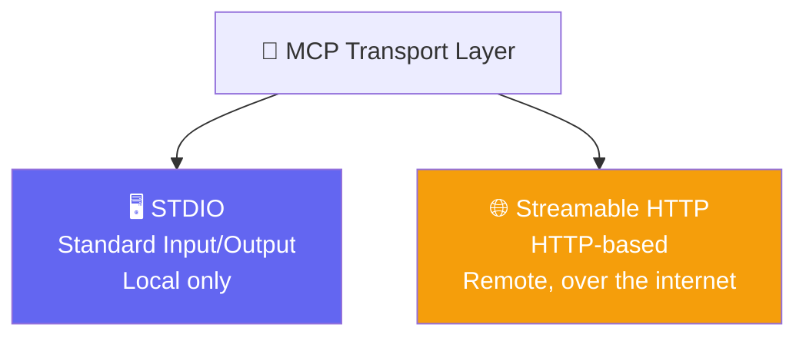
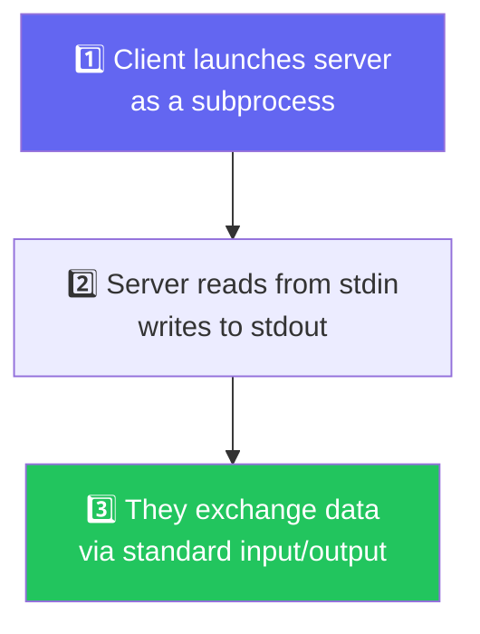
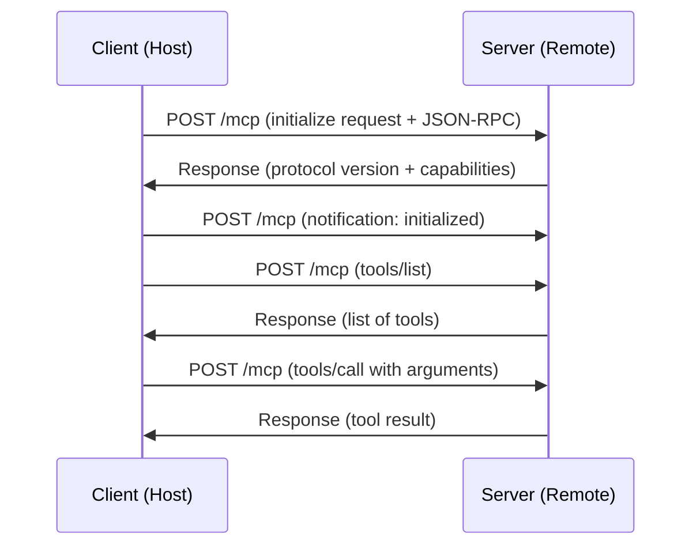
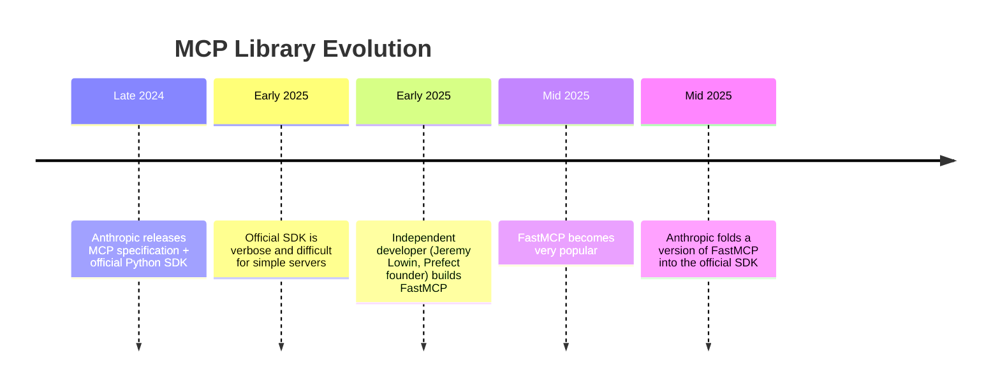

# 🧠 MCP Deep Dive — Transport Layer, Shutdown Phase & Building Your Own Server

**Author:** Pragati  
**Course:** Agentic AI Specialization  
**Date:** 12 September 2026

---

## 📋 Table of Contents
1. [Quick Recap — Where We Left Off](#-quick-recap--where-we-left-off)
2. [The Transport Layer — How Client and Server Actually Connect](#-the-transport-layer--how-client-and-server-actually-connect)
3. [STDIO — Standard Input/Output](#-stdio--standard-inputoutput)
4. [Streamable HTTP — The Remote Connection](#-streamable-http--the-remote-connection)
5. [The Shutdown Phase — Closing the Connection](#-the-shutdown-phase--closing-the-connection)
6. [Building Your Own MCP Server](#-building-your-own-mcp-server)
7. [The Recipe Box Project — Tools, Resources & Prompts](#-the-recipe-box-project--tools-resources--prompts)
8. [MCP Inspector & MCP Jam — Seeing the Invisible](#-mcp-inspector--mcp-jam--seeing-the-invisible)
9. [The History of MCP Libraries — TensorFlow vs Keras](#-the-history-of-mcp-libraries--tensorflow-vs-keras)
10. [Live Q&A Highlights](#-live-qa-highlights)
11. [Action Items](#-action-items)
12. [Key Takeaways](#-key-takeaways)

---

## 🔁 Quick Recap — Where We Left Off

**Analogy:** Think of the MCP lifecycle like a **three-act play**. Act 1 was the introduction (initialization) — we covered handshake, version negotiation, and capability negotiation. Act 2 is the main story (operation) — discovery and calling tools. Today, we're diving into the **backstage mechanics**: how the actors actually get to the stage (transport layer) and how they leave when the show ends (shutdown).

Previously covered:
- **Client** — what exactly is a client, and why it's always 1:1 with a server
- **Primitives** — Tools, Resources, Prompts (what a server can offer)
- **MCP Lifecycle** — Initialization, Operation, Shutdown
- **Version Negotiation** — ensuring client and server speak the same protocol version
- **Capability Negotiation** — an honest menu of what each side can do
- **JSON-RPC 2.0** — the shared language and grammar they use to exchange messages

Today's focus: **Transport Layer**, **Shutdown Phase**, and **Building Your Own MCP Server**.

---

## 🛣️ The Transport Layer — How Client and Server Actually Connect

**Analogy:** Think of the transport layer like the **road** between two cities. JSON-RPC is the language the drivers speak, but the road is what actually connects them. You can have a local road (STDIO) or a highway across the internet (Streamable HTTP).

We know *how* client and server talk (JSON-RPC). We know *what* they say (the lifecycle). But we haven't yet understood **how they are connected in the first place**. That's what the transport layer defines.

MCP supports **two types of transport**:

| Transport | Where It Runs | Analogy |
|---|---|---|
| **STDIO** | Local machine only | A direct phone line between two rooms in the same building |
| **Streamable HTTP** | Anywhere on the internet | A phone call across the world |



> *"JSON-RPC is the language. JSON-RPC is not the transport. How this will be sent to your friend is the transport protocol."*

---

## 🖥️ STDIO — Standard Input/Output

**Analogy:** Think of STDIO like a **parent talking to a child**. The parent (client) starts the child (server) as a subprocess. The parent can send messages by writing to the child's stdin, and the child responds by writing to stdout. They're in the same house (machine), so communication is instant.

### How STDIO Works — The Three Steps



1. **Client launches the server as a subprocess** — a direct parent-child relationship
2. **Server reads from stdin** — whatever the client sends is received
3. **Server writes to stdout** — whatever the server outputs is read by the client

### The Live Demo — Seeing STDIO in Action

The instructor demonstrated this with a simple Python file:

```python
# Simple demo file
print("Hello, from Python file")
name = input("Please tell me the name: ")
print(name)
print("STDIO is being explained")
```

Running this from the terminal:
```bash
python demo.py
# Please tell me the name: STDIO is being explained
# STDIO is being explained
# Hello, from Python file
```

**What actually happened behind the scenes:**
- The terminal (client) started the Python file (server) as a subprocess
- They connected via STDIO
- Whatever the terminal received as input was passed to the Python file
- Whatever the Python file output was shown in the terminal

> *"This is exactly how, unknowingly, we have been doing all these steps throughout our lives. Whenever we write `#include <stdio.h>` in C, we're forming this connection."*

### Benefits of STDIO

| Benefit | Why It Matters |
|---|---|
| **Fast** | Both processes are on the same machine — no network round trip |
| **Secure** | No network exposure — nothing leaves the machine |
| **Simple** | No server address, no network setup, no configuration beyond the command itself |
| **Private by construction** | No network attack surface to defend |

### The Limitation

> *"STDIO cannot be used everywhere, because everything cannot be running on your local machine."*

For example, Gmail's MCP server cannot run on your machine — Google needs to host it. That's where Streamable HTTP comes in.

---

## 🌐 Streamable HTTP — The Remote Connection

**Analogy:** Think of Streamable HTTP like **calling a restaurant to place an order**. You dial the number (make a POST request), tell them what you want (send JSON-RPC), and they respond (send back the result). The restaurant could be anywhere in the world.

### How Streamable HTTP Works



- The client sends a **POST call** to the server
- The JSON-RPC message is embedded in the POST body
- Standard HTTP headers, authentication (OAuth, API keys), etc. all apply
- The endpoint is commonly `/mcp` (you can see this in LangChain's server URL, Excalidraw's MCP server, etc.)

> *"One endpoint commonly slash MCP, which can do the post plus get. Plain JSON or upgrades to SSE for long calls."*

### Where You've Seen `/mcp` Before

The instructor pointed out that when connecting to the LangChain MCP server, the URL ends with `/mcp`. This is the standard endpoint convention for Streamable HTTP MCP servers.

### Benefits of Streamable HTTP

| Benefit | Why It Matters |
|---|---|
| **Reaches anywhere** | The server can run on any machine, in any cloud, anywhere in the world |
| **Scalable** | The server provider handles scaling for millions of users |
| **Standard auth** | HTTP-based authentication (OAuth, API keys) works natively |
| **Long-running tasks** | SSE (Server-Sent Events) can stream progress updates back |

### The Limitation

> *"If the internet is not working, it will not work, because an HTTP call is being sent."*

---

## 🛑 The Shutdown Phase — Closing the Connection

**Analogy:** Think of shutdown like **ending a phone call**. How you end the call depends on how you were connected. If you were chatting on WhatsApp, you close the internet. If you were talking on a phone, you hang up. Same with MCP — the shutdown depends on the transport layer.

> *"No JSON-RPC messages are exchanged during shutdown at all. The entire responsibility shifts to the transport layer."*

### Shutdown for STDIO

Since STDIO is a subprocess relationship, shutdown happens at the process level:

| Method | What Happens |
|---|---|
| **Close stdin** | The client stops sending input — the server sees EOF and exits |
| **Send SIGTERM** | The client sends a termination signal |
| **Send SIGKILL** | The client forcefully kills the process (last resort) |
| **Server closes stdout** | The server decides to exit and closes its output stream |

> *"99% of the time, it is initiated by the client. If I close Claude, it terminates the connection."*

### Shutdown for Streamable HTTP

Much simpler — you just close the HTTP connection:

> *"If you want to disconnect or shut down the Streamable HTTP, just close the HTTP connection. The client closes the connection."*

The instructor connected this to everyday experience:

> *"When you open a website which is not safe, you quickly close your browser or disconnect your internet. Unknowingly, you have been doing this — closing the HTTP connection."*

### Unexpected Server Shutdown

If the server goes down unexpectedly (crash, network failure), the client should **try to reconnect gracefully** — checking what went wrong and re-establishing the connection.

---

## 🛠️ Building Your Own MCP Server

**Analogy:** Think of building an MCP server like **building a house**. You can build it with raw materials and hand tools (low-level MCP SDK), or you can use pre-fabricated modules and power tools (FastMCP). Both give you a house, but one is much faster.

### Two Libraries for Building MCP Servers

| Library | Who Made It | Analogy |
|---|---|---|
| **MCP SDK (Official)** | Anthropic | Building with raw materials — verbose, manual |
| **FastMCP** | Independent developer (Jeremy Lowin, founder of Prefect) | Building with power tools — concise, automatic |

### Low-Level MCP SDK — The Hard Way

The instructor showed what building an MCP server used to look like (and still looks like in some companies):

```python
# Low-level approach — you define everything manually
# - List tools function
# - Get tool function
# - Search tool function
# - Dispatch logic with if/else chains
# - Manual schema definitions
```

> *"Earlier, this was very, very difficult. You had to write lots of code for creating a simple MCP server."*

### FastMCP — The Easy Way

With FastMCP, the same server can be built with just a few decorators:

```python
from fastmcp import FastMCP

mcp = FastMCP("Recipe Box")

@mcp.tool
def list_recipes() -> list[dict]:
    """List all recipes."""
    return [{"id": k, "title": v["title"]} for k, v in recipes.items()]

@mcp.tool
def get_recipe(recipe_id: int) -> dict:
    """Get a specific recipe by ID."""
    return recipes.get(recipe_id, {})

@mcp.tool
def search_recipes(tag: str) -> list[dict]:
    """Search recipes by tag."""
    return [r for r in recipes.values() if tag in r["tags"]]

if __name__ == "__main__":
    mcp.run()
```

> *"This is how easily we can create our MCP servers. You don't have to write the list MCP calls or get MCP calls. FastMCP will run itself."*

### The Decorator Trio

| Decorator | What It Creates | Example |
|---|---|---|
| `@mcp.tool` | An action the AI can perform | `list_recipes`, `get_recipe` |
| `@mcp.resource` | Read-only data for context | `valid_tags`, `README` file |
| `@mcp.prompt` | A reusable template | `plan_weekly_meals` |

### Adding Resources

```python
@mcp.resource("recipe://tags")
def valid_tags() -> list[str]:
    """Return the list of valid tags."""
    return ["quick", "vegetarian", "sunday", "meat", "vegan"]
```

> *"Resource exports data from files, API, database, or any other resource. Each resource has a unique URI and a MIME type."*

### Adding Prompts

```python
@mcp.prompt
def plan_weekly_meals() -> str:
    """Plan weekly meals based on available recipes."""
    return "Help me plan my weekly meals using the recipes available."
```

> *"Prompts and tools are not connected — prompts are supplementary. You can add them to help the LLM make better calls."*

---

## 🍳 The Recipe Box Project — Tools, Resources & Prompts

**Analogy:** Think of the Recipe Box like a **real recipe book**. The tools are the actions you can take (list recipes, get a recipe, search). The resource is the index of tags (so you know what's available). The prompt is a pre-written meal-planning template.

### The Recipe Data Structure

```python
recipes = {
    1: {"title": "Weeknight Pasta", "minutes": 20, "tags": ["quick", "vegetarian"]},
    2: {"title": "5-Minute Salsa", "minutes": 5, "tags": ["quick", "vegan"]},
    3: {"title": "Sunday Roast", "minutes": 120, "tags": ["sunday", "meat"]},
    4: {"title": "Vegan Buddha Bowl", "minutes": 25, "tags": ["vegan", "quick"]},
}
```

### The Three Tools

| Tool | Input | Output |
|---|---|---|
| `list_recipes` | None | List of recipe IDs and titles |
| `get_recipe` | `recipe_id: int` | Full recipe details |
| `search_recipes` | `tag: str` | Recipes containing the tag |

### The Resource

```python
@mcp.resource("recipe://tags")
def valid_tags() -> list[str]:
    """Return the list of valid tags."""
    return ["quick", "vegetarian", "sunday", "meat", "vegan"]
```

### The Prompt

```python
@mcp.prompt
def plan_weekly_meals() -> str:
    """Plan weekly meals based on available recipes."""
    return "Help me plan my weekly meals using the recipes available."
```

### Connecting to Claude Desktop

```bash
uv run fastmcp install claude-desktop recipebox_fastmcp.py
```

> *"The second you hit this command, it will install my recipe box in my Claude Desktop, making it directly useful."*

---

## 🔬 MCP Inspector & MCP Jam — Seeing the Invisible

**Analogy:** Think of these tools like **X-ray glasses** for MCP. Normally, all the JSON-RPC messages are hidden — you just see the final answer. These tools let you watch the entire conversation happen in real time.

### MCP Inspector

The official inspector from the MCP library:

```bash
npx @modelcontextprotocol/inspector python recipebox_fastmcp.py
```

- Opens at `http://localhost:6274` (or your specified port)
- Shows protocol messages, tools, resources, and prompts
- Lets you call tools directly and see the JSON-RPC exchange

> *"MCP Inspector doesn't care how your server was built — FastMCP or low-level SDK. It just cares that your server is defined correctly."*

### MCP Jam

A third-party, more advanced alternative:

- Shows the full JSON-RPC conversation live
- Highlights discovery, initialization, and tool calls
- Visualizes the version negotiation and capability negotiation
- Free to use

> *"MCP Jam is like the flight data recorder for MCP connections. Instead of just seeing 'the flight landed safely,' you can watch every control input, every instrument reading, and every radio call — in real time."*

### What You See in the Logs

| Log Entry | What It Means |
|---|---|
| `server/discover` | Newer MCP versions support this — older servers may not |
| `initialize` | The handshake request with version + capabilities |
| `notifications/initialized` | The fire-and-forget message with no ID |
| `tools/list` | Discovery of available tools |
| `tools/call` | Actual tool invocations with arguments |
| JSON-RPC IDs | Increment for every call (1, 2, 3, 4...) |
| Timing | How long each call took (e.g., 5 milliseconds) |

> *"If you make any errors in the request, you will get a return error JSON-RPC. If you make the tool name wrong, you will get a method not found error."*

---

## 📜 The History of MCP Libraries — TensorFlow vs Keras

**Analogy:** Think of this like **TensorFlow and Keras**. TensorFlow was powerful but hard to use. Someone built Keras as an easier wrapper. Google hired that person and folded Keras into TensorFlow. The same thing happened with MCP.

### The Timeline



### The Key Distinction

> *"FastMCP and FastAPI are not directly connected. FastMCP was created by an individual developer, not the FastAPI team. The name is coincidental."*

| Library | Maintained By | Current State |
|---|---|---|
| **MCP SDK (Official)** | Anthropic | Adopted FastMCP-style API — now much easier |
| **FastMCP** | Prefect (Jeremy Lowin) | Still the most widely used for real servers |

### Why Learn Both?

> *"Companies may still use the older, low-level code. I specifically remember, just 6 months ago, I was creating my MCP servers by writing code like that. So you should be aware of both."*

---

## 💬 Live Q&A Highlights

| Question | Answer |
|---|---|
| **What is the difference between JSON and JSON-RPC?** | JSON is a data format. JSON-RPC is a protocol that uses JSON for remote procedure calls — it adds `id`, `method`, `params`, and `result`/`error` fields. |
| **Can we call STDIO local?** | Yes — STDIO is inherently local. Both client and server run on the same machine. |
| **What are the advantages of STDIO?** | Fast (no network), secure (no exposure), simple (no configuration). |
| **What are the disadvantages of STDIO?** | Cannot be used everywhere — both client and server must be on the same machine. |
| **Can we use Streamable HTTP for a local server?** | No — Streamable HTTP is for remote servers. If the server is local, use STDIO. |
| **How does the server decide which tool to call?** | It doesn't. The client (specifically the model) decides. The server only executes what it's asked. |
| **Can I limit the number of tools a client loads?** | Yes — using middleware like `LLMToolSelectorMiddleware` in LangChain. But `tools/list` still returns all tools. |
| **Is MCP an Anthropic product I have to pay for?** | No — it's a free, open specification governed by multiple companies. |
| **What is the difference between MCP and a normal API?** | MCP is AI-compatible — it lets the LLM decide which tool to call. A normal API requires the client to know exactly which endpoint to hit. |
| **Can we have multiple clients connect to one server?** | No — it's strictly 1:1. Two Gmail accounts need two servers. |
| **What happens if the server crashes?** | The client should try to reconnect gracefully. Logs help you debug what went wrong. |
| **How do I test my MCP server?** | Like any other API — test each tool individually. Also test with different LLMs (Claude, ChatGPT, Copilot) since each may behave differently. |
| **What is the `/mcp` endpoint?** | It's the standard convention for Streamable HTTP servers. You'll see it in LangChain's server URL, Excalidraw's server, etc. |
| **Why does MCP use JSON-RPC instead of REST?** | JSON-RPC is transport-agnostic, two-way by design, has built-in notifications, and standard error codes. REST is one-way (client always initiates). |
| **What is `stdio` in C?** | `#include <stdio.h>` in C is what forms the connection between your terminal and your compiled program — the same concept as MCP's STDIO transport. |
| **Can an MCP server make a call to the client?** | Yes — MCP is two-way. The server can send requests (like elicitation) to the client. |
| **What is the difference between MCP Jam and MCP Inspector?** | Both show the same information. MCP Jam is a bit more advanced and user-friendly. |
| **How do I add my custom MCP to Claude Desktop?** | Via the `fastmcp install claude-desktop` command, or by editing `claude_desktop_config.json` manually. |
| **What is the MIME type for a resource?** | It's the format of the data — `text/plain` for text, `audio/mp3` for audio, `image/png` for images, etc. |

---

## ✅ Action Items

- [ ] **🖥️ Recreate STDIO Demo:** Write a simple Python script that takes input and prints output. Run it from your terminal and observe the parent-child relationship.
- [ ] **🌐 Explore MCP Jam:** Download MCP Jam and connect it to at least one MCP server. Watch the JSON-RPC conversation in real time.
- [ ] **🛠️ Build a Server:** Create your own MCP server using FastMCP with at least three tools.
- [ ] **📄 Add a Resource:** Add a resource to your server that returns a list of valid values (like tags, categories, etc.).
- [ ] **📋 Add a Prompt:** Add a prompt that guides the LLM to combine multiple tools into a single output.
- [ ] **🔬 Test with MCP Inspector:** Run your server with MCP Inspector and verify all tools, resources, and prompts appear correctly.
- [ ] **🔗 Connect to Claude Desktop:** Install your MCP server in Claude Desktop and test it with natural language queries.
- [ ] **🛑 Practice Shutdown:** Observe what happens when you close Claude Desktop — the STDIO connection terminates.
- [ ] **📖 Revise the Transport Layer:** Understand when to use STDIO vs Streamable HTTP.
- [ ] **🧠 Prepare for Interviews:** Be ready to explain:
  - What is the transport layer?
  - How does STDIO work?
  - How does Streamable HTTP work?
  - How does shutdown differ between the two?
  - How do you create an MCP server?

---

## 📝 Key Takeaways

| Takeaway | In One Sentence |
|---|---|
| **Transport layer = the road** | JSON-RPC is the language; the transport layer is how the message travels. |
| **STDIO = local, subprocess** | The client starts the server as a subprocess and communicates via stdin/stdout. |
| **Streamable HTTP = remote** | The client sends POST requests to a remote server — works anywhere. |
| **Shutdown depends on transport** | Close stdin or send SIGTERM for STDIO; close the HTTP connection for remote. |
| **FastMCP = easy mode** | Decorators make server creation simple — no manual schema or dispatch logic. |
| **Three decorators** | `@mcp.tool` for actions, `@mcp.resource` for data, `@mcp.prompt` for templates. |
| **MCP Inspector shows the invisible** | It reveals the JSON-RPC conversation that normally happens behind the scenes. |
| **History repeats** | FastMCP was to MCP what Keras was to TensorFlow — a developer-friendly wrapper later adopted by the official library. |
| **Testing is like any API** | Test each tool individually, with different LLMs, using golden questions and ground truths. |
| **`#include <stdio.h>`** | You've been using STDIO your whole programming life — MCP just formalizes it. |
| **The `/mcp` endpoint** | Standard convention for Streamable HTTP servers — you'll see it everywhere. |
| **MCP is AI-compatible** | It lets the LLM decide which tool to call — unlike a normal API where the client must know exactly which endpoint to hit. |

---

## 📚 Additional Resources

- [MCP Specification — Transports](https://modelcontextprotocol.io/specification)
- [MCP Lifecycle Simulator](https://mcp-lifecycle-simulator.netlify.app/)
- [FastMCP Documentation](https://gofastmcp.com/)
- [MCP Inspector](https://github.com/modelcontextprotocol/inspector)
- [MCP Jam](https://www.mcpjam.com/)
- [Claude Desktop Download](https://claude.ai/download)

---

