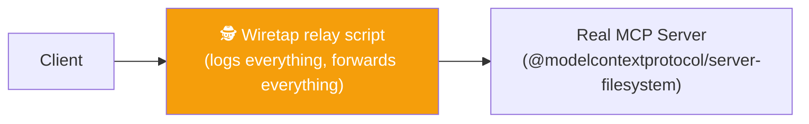
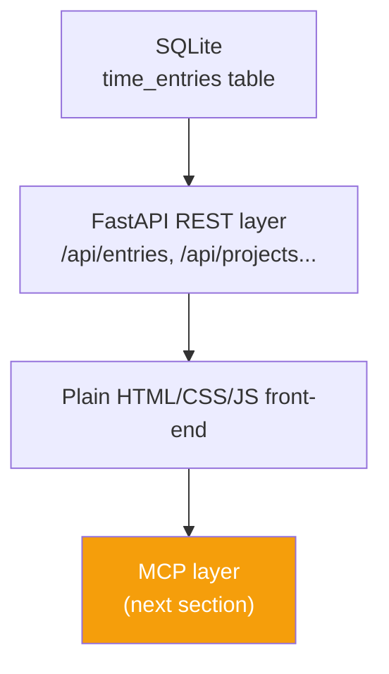
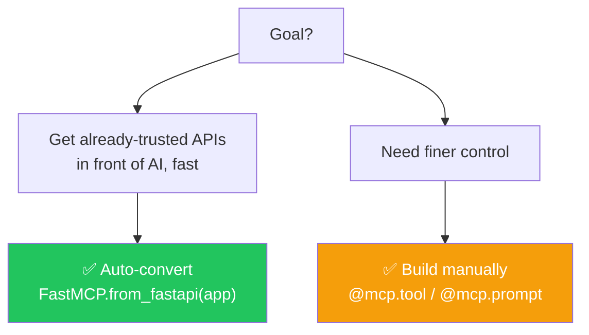
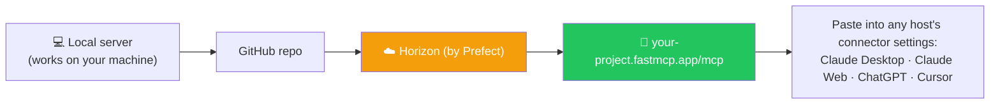
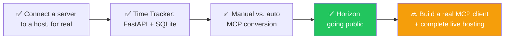

# 🚀 Class 20 — Wrapping a Real API in MCP

**Author:** Pragati  
**Course:** Agentic AI Specialization  
**Date:** 13 September 2026

---

## 📋 Table of Contents
1. [Where This Class Sits](#-where-this-class-sits)
2. [Connecting a Server to a Host, For Real](#-connecting-a-server-to-a-host-for-real)
3. [The Time Tracker Project](#-the-time-tracker-project)
4. [Two Ways to Turn an API Into an MCP Server](#-two-ways-to-turn-an-api-into-an-mcp-server)
5. [Going Public — FastMCP Cloud (Horizon)](#-going-public--fastmcp-cloud-horizon)
6. [Live Q&A](#-live-qa)
7. [Key Pointers to Remember](#-key-pointers-to-remember)
8. [Action Items](#-action-items)
9. [What's Next](#-whats-next)

---

## 🎯 Where This Class Sits

**Analogy:** Think of this like **learning the grammar of a language vs. holding your first real conversation**. The previous class taught the grammar of MCP — the structure, the vocabulary, the rules. This class is the first real conversation held in that language: a real SQLite database, a real REST API, two different ways to wrap it in MCP, and a real path to making it public.

Everything before this was theory and a toy warm-up server. Class 20's whole point is to prove the theory holds up against a real product.

> *"Using AI assistance to write and understand code is treated as a normal, professional habit in this course — not a shortcut to be ashamed of. The goal is understanding architecture and decisions deeply, not memorizing syntax by hand."*

---

## 🔌 Connecting a Server to a Host, For Real

### The Two Doors Into the Same Room

**Analogy:** Think of the Connector UI as the **"Add a new gadget" wizard** on a smart-home app; the config file is the **wiring closet** the wizard is secretly editing on your behalf. A developer building their own gadget skips the wizard and goes straight to the wiring closet.

There are two ways to add a server to a host — but they are **not two different mechanisms**. They're two interfaces onto the exact same underlying file.

| Method | Who It's For | What It Really Is |
|---|---|---|
| **Connectors (UI)** | The layperson — click "Add," paste a name and a hosted URL, done | A friendly form that, behind the scenes, writes an entry into the config file |
| **Config File** (`claude_desktop_config.json` on Mac) | Developers running their own locally-built server | The actual source of truth every host reads from |

### A Real Look at the Config File

It's just a JSON object — one entry per server, naming the exact command used to start it:

```json
"RecipeBox_Updated": {
  "command": "/opt/homebrew/bin/uv",
  "args": ["run", "--with", "fastmcp", "fastmcp", "run", ".../recipebox_fastmcp.py"],
  "transport": "stdio"
},
"demo-filesystem-wiretapped": {
  "command": "python3",
  "args": ["mcp_wiretap.py", "--log", "wiretap-live.log", "--", "npx", "-y", "@modelcontextprotocol/server-filesystem", "..."]
}
```

### 🩹 Two Hard-Won Practical Lessons

#### Lesson 1 — The "Bare Command" Trap

Writing just `"command": "uv"` often fails **silently** inside Claude Desktop, because the host doesn't necessarily know where `uv` lives on your machine — it isn't reading your shell's `$PATH` the way a terminal does.

**The fix:**
```bash
which uv     # → /opt/homebrew/bin/uv
which python # same idea, for python-based servers
```

Swap that **full path** into the config's `"command"` field, restart the host, and the server appears under Connectors. This is one of the **most common real-world setup bugs**.

#### Lesson 2 — Wiretapping a Server

When a host's own on-disk logs aren't detailed enough: run the server through a small **relay script** that transparently forwards every message through to the real server, while independently logging the full JSON-RPC conversation on the side.



This is the same architectural pattern as the "man-in-the-middle" logging proxies used in ordinary networking — the relay is completely transparent to both sides, it just happens to be nosy.

### The Same Pattern in VS Code

Proof that this isn't a Claude-specific quirk — VS Code follows an identical logical flow, through a different door:

```
Cmd/Ctrl+Shift+P → "MCP: Add Server" → choose STDIO → provide the exact command
```

This generates VS Code's own `mcp.json` (its equivalent of `claude_desktop_config.json`). Restart the connection, and the same tools become available to VS Code's own AI features.

> **Every host — Claude, VS Code, Cursor, ChatGPT — runs through the exact same underlying architecture; only the settings screen wrapped around it differs.**

### A Doubt Worth Settling Clearly

> **Who decides which tool gets called — the server, or something else?**

**The MCP server never decides.** A server just sits there, waiting to be asked. The client sends a `tools/call` request naming exactly which tool and which arguments. All the "deciding" happens on the **model/brain side**, before the request is ever sent — the server's whole job is to **execute, not to choose**.

---

## 🗄️ The Time Tracker Project

**Analogy:** Think of this like building a **real restaurant** instead of a toy kitchen. The previous examples were demos — this is the same category of product as Toggl or Clockify, with real employees logging real hours against real projects.

### The Database Layer

A **SQLite database** with a `time_entries` table: auto-incrementing ID, employee name, project, entry date, hours, and a description of the work done. It's **seeded with sample data on first run**, so the app never starts genuinely empty.

A small `row_to_dict` helper converts SQLite's native row objects into plain Python dictionaries — the shape every API endpoint actually needs to return.

### The API Layer (FastAPI — Deliberately Not MCP Yet)

**This layer has nothing to do with MCP. That's the point.** It's the same kind of ordinary REST API that Gmail, Google Calendar, or any real product already has, long before anyone thinks about wrapping it for AI.

```python
from fastapi import FastAPI
import database as db

app = FastAPI(title="Time Track", description="A simple time tracking app with REST and MCP endpoints")

db.init_db()  # creates the table and seeds sample data if empty

@app.get("/api/entries")
def list_all_entries():
    return db.list_all_entries()

@app.get("/api/projects")
def list_projects():
    return db.list_projects()

@app.get("/api/projects/{project}/summary")
def get_project_summary(project: str):
    return db.get_project_summary(project)

class NewEntry(BaseModel):
    employee_name: str
    project: str
    entry_date: str
    hours: float
    description: str

@app.post("/api/entries")
def log_time(entry: NewEntry):
    return db.log_time(entry.employee_name, entry.project, entry.entry_date, entry.hours, entry.description)
```

**Running it:**
```bash
uv run fastapi dev main.py
```

This produces:
- A working **Swagger docs page** (`/docs`) — every endpoint testable directly in the browser
- A **real front-end** (plain HTML/CSS + `app.js` handling fetch calls) that lets someone log time and see project summaries through a normal web UI



> **The point made explicitly:** This is the same starting position almost every real MCP integration begins from — a working product with its own REST API, built with **zero awareness** that MCP will ever sit on top of it. Nothing about a real company's Gmail or Slack API was designed "for AI." MCP is what gets bolted on afterward.

---

## 🛠️ Two Ways to Turn an API Into an MCP Server

With the Time Tracker's API working end to end, the MCP layer was built **two different ways**, with an explicit discussion of when to reach for each.

### Option 1 — Manual Tools: Full Control

**Analogy:** Think of this like **hand-carving each tool** instead of 3D-printing them. More effort, but you get exactly the shape you want.

```python
from fastmcp import FastMCP
import database as db

mcp = FastMCP("Time Tracker")

@mcp.tool
def log_time(employee_name: str, project: str, entry_date: str, hours: float, description: str) -> dict:
    """Log a new time entry for an employee against a project."""
    return db.log_time(employee_name, project, entry_date, hours, description)

@mcp.tool
def get_timesheet(employee_name: str, week_start: str) -> list[dict]:
    """Get all time entries for one employee for a given week."""
    return db.get_timesheet(employee_name, week_start)

@mcp.tool
def get_project_summary(project: str) -> dict:
    """Get total hours and a per-employee breakdown for one project."""
    return db.get_project_summary(project)

@mcp.tool
def list_projects() -> list[str]:
    """List every known project name."""
    return db.list_projects()

@mcp.prompt
def generate_weekly_report(employee_name: str, week_start: str) -> str:
    """A template guiding the AI to pull an employee's week and write a clean summary report."""
    return f"Generate a weekly report for {employee_name} starting {week_start}, using their timesheet and project summaries..."

if __name__ == "__main__":
    mcp.run()
```

**Confirmed live via MCP Inspector:** The exact same lifecycle steps from the protocol — `initialize`, discovery of tools/resources/prompts, then a real `tools/call` — showed up **identically** for this brand-new, genuinely custom-built server. That's the payoff of learning the protocol in depth: it's not different for a "real" server, it's the same handshake every time.

**The standout feature — `generate_weekly_report`:** This is something a **plain API alone cannot replicate**. It's a template that guides the AI to combine multiple tool calls (`get_timesheet` + `get_project_summary`) into a single, well-structured output. This is exactly the **prompt primitive** — a form, not data, not an action — the value a hand-written MCP layer adds beyond just mirroring existing endpoints.

### Option 2 — Automatic Conversion: Speed

**Analogy:** Think of this like **taking a photo of a document vs. retyping it**. Four lines, everything converted instantly.

```python
from fastmcp import FastMCP

mcp = FastMCP.from_fastapi(app)  # 'app' is the exact FastAPI instance already defined above
```

In **four lines**, every existing FastAPI endpoint became a callable MCP tool automatically — confirmed live in MCP Inspector, with tools mapped straight from the REST routes.

**Notably:** No prompts, no resources — because those **don't exist as a concept in plain REST**, so there's nothing to auto-convert them from.

### Choosing Between Them



| Situation | Recommendation |
|---|---|
| Just making already-working, already-trusted APIs available to AI, quickly | **Auto-convert** |
| Combining two or more API calls into a single, well-named tool | **Build manually** |
| Writing richer, more AI-friendly descriptions than the original API needed | **Build manually** |
| Wanting prompts at all | **Build manually** — auto-conversion cannot produce them |
| Real-company risk aversion: teams reluctant to touch already-deployed APIs | **Build manually**, as a separate layer — avoids touching code already trusted in production |

---

## ☁️ Going Public — FastMCP Cloud (Horizon)

**Analogy:** Think of this like **moving from a home kitchen to a food truck with a public address**. A server running on your own laptop is only useful to you. This is the path from "works on my machine" to "a URL anyone's AI host can connect to."

**Horizon**, built by **Prefect** (the same company behind FastMCP itself), is the hosting platform FastMCP's own documentation recommends.

| Free Tier Detail | Value |
|---|---|
| Developers | 1 |
| MCP Servers | Up to 200 |
| Log Retention | 1 hour |
| Deployment | Connected via GitHub — any future code push deploys automatically |
| Resulting URL Shape | `your-project.fastmcp.app/mcp` |



This closes the full loop: a locally-built, fully-understood server becomes something **anyone in the world can add to their own AI, in a single paste** — exactly the same mechanism used earlier to add a public connector. Nothing new to learn on the "connecting" side — it's the same Connector door, just now pointing at a **URL you control** instead of someone else's.

---

## 💬 Live Q&A

| Question | Answer |
|---|---|
| **For production APIs already deployed, should we use the 4-line auto-conversion or build tools manually?** | Auto-conversion is the faster, safer starting point specifically because it doesn't require touching already-trusted production code. Manual tools are worth it once finer control is genuinely needed. |
| **If I have 5 connectors, do they all need to be defined in one config file?** | Yes — each connector is its own separate server entry; the host starts each one independently. |
| **How does an MCP server decide which tool to call for a given request?** | It doesn't. The server only executes whatever tool a client's request explicitly names. The decision happens on the model/client side, before the request is even sent. |
| **Is the GitHub → Horizon deployment step similar to a Java developer deploying to Kubernetes?** | Conceptually yes — same underlying idea of taking working local code and making it a reachable running service, just via a platform built specifically for MCP servers. |
| **Will authorization be added to this project?** | Yes — planned as a natural next step once the server is properly hosted, since a publicly reachable server needs real access control. |
| **Is writing code without AI assistance still expected in interviews?** | No — using AI to write and understand code is a normal, expected professional skill. What matters is understanding the resulting architecture and decisions well enough to explain and defend them. |

---

## 🔑 Key Pointers to Remember

| Pointer | In One Sentence |
|---|---|
| **Connector = Config File** | A connector and a config-file entry are the same underlying thing — connectors are just the friendly UI for what's really stored in a config file every host maintains. |
| **Server Never Decides** | The MCP server never decides which tool to call. It only executes what a client's `tools/call` request explicitly names — all the deciding happens upstream, in the model. |
| **Path Failures Are Common** | A `uv`/`python` path failure inside a host's config is one of the most common real setup bugs — `which uv` (or `which python`) gives the exact full path a config often needs spelled out. |
| **MCP Is Bolted On** | Real products already have APIs before anyone thinks about MCP. Building an MCP layer is something added afterward, on top of infrastructure that was never designed with AI in mind. |
| **Auto-Conversion Is Fast but Limited** | `FastMCP.from_fastapi(app)` auto-converts an entire existing API into MCP tools in four lines — but it produces no prompts, no custom descriptions, no combined multi-API tools. |
| **Manual Tools Give Control** | Manual `@mcp.tool` definitions are worth the extra effort when you need control: better AI-facing descriptions, combining multiple API calls, or adding prompts. |
| **Separate Layer for Production** | Teams often prefer a separate, hand-built MCP layer specifically to avoid touching already-trusted production API code. |
| **Horizon = Free Hosting** | Horizon (by Prefect) is FastMCP's own recommended free hosting path, connected via GitHub, turning a local server into a real public URL any AI host can use. |

---

## ✅ Action Items

- [ ] **🔌 Config File Exploration:** Open your own host's config file (Claude Desktop, VS Code, or similar) and identify the exact command/path structure for at least one connected server
- [ ] **🩹 Break and Fix:** Deliberately break a server's config with a bare `uv`/`python` command (no full path) and fix it using `which uv` / `which python`
- [ ] **🏗️ Build a Backend:** Build a small FastAPI backend with at least two endpoints and a SQLite-backed database, exactly like the Time Tracker's entries/projects tables
- [ ] **🛠️ Wrap It Two Ways:** Wrap that same API in MCP two ways — manually with `@mcp.tool`, and automatically with `FastMCP.from_fastapi(app)` — compare the resulting tool lists in MCP Inspector
- [ ] **📋 Add a Prompt:** Add one `@mcp.prompt` to your manually-built server that combines two or more of your tools into a single guided output
- [ ] **☁️ Explore Horizon:** Look into Horizon's free tier and understand, at a high level, the GitHub-to-live-URL deployment flow
- [ ] **📖 Preparation:** Come back ready for building a real MCP client and completing the public deployment

---

## 🗺️ What's Next



Client creation and completing the live hosting are the two pieces explicitly left for the next session, with a return to **LangChain** — and understanding the newest MCP architecture's changes — targeted for the following weekend.

---

## 📚 Additional Resources

- [MCP Official Documentation](https://modelcontextprotocol.io/)
- [MCP Lifecycle Simulator](https://mcp-lifecycle.netlify.app/)
- [FastMCP Documentation](https://gofastmcp.com/)
- [Prefect Horizon](https://www.prefect.io/horizon)
- [MCP Inspector](http://127.0.0.1:6274)

---

