# 🚀 Class 21: Taking an MCP Server Live — Deployment, Real Code & Building Your Own Client

**Author:** Pragati  
**Course:** Agentic AI Specialization  
**Date:** 19 September 2026

---

## 📋 Table of Contents
1. [Interview Experience — A Real Candidate's Story](#-interview-experience--a-real-candidates-story)
2. [From "It Works on My Machine" to "Anyone Can Use It"](#-from-it-works-on-my-machine-to-anyone-can-use-it)
3. [STDIO vs. HTTP — Side by Side](#-stdio-vs-http--side-by-side)
4. [The Same File, Two Transports](#-the-same-file-two-transports)
5. [The Real Code, Wired Together Correctly](#-the-real-code-wired-together-correctly)
6. [Two Rules That Genuinely Matter](#-two-rules-that-genuinely-matter)
7. [The Persistence Layer](#-the-persistence-layer)
8. [Deploying to Prefect Horizon](#-deploying-to-prefect-horizon)
9. [Connecting Claude Desktop to a Deployed Server](#-connecting-claude-desktop-to-a-deployed-server)
10. [A Second, Simpler Example — No API at All](#-a-second-simpler-example--no-api-at-all)
11. [Building Your Own MCP Client — Why It's Necessary](#-building-your-own-mcp-client--why-its-necessary)
12. [The Harness Engineering Framing](#-the-harness-engineering-framing)
13. [The Actual Shape of a Client](#-the-actual-shape-of-a-client)
14. [Live Q&A Highlights](#-live-qa-highlights)
15. [FAQ](#-faq)
16. [Action Items](#-action-items)
17. [Key Takeaways](#-key-takeaways)

---

## 🎤 Interview Experience — A Real Candidate's Story

**Analogy:** Think of this like a **dress rehearsal before the actual play**. A classmate who already went through the interview came back to share exactly what was asked — the questions, the format, the feedback. It's the closest thing to a preview you can get.

A fellow learner appeared for a **Senior AI Engineer** role and shared his complete experience:

### Questions Asked

| Category | Specific Questions |
|---|---|
| **ML Basics** | What is supervised learning? What is unsupervised learning? |
| **Time Series** | What is ARIMA? When do we apply time series models? What are the basic models? |
| **Ensemble Techniques** | What is bagging? What is boosting? How do they differ? |
| **Production ML** | If training accuracy is good but production accuracy drops, what do you check first? How do you solve it? |
| **RAG Pipeline** | How does the RAG pipeline go? What are chunking strategies? What are retrieval strategies? |
| **Production RAG** | If the user doesn't want an answer from the LLM's own knowledge, what do you do? |
| **Metrics** | What is the difference between RMSE and MAP? How are they used? |
| **Coding** | Reverse a text string. Sort numbers with a twist — last two numbers stay in their original positions regardless of sort order. |

### The Feedback

> **Concepts were fine, but coding and explanation on projects were not up to the mark.**

**The takeaway:** Concepts alone aren't enough. You need to:
1. Be able to **code** comfortably
2. Be able to **explain any project** on your CV for 30 minutes without notes

> *"Any word you put on your resume, you should be able to talk about for 30 minutes. Otherwise, it's playing against you — the interviewer will pick it up and ask about it."*

---

## 🌍 From "It Works on My Machine" to "Anyone Can Use It"

**Analogy:** Think of this like **building a house vs. opening a restaurant**. A house is great for you and your family — but if you want strangers to walk in, order food, and pay for it, you need a storefront, a sign, and a location that people can actually reach. A local MCP server is your house; a deployed server is your restaurant.

A working local MCP server is a good start, but it only helps the machine it's running on.

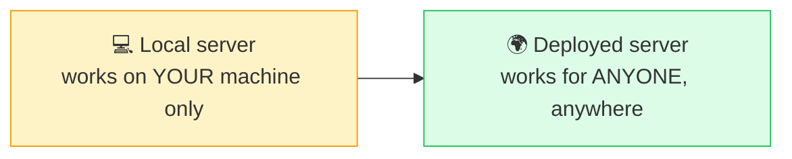

Getting from one side of that arrow to the other means understanding two things clearly:
1. **Which transport** a server should run on
2. **What it actually takes** to put it somewhere reachable

---

## 🖥️ STDIO vs. HTTP — Side by Side

**Analogy:** Think of STDIO like a **direct phone line between two rooms in the same building** — instant, private, but only works if both rooms are in the same building. HTTP is like a **phone call across the world** — a bit slower, but you can reach anyone, anywhere.

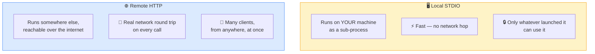

| | Local STDIO | Remote HTTP |
|---|---|---|
| **Where the power lives** | Split across whoever's running it locally | Centralized — the server can be genuinely powerful, serving everyone from one place |
| **Typical use case** | A personal tool, one person, one machine | Team or company-wide tools meant to be shared |
| **Speed** | Very fast — no network hop | Real network round trip on every call |
| **Who can use it** | Only the machine that launched it | Multiple clients from anywhere, simultaneously |

> *"This is exactly why most serious, shared MCP servers run over HTTP rather than STDIO — a locally-started server, however well built, simply isn't reachable by anyone else."*

---

## 🔄 The Same File, Two Transports

**Analogy:** Think of this like a **light switch with two settings**. The same light bulb (the code) can be turned on in two different ways — one for your room only, one for the whole house. The switch is a single line of command.

Switching a FastMCP server between the two is a **one-line change**.

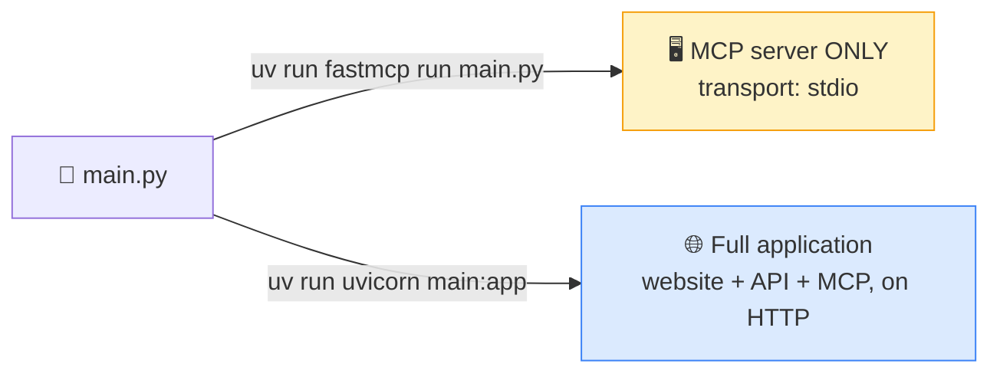

```bash
# Start ONLY the MCP server (STDIO)
uv run fastmcp run main.py
# Starting MCP server 'TimeTrack' with transport 'stdio'
```

```bash
# Start the WHOLE application (HTTP)
uv run uvicorn main:app --reload
# now reachable at http://127.0.0.1:8000, with the MCP endpoint at /mcp
```

### The Critical Distinction

| Command | What It Starts |
|---|---|
| `uv run fastmcp run main.py` | **Just the MCP server object** — nothing else |
| `uv run uvicorn main:app` | **The whole application** — the website, the REST API, and the MCP server mounted together |

> *"The distinction matters: `app` is the FastAPI instance that has everything wired into it. The MCP server is mounted at `/mcp`, and the full application lives at the root URL."*

---

## 🏗️ The Real Code, Wired Together Correctly

**Analogy:** Think of this like a **building with two entrances** — one for regular customers (the website/API), one for AI assistants (the MCP server). Both lead to the same database — the same source of truth.

The actual `main.py` for this project shows the complete pattern: **one running application, two front doors onto the exact same database.**

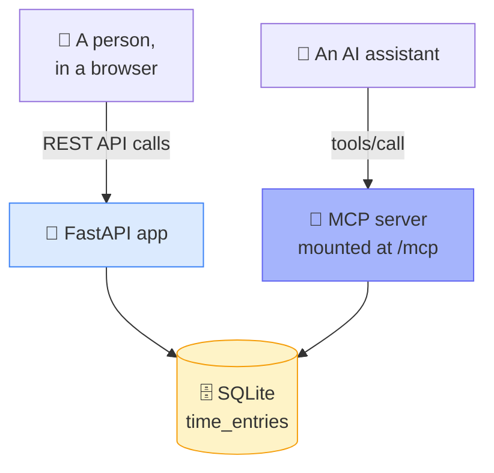

```python
from fastapi import FastAPI
from fastapi.staticfiles import StaticFiles
from fastapi.responses import FileResponse
from pydantic import BaseModel
from fastmcp import FastMCP
import database as db

db.init_db()

# ---------- Step 1: build the MCP server first ----------
mcp = FastMCP("TimeTrack")

@mcp.tool
def log_time(employee_name: str, project: str, entry_date: str, hours: float, description: str = "") -> dict:
    """Log a time entry. entry_date must be YYYY-MM-DD. Shows up on the website immediately."""
    return db.log_time(employee_name, project, entry_date, hours, description)

@mcp.tool
def get_timesheet(employee_name: str, start_date: str = "", end_date: str = "") -> list[dict]:
    """Get one employee's logged entries, optionally filtered to a date range (YYYY-MM-DD)."""
    return db.get_timesheet(employee_name, start_date or None, end_date or None)

@mcp.tool
def get_project_summary(project: str) -> dict:
    """Get total hours logged against a project, broken down by employee."""
    return db.get_project_summary(project)

@mcp.tool
def list_projects() -> list[str]:
    """List every project that has at least one logged time entry."""
    return db.list_projects()

@mcp.resource("timesheet://projects")
def known_projects() -> list[str]:
    """The current set of projects with logged time, for consistent naming."""
    return db.list_projects()

@mcp.prompt
def generate_weekly_report(employee_name: str, week_start: str) -> str:
    """Guides the AI to build a structured weekly hours report from this server's own tools."""
    return f"""Build a weekly report for {employee_name}, starting {week_start}.
1. Call get_timesheet with employee_name='{employee_name}', start_date='{week_start}'
2. Group the results by project
3. Present it as:
{{employee_name}} -- Week of {week_start}
[Project]: {{total hours for that project}}h
Total: {{sum of all hours}}h
If no entries are found for that week, say so plainly instead of inventing data."""

# path="/" here, NOT "/mcp" -- app.mount() below adds that prefix.
mcp_app = mcp.http_app(path="/")

# ---------- Step 2: build the FastAPI app, lifespan wired in AT CONSTRUCTION ----------
app = FastAPI(title="TimeTrack", lifespan=mcp_app.lifespan)

class NewEntry(BaseModel):
    employee_name: str
    project: str
    entry_date: str
    hours: float
    description: str = ""

@app.get("/api/entries")
def api_list_entries():
    return db.list_all_entries()

@app.post("/api/entries")
def api_log_entry(entry: NewEntry):
    return db.log_time(entry.employee_name, entry.project, entry.entry_date, entry.hours, entry.description)

@app.get("/")
def serve_index():
    return FileResponse("static/index.html")

app.mount("/static", StaticFiles(directory="static"), name="static")
app.mount("/mcp", mcp_app)
```

---

## ⚠️ Two Rules That Genuinely Matter

**Analogy:** Think of these like **two wires that must be connected in the right order** — connect them wrong, and the whole system silently fails. The lights don't turn on, but there's no smoke or bang — just a quiet failure that's hard to debug.

These are easy to get wrong, and both were verified directly against FastMCP's own documentation.

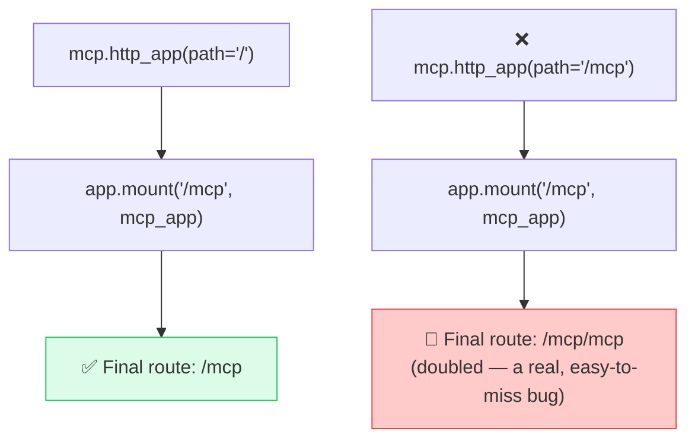

### Rule 1: `mcp.http_app(path="/")` — NOT `path="/mcp"`

The `app.mount("/mcp", mcp_app)` call below it already adds that prefix. Setting both doubles it into `/mcp/mcp`.

| What You Write | Final Route |
|---|---|
| `mcp.http_app(path="/")` + `app.mount("/mcp", mcp_app)` | ✅ `/mcp` |
| `mcp.http_app(path="/mcp")` + `app.mount("/mcp", mcp_app)` | 🐛 `/mcp/mcp` (doubled) |

### Rule 2: `FastAPI(lifespan=mcp_app.lifespan)` Must Be Passed at Construction

It cannot be set on the app afterward. Get this wrong and the MCP session manager **silently never initializes** — the server looks fine until the first real request fails.

> *"This is a real, easy-to-miss bug. The server looks perfectly healthy, but it just doesn't work."*

---

## 🗄️ The Persistence Layer

**Analogy:** Think of `database.py` like a **filing cabinet** — nothing fancy, nothing exotic, just a reliable place to store and retrieve records. It does one thing well: store time entries.

`database.py` is a small, honest SQLite layer — nothing exotic, which is exactly the point:

```python
import os
import sqlite3
from pathlib import Path

DB_PATH = Path(os.environ.get("TIMETRACK_DB_PATH", "/tmp/timetrack.db"))

def get_connection():
    conn = sqlite3.connect(DB_PATH)
    conn.row_factory = sqlite3.Row
    return conn

def init_db():
    conn = get_connection()
    conn.execute("""
        CREATE TABLE IF NOT EXISTS time_entries (
            id INTEGER PRIMARY KEY AUTOINCREMENT,
            employee_name TEXT NOT NULL,
            project TEXT NOT NULL,
            entry_date TEXT NOT NULL,
            hours REAL NOT NULL,
            description TEXT NOT NULL DEFAULT ''
        )
    """)
    count = conn.execute("SELECT COUNT(*) FROM time_entries").fetchone()[0]
    if count == 0:
        seed = [
            ("Asha Patel", "Website Redesign", "2026-09-08", 6.5, "Homepage layout"),
            ("Rahul Mehta", "Internal Tools", "2026-09-09", 8.0, "Dashboard bug fixes"),
        ]
        conn.executemany(
            "INSERT INTO time_entries (employee_name, project, entry_date, hours, description) "
            "VALUES (?, ?, ?, ?, ?)", seed,
        )
        conn.commit()
    conn.close()

def log_time(employee_name, project, entry_date, hours, description=""):
    if hours <= 0:
        raise ValueError("hours must be a positive number")
    conn = get_connection()
    cursor = conn.execute(
        "INSERT INTO time_entries (employee_name, project, entry_date, hours, description) VALUES (?, ?, ?, ?, ?)",
        (employee_name, project, entry_date, hours, description),
    )
    conn.commit()
    row = conn.execute("SELECT * FROM time_entries WHERE id = ?", (cursor.lastrowid,)).fetchone()
    conn.close()
    return dict(row)

def get_project_summary(project: str) -> dict:
    conn = get_connection()
    rows = conn.execute(
        "SELECT employee_name, SUM(hours) as total_hours FROM time_entries "
        "WHERE project = ? GROUP BY employee_name ORDER BY employee_name",
        (project,),
    ).fetchall()
    conn.close()
    if not rows:
        raise ValueError(f"No time logged against project '{project}'")
    by_employee = {r["employee_name"]: r["total_hours"] for r in rows}
    return {"project": project, "total_hours": sum(by_employee.values()), "by_employee": by_employee}
```

### Two Details Worth Noting

| Detail | Why It Matters |
|---|---|
| **`log_time` validates `hours > 0`** | The kind of small guardrail that's easy to skip in a demo but matters the moment a real tool is exposed to an AI that might send bad input |
| **`get_project_summary` uses `GROUP BY`** | The per-employee breakdown isn't computed in Python after the fact — it's the database doing what databases are good at |

---

## ☁️ Deploying to Prefect Horizon

**Analogy:** Think of this like **moving from a home kitchen to a commercial kitchen**. Your recipes (code) stay the same, but now you have a space that anyone can order from, with proper equipment and scale.

With the server working locally, making it public follows a specific, repeatable sequence.

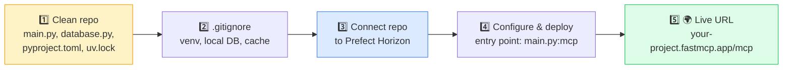

### Step 1: Create a Clean, Separate Repository

Containing **just the MCP server** — not an entire course-learning project with scratch files and notes mixed in.

**Why this matters:** The hosting platform builds from exactly what's in the repo. `main.py`, `database.py`, `pyproject.toml`, and `uv.lock` are what it actually needs.

| File | Purpose |
|---|---|
| `pyproject.toml` | Lists which libraries the project depends on |
| `uv.lock` | Pins the exact versions of those libraries |

> *"Together they're what a hosting platform reads to reproduce the environment exactly."*

### Step 2: Exclude Anything the Server Doesn't Need

In `.gitignore`:
- Virtual environment (`.venv`)
- Local database files (`*.db`)
- Cache files
- Editor-specific folders (`.claude`, etc.)

**Key insight:** The database gets created fresh wherever the server actually runs. A `.gitignore`'d database file locally has **no relationship at all** to whatever database file gets created on the hosting platform. They're separate files, separate data, full stop — updating one never touches the other.

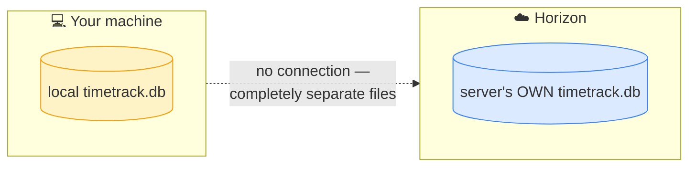

### Step 3: Connect the Repo to Prefect Horizon

Prefect Horizon is the current name for what used to be called **FastMCP Cloud** — same team, same idea, built by Prefect, the company behind FastMCP itself.

Signing in with GitHub and selecting the repository is enough for Horizon to auto-detect dependencies from `pyproject.toml`.

### Step 4: Configure and Deploy

| Setting | Value |
|---|---|
| **Server name** | `TimeTrack` (or whatever you choose) |
| **Entry point** | `main.py` |
| **Object** | `mcp` (not the whole `app`) |

Horizon then installs every required library and starts the server, with logs visible during the build.

### Step 5: Get a Live URL

Once deployed, the server is reachable at a predictable address:

```
https://your-project-name.fastmcp.app/mcp
```

This is pasteable into any AI host's connector settings.

> *"One thing worth confirming directly for any project with more than just an MCP server: Horizon is purpose-built for the MCP piece specifically, so it's worth checking whether a website's static routes deploy along with it. If not, a general-purpose host like Vercel or Railway is the fallback for the full application."*

---

## 🔗 Connecting Claude Desktop to a Deployed Server

**Analogy:** Think of this like **giving someone your phone number** — once they have it, they can call you from anywhere. The URL is your server's phone number.

```json
{
  "mcpServers": {
    "timetrack": { "url": "https://your-project-name.fastmcp.app/mcp" }
  }
}
```

### The Full Conversation Flow

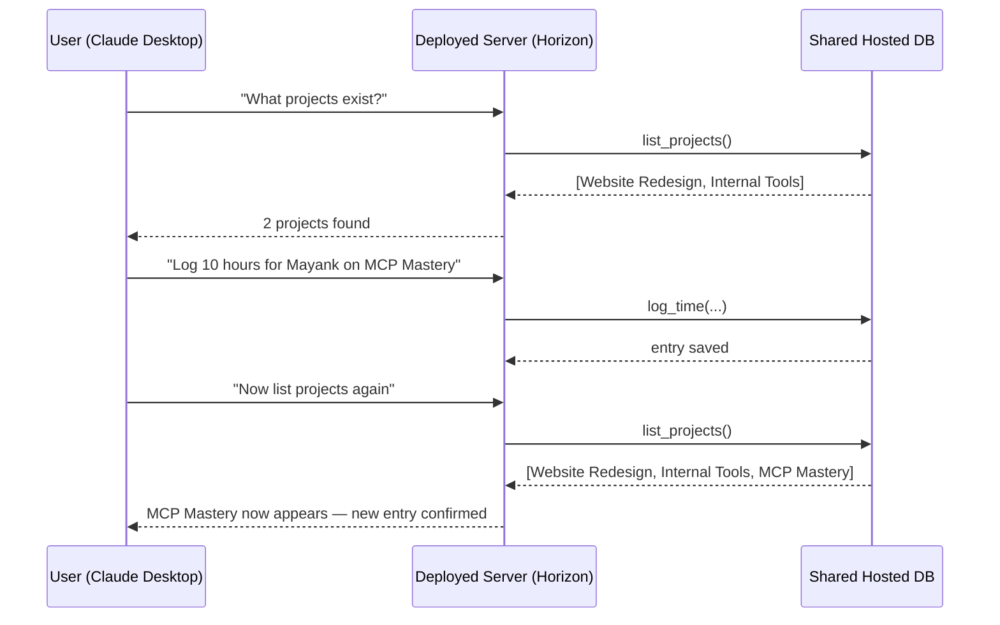

Once connected, a real conversation can use the deployed server exactly like a local one:
1. Ask for a project list
2. Log a new entry
3. Ask for the list again — the new entry is already reflected, live

> *"Anyone who has that URL can connect the same way — logging their own hours through their own AI assistant, all writing to the same shared, hosted database."*

### The Horizon Authorization Caveat

**Important:** Horizon's free tier requires authentication — anyone connecting to your server must be logged into Horizon and be a member of your organization. This makes adaptability poor for a truly public server.

> *"To connect to this server, you will need to be part of my organization and have a Horizon account. This makes adaptability very bad — I would have to add all of you."*

**The Workaround:** Use a general-purpose hosting platform like **Vercel** instead, where you can disable deployment protection and make the server truly open.

---

## 🧮 A Second, Simpler Example — No API at All

**Analogy:** Think of this like a **basic calculator app** vs. a full accounting system. Both do math, but one is just a function with no dependencies.

It's worth being explicit that **MCP has no dependency on having a REST API underneath it.**

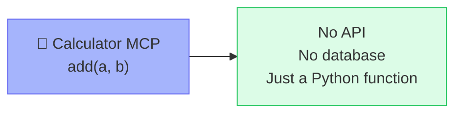

A second, deliberately bare-bones server proves this:

```python
from fastmcp import FastMCP

mcp = FastMCP("Calculator")

@mcp.tool
def add(a: float, b: float) -> float:
    """Add two numbers."""
    return a + b

if __name__ == "__main__":
    mcp.run()
```

Deployed the same way as the Time Tracker server, a request like **"what is 5 plus 3?"** triggers a `tools/call` to `add`, which runs the raw Python function and returns the result.

> *"Nothing about MCP requires an API layer underneath it. An MCP server is just a server; what it does internally is entirely up to whoever builds it."*

---

## 🔧 Building Your Own MCP Client — Why It's Necessary

**Analogy:** Think of this like **building your own remote control** instead of borrowing someone else's. Every TV comes with a remote (Claude Desktop, VS Code), but if you want to control a custom device (your own MCP server) from your own interface, you need to build the remote yourself.

Every earlier session took MCP clients for granted, because Claude Desktop, VS Code, and similar hosts quietly **are** MCP clients — they handle the handshake, discovery, and tool calling invisibly.

---

## 🎯 The Harness Engineering Framing

**Analogy:** Think of this like a **translator between two people who don't speak the same language**. The model speaks "AI" (it can reason and decide), the server speaks "capabilities" (it can do things), but neither can talk to the other directly. The client is the translator — it sits in the middle, passing messages back and forth.

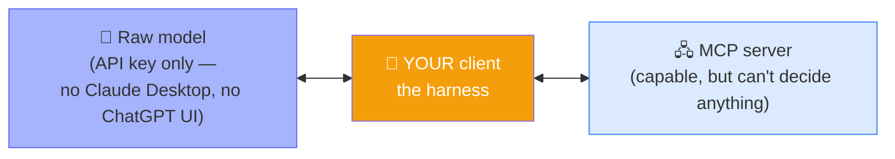

Picture having two separate things:
1. A **raw model**, accessed directly through a provider's API key
2. An **MCP server**, sitting there capable of doing useful work

Neither one, by itself, does anything for the other:
- The model has **no idea the server exists**
- The server has **no way to decide anything on its own**

> *"Something has to sit in the middle, connecting the model's intelligence to the server's capabilities — and building that connective layer yourself is exactly what's meant by **harness engineering**."*

Every chat application ever built is, underneath, **a harness wrapped around a raw model** — Claude Desktop and ChatGPT simply build that harness for you and hide it.

---

## 🔄 The Actual Shape of a Client

**Analogy:** Think of this like a **waiter taking an order**. The customer (model) says what they want, the waiter (client) goes to the kitchen (server), gets the dish, and brings it back. The customer never goes into the kitchen themselves.

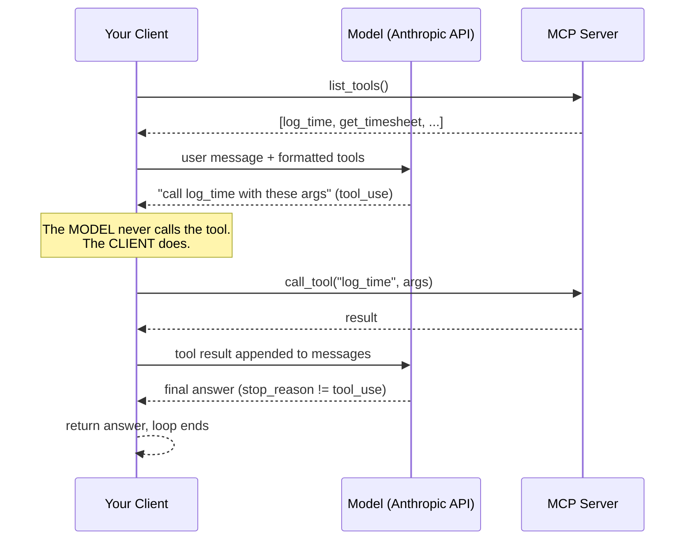

```python
from fastmcp import Client
from anthropic import Anthropic

anthropic_client = Anthropic()

async def run_agent(user_message: str):
    async with Client("main.py") as mcp_client:  # connects to the LOCAL server file
        # Discover: what tools does the server actually offer?
        mcp_tools = await mcp_client.list_tools()
        anthropic_tools = [
            {"name": t.name, "description": t.description, "input_schema": t.inputSchema}
            for t in mcp_tools
        ]

        messages = [{"role": "user", "content": user_message}]

        while True:
            response = anthropic_client.messages.create(
                model="claude-sonnet-4-6",
                messages=messages,
                tools=anthropic_tools,
            )

            if response.stop_reason != "tool_use":
                return response.content  # final answer -- exit the loop

            # The model is asking for a tool -- the CLIENT executes it, never the model itself
            for block in response.content:
                if block.type == "tool_use":
                    result = await mcp_client.call_tool(block.name, block.input)
                    messages.append({"role": "assistant", "content": response.content})
                    messages.append({
                        "role": "user",
                        "content": [{"type": "tool_result", "tool_use_id": block.id, "content": str(result)}],
                    })
```

### Every Piece Maps to the Zero Agent

| Step | What Happens |
|---|---|
| **Discover tools** | `mcp_client.list_tools()` — get the tool list from the server |
| **Format tools** | Convert to the format the model provider expects (Anthropic format) |
| **Send message + tools** | `anthropic_client.messages.create(...)` with tools attached |
| **Check stop reason** | If `stop_reason != "tool_use"`, return the final answer |
| **Execute tool** | `mcp_client.call_tool(...)` — **the client runs the tool, not the model** |
| **Append result** | Add the tool result to the message history |
| **Loop** | Go back to step 3 until the model stops asking for tools |

> *"An MCP client is the exact same agentic loop — the model never calls a tool itself; it only ever says which tool it wants called, and the client is the thing that actually calls it."*

MCP doesn't change that fundamental mechanic at all — it just **standardizes** how the tool list and the tool call get communicated between the client and whatever server is providing them.

This is also precisely what a framework's "MCP adapter" (LangChain's, for instance) is doing under the hood — wrapping this exact connect-discover-format-loop pattern into a few lines, the same way `create_agent()` wraps the raw agentic loop built earlier in the course.

---

## 💬 Live Q&A Highlights

| Question | Answer |
|---|---|
| **What's the difference between `uv run fastmcp` and `uv run python main.py`?** | `fastmcp run` starts just the MCP server object directly. `uvicorn main:app` starts the whole application — the website, REST API, and MCP server mounted together. |
| **Can I use Vercel instead of Horizon?** | Yes — Vercel can host the full application, and you can disable deployment protection to make the MCP server truly open to anyone. |
| **Does Horizon support authentication?** | Yes, but the free tier requires it. Anyone connecting must be part of your organization, which limits adaptability. |
| **How do I restrict tools in an MCP server?** | Use environment variables read at startup — if `READ_ONLY=true`, only read-style tools get loaded at all. |
| **What is the difference between `uv` and `uvx`?** | `uv` operates inside your project. `uvx` runs a tool in an isolated, temporary environment without touching your project. |
| **Can I connect multiple MCP servers to one client?** | Yes — via an **MCP gateway**, which aggregates multiple servers behind a single entry point. |
| **How do I handle thread-level state in MCP?** | Thread-level state is the hardest — it needs deliberately tracking which thread or request a given piece of context belongs to. There's no free built-in mechanism. |
| **Why does the DB get initialized every deployment?** | Because `db.init_db()` runs on startup. This is a design flaw for production — a real database should be separate and persistent. |
| **Can I use this with LangChain?** | Yes — LangChain's MCP adapter wraps this exact pattern into a few lines. We cover this in the next class. |
| **Is MCP used in production?** | Yes — many companies are creating connectors for their products. Horizon's enterprise platform shows Cisco and others using it. |
| **How do I test the MCP server without Claude Desktop?** | Use MCP Inspector, MCP Jam, or curl commands directly against the HTTP endpoint. |

---

## ❓ FAQ

**If a third-party MCP server (like a Postgres server) runs on my own machine, is it really a "local" server, even though it connects to a remote database?**

Yes. "Local" describes **where the MCP server process runs**, not where the data it touches lives. A Postgres MCP server started with `npx` on a laptop is a local server, full stop — it just happens to make outbound calls to a database sitting elsewhere, exactly the way a browser on a laptop is "local" even though the websites it loads are not.

**Where do the tool functions inside something like a Postgres MCP server actually come from?**

From whoever built that server. A database vendor (or the open-source community around it) writes functions like `execute` or `list_tables` once, packages them as an MCP server, and anyone who runs that server gets those pre-built functions for free — no need to understand the underlying driver or write the query logic from scratch.

**Should I always reach for MCP, or is a plain tool sometimes the better choice?**

A plain tool is often the right call for a narrow, well-defined action — sending an email through one specific channel, for instance. MCP earns its place when a **broader surface of functionality** needs supporting without wanting to hand-build and maintain dozens of individual tools yourself. If the scope of what's needed is small and fixed, a tool is simpler; **MCP is for breadth**.

**I need one MCP setup that can reach several different databases (Postgres, Oracle, a mainframe) — what's the right architecture?**

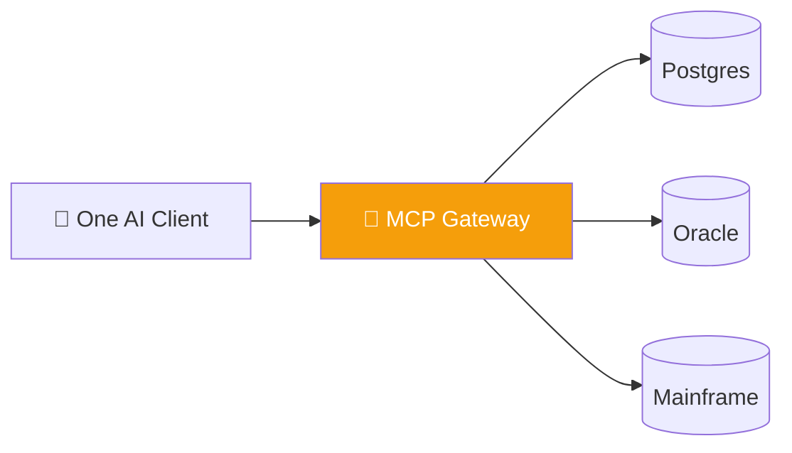

Two solid options:
1. Build **one custom MCP server** with all of them wired in underneath
2. Use an **MCP gateway** — a dedicated pattern for aggregating multiple existing MCP servers behind a single entry point

**How do I stop an AI from accidentally modifying data through an MCP server connected to a production database?**

A common, simple pattern is an **environment variable read at startup** (e.g. `READ_ONLY=true`) that controls which tools the server even loads. If it's set, only read-style tools get registered at all — so write operations are **never exposed as an option in the first place**, rather than being blocked after the fact.

**What's the actual difference between `uv` and `uvx`?**

| Command | What It Does |
|---|---|
| `uv` | Operates **inside your project** — installing and running things as part of it |
| `uvx` | Runs a tool in an **isolated, temporary environment** without touching your project at all — similar in spirit to `npx` |

Reach for `uvx` when a tool just needs to run once without becoming a permanent project dependency.

**Does a hosting platform need to know or care whether my server makes calls to an AI model?**

No — and this is a common misconception. Once a server is deployed, **"does it call AI?" isn't a meaningfully different question from "does it make an API call?"** — since a call to an LLM provider is just another API call like any other. A generic hosting platform doesn't distinguish between the two.

**How would I maintain state at different levels — a single call, a conversation thread, and the whole running application — for a custom-hosted MCP server?**

| Level | Mechanism |
|---|---|
| **Application-wide** | Straightforward — lives for as long as the process runs |
| **Session-level** | Ties to whatever session identifier a client provides |
| **Thread-level** | Hardest of the three — generally needs deliberately tracking which thread or request a given piece of context belongs to. No free built-in mechanism, so it has to be designed in explicitly |

---

## ✅ Action Items

- [ ] **Create a Clean Repo:** Set up a separate repository containing only `main.py`, `database.py`, `pyproject.toml`, and `uv.lock`
- [ ] **Configure .gitignore:** Exclude the virtual environment, local database files, cache, and editor folders
- [ ] **Deploy to Horizon:** Sign up, connect your repo, configure the entry point, and deploy your MCP server
- [ ] **Test the Live URL:** Use the deployed URL in Claude Desktop or another MCP client to verify it works
- [ ] **Build a Second Simple Server:** Create a calculator-style MCP server with no API and no database
- [ ] **Build Your Own Client:** Write the connect-discover-format-loop pattern from scratch using FastMCP's `Client` and Anthropic's SDK
- [ ] **Test Horizon vs. Vercel:** Compare the authorization requirements and choose the right host for your use case
- [ ] **Prepare for Next Class:** LangChain MCP integration — wrapping the client pattern into a few lines

---

## 📝 Key Takeaways

| Takeaway | In One Sentence |
|---|---|
| **Local vs. deployed** | A local MCP server only helps your machine; a deployed server helps anyone, anywhere. |
| **STDIO vs. HTTP** | STDIO is fast and private but local-only; HTTP is slower but reachable by anyone. |
| **Same file, two transports** | `fastmcp run` starts just the MCP server; `uvicorn main:app` starts the whole application. |
| **Two rules matter** | `path="/"` (not `/mcp`) and `lifespan=mcp_app.lifespan` at construction — get either wrong and the server fails silently. |
| **DB is separate** | The local database and the deployed database are completely separate files — updating one never touches the other. |
| **Horizon = MCP hosting** | Prefect Horizon is purpose-built for MCP servers — free tier requires authentication. |
| **Vercel = full app** | Vercel hosts the full application, and you can disable deployment protection for a truly open MCP server. |
| **No API? No problem** | An MCP server is just a server — what it does internally is up to you. A calculator with no API is a valid MCP server. |
| **Harness engineering** | The client is the harness — it connects the model's intelligence to the server's capabilities. |
| **The client calls tools** | The model never calls a tool itself — it only says which tool it wants; the client executes it. |
| **MCP adapters wrap this** | LangChain's MCP adapter is just this same connect-discover-format-loop pattern in a few lines. |

---

## 📚 Additional Resources

- [Prefect Horizon](https://horizon.prefect.io/)
- [MCP Legacy vs. Modern](https://mcp-legacy-vs-modern.netlify.app/)
- [Time Track MCP Server Repo](https://github.com/mayank953ai/time-track-mcp-server)
- [Time Track MCP Server Live](https://time-track-mcp-server.vercel.app/)
- [FastMCP Documentation](https://gofastmcp.com/)
- [MCP Specification](https://modelcontextprotocol.io/)

---

