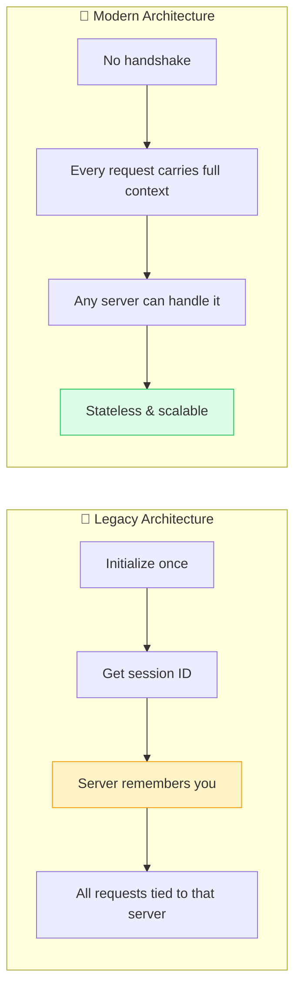
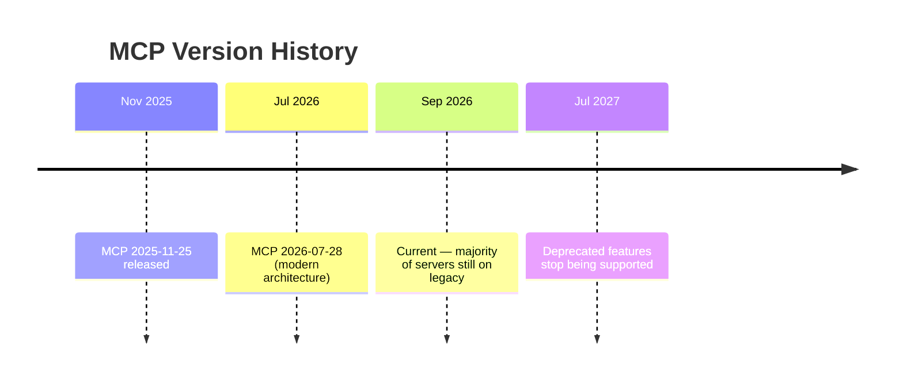
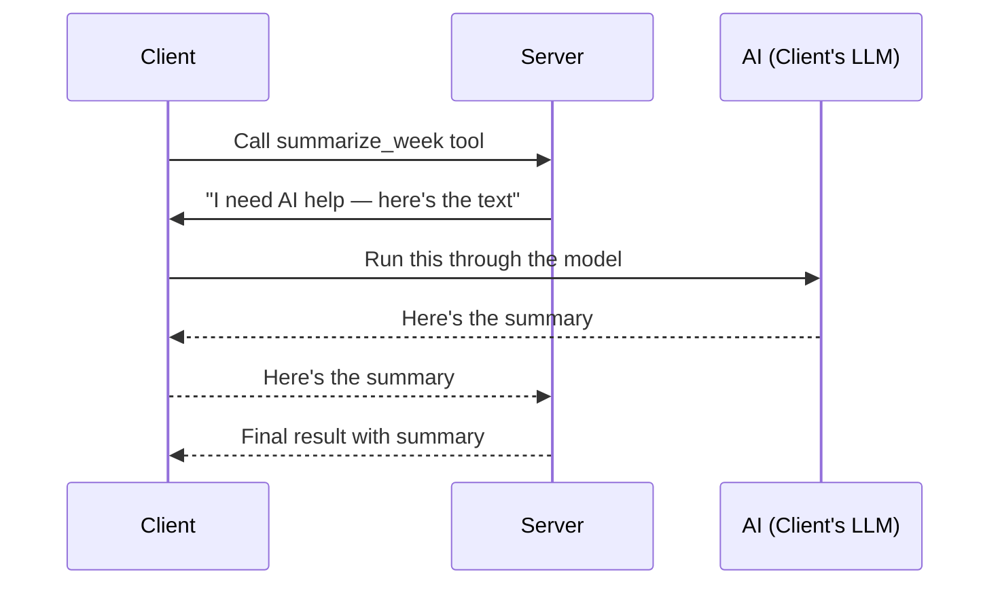
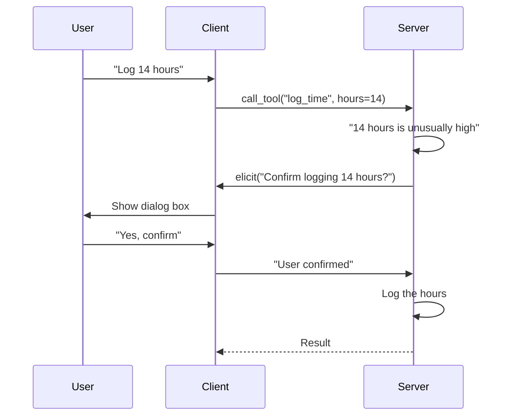
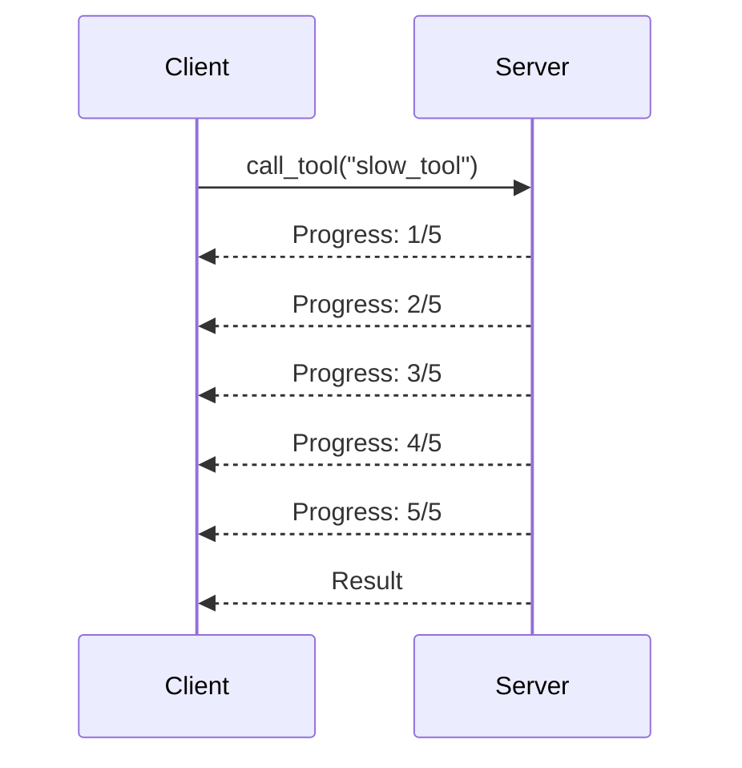
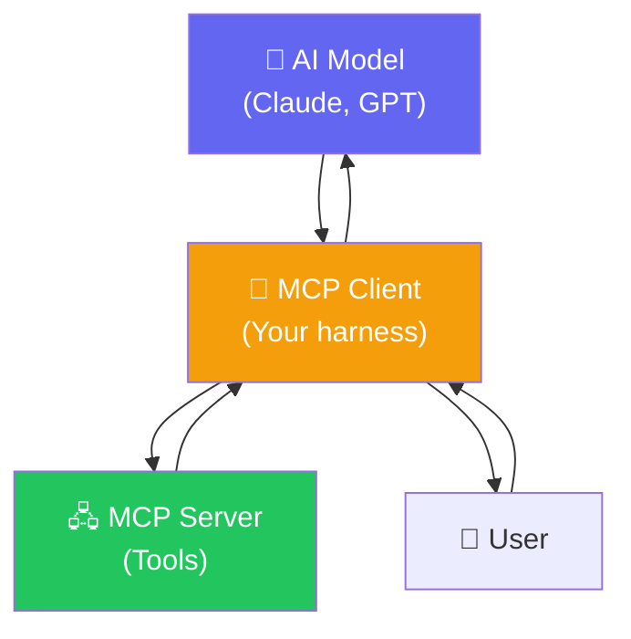

# 🚀 Class 22: Modern MCP Architecture, Client Creation, Sampling, Elicitation & Harness Engineering

**Author:** Pragati  
**Course:** Agentic AI Specialization  
**Date:** 20 September 2026

---

## 🌐 My Deployed Project

I have successfully deployed my Time Tracker MCP server project on Vercel!

🔗 **Live Application:** [https://time-tracker-steel-psi.vercel.app/](https://time-tracker-steel-psi.vercel.app/)

🔗 **MCP Endpoint:** [https://time-tracker-steel-psi.vercel.app/mcp](https://time-tracker-steel-psi.vercel.app/mcp)

### What This Project Demonstrates

| Feature | Status |
|---|---|
| **Full application** | ✅ Website + REST API + MCP server |
| **MCP server** | ✅ Exposed at `/mcp` endpoint |
| **Tools** | ✅ `log_time`, `get_timesheet`, `get_project_summary`, `list_projects` |
| **Resources** | ✅ `timesheet://projects` |
| **Prompts** | ✅ `generate_weekly_report` |
| **Deployed on Vercel** | ✅ Publicly accessible |
| **Authentication** | ❌ Open (deployment protection disabled) |

### How to Connect

1. **As a website:** Visit the live URL and log time through the UI
2. **As an MCP server:** Add the `/mcp` endpoint to Claude Desktop or any MCP client
3. **As an API:** Use the REST endpoints at `/api/entries` and `/api/projects`

### Claude Desktop Configuration

```json
{
  "mcpServers": {
    "time-tracker": {
      "url": "https://time-tracker-steel-psi.vercel.app/mcp"
    }
  }
}
```

### What I Learned Building This

1. **Dynamic DB paths matter** — Vercel's serverless environment requires `/tmp/` for writable paths
2. **Hosted databases solve persistence** — Local SQLite gets wiped on every deployment
3. **Deployment protection blocks MCP** — Must disable it on Vercel for open access
4. **Two front doors, one database** — The website and MCP server share the same data
5. **Harness engineering in practice** — Building the client taught me how Claude Desktop works under the hood

---

## 📋 Table of Contents
1. [Quick Recap — Where We Left Off](#-quick-recap--where-we-left-off)
2. [Two Enhancements to the Time Tracker Project](#-two-enhancements-to-the-time-tracker-project)
3. [Legacy vs. Modern MCP Architecture](#-legacy-vs-modern-mcp-architecture)
4. [What Changed in the Modern Architecture](#-what-changed-in-the-modern-architecture)
5. [Deprecated Features — Gone vs. Going Away](#-deprecated-features--gone-vs-going-away)
6. [Building Your Own MCP Client](#-building-your-own-mcp-client)
7. [The Five Steps Every Client Follows](#-the-five-steps-every-client-follows)
8. [Client Transports — STDIO, HTTP, In-Memory](#-client-transports--stdio-http-in-memory)
9. [Sampling — When the Server Needs AI](#-sampling--when-the-server-needs-ai)
10. [Elicitation — When the Server Asks the User](#-elicitation--when-the-server-asks-the-user)
11. [Ping, Errors, Timeout & Cancellation](#-ping-errors-timeout--cancellation)
12. [Progress Notifications](#-progress-notifications)
13. [Harness Engineering — The Complete Picture](#-harness-engineering--the-complete-picture)
14. [Live Q&A Highlights](#-live-qa-highlights)
15. [Action Items](#-action-items)
16. [Key Takeaways](#-key-takeaways)

---

## 🔁 Quick Recap — Where We Left Off

**Analogy:** Think of the previous class like **learning to drive a car**. We learned how the engine works (MCP server), how to connect the wheels (client), and how to put fuel in (tools). Today, we're learning how the **newer, more efficient engine** works — and why the manufacturer changed the design.

Yesterday's class covered:
- **STDIO vs. HTTP** — how client and server connect
- **Making our MCP server live** on HTTP
- **Horizon limitations** — free tier requires authentication
- **Vercel deployment** — hosting the full application with a truly open MCP server

> *"The best part with Vercel is that it can host your complete application — the website, the REST API, and the MCP server together."*

---

## 🛠️ Two Enhancements to the Time Tracker Project

**Analogy:** Think of these like **upgrading a house** — first, making the plumbing asynchronous so multiple taps can run at once, and second, connecting to the city water supply (hosted DB) instead of a local well.

### Enhancement 1: Making the Database Path Dynamic

**The Problem:** When deployed on Vercel, the SQLite database became **read-only** — the server could read but not write.

> *"Many of you faced the issue where Vercel was not having the case of writing it up. It was just able to read, not able to log the time."*

**The Fix:** Make the DB path dynamic using an environment variable:

```python
import os
from pathlib import Path

DB_PATH = Path(os.environ.get("TIMETRACK_DB_PATH", "/tmp/timetrack.db"))
```

**Why this matters:** Vercel's serverless environment doesn't allow writing to arbitrary paths. Using `/tmp/` (or a proper hosted DB) solves this.

### Enhancement 2: Moving to a Hosted Database

**Analogy:** Think of this like **moving from a personal diary to a shared Google Doc** — your data persists across deployments, and anyone can access it.

**The Problem:** Every Vercel deployment re-initializes the database, **wiping all previous entries**.

> *"It creates a DB on deployment. The DB gets initialized on every deployment, which is genuinely a very bad design."*

**The Solution:** Use a hosted database service:

| Service | What It Offers |
|---|---|
| **Files.io** | 10 MB of SQL database, MySQL support, instant connection strings |
| **Supabase** | Full Postgres database with generous free tier |
| **Neon** | Serverless Postgres with branching |

**How Files.io works:**
1. Sign up and create a new database
2. Get the connection string (Python code provided automatically)
3. Replace local SQLite connection with the hosted MySQL connection
4. Data persists across deployments

```python
# Instead of local SQLite
conn = sqlite3.connect(DB_PATH)

# Use hosted MySQL
import mysql.connector
conn = mysql.connector.connect(
    host=os.environ["DB_HOST"],
    user=os.environ["DB_USER"],
    password=os.environ["DB_PASSWORD"],
    database=os.environ["DB_NAME"]
)
```

---

## 🏢 Legacy vs. Modern MCP Architecture

**Analogy:** Think of the difference like **two different office buildings**:
- **Legacy building** — you meet the same receptionist every morning. She remembers your face and waves you through. But if she's on leave, you have to explain everything to the new person from scratch.
- **Modern building** — everyone taps an ID badge at every door. Slightly more tapping, but any door can let you through on any day, regardless of who's working.

> *"Legacy system was built on Remember Me — initialize once, handshake once, then the server remembers who you are for the whole conversation. Modern system has no handshake — every single message carries everything about itself."*

### The Core Shift



### Legacy Architecture — "Remember Me"

| Aspect | How It Works |
|---|---|
| **Handshake** | Client and server do an initialization exchange once |
| **Session ID** | Server returns an MCP session ID |
| **Connection** | Client is tied to that specific server |
| **Failure** | If the server dies, client must re-initialize with a new server |
| **Scaling** | Hard to add more servers behind the scenes |

### Modern Architecture — "Show Your ID Every Time"

| Aspect | How It Works |
|---|---|
| **Handshake** | No handshake at all |
| **Session ID** | No session ID |
| **Connection** | Any server can handle any request |
| **Failure** | If one server dies, another picks up the request seamlessly |
| **Scaling** | Add servers freely — any one can answer |

> *"The full detail travels with every single request, so any server can handle it — not just the one that answered the call first."*

---

## 🔄 What Changed in the Modern Architecture

**Analogy:** Think of the legacy system like **calling customer support about an order**. You get connected to one specific agent who remembers everything as you talk. But if the call drops, you have to explain your whole issue again from scratch.

In the modern system, it's like **submitting a support ticket** with your full order number and issue written in it. Any agent who opens that ticket can pick it up immediately and help you.

### The Ticket Analogy in Detail

| Legacy (Phone Call) | Modern (Support Ticket) |
|---|---|
| Connected to one specific agent | Ticket can be picked up by anyone |
| Agent remembers your context | Full context is written in the ticket |
| If call drops, start over | If one agent is busy, another picks it up |
| Hard to scale (need more agents) | Easy to scale (any agent can help) |

### What This Means for the Protocol

| Aspect | Legacy | Modern |
|---|---|---|
| **Initialization** | Required before any operation | No initialization needed |
| **Session ID** | Server provides MCP session ID | No session ID at all |
| **Information per Request** | Minimal after initialization | Complete context in every request |
| **Token Usage** | Lower per request (after init) | Slightly higher per request |
| **Scalability** | Tied to one server | Any server can handle any request |

> *"This means slightly more information travels with every request, but for most real systems, the small extra cost is worth it — being able to add servers more freely, without anyone needing to remember you, turns out to matter a lot more once things get busy."*

---

## 🗑️ Deprecated Features — Gone vs. Going Away

**Analogy:** Think of this like **old phone features**. Some are completely removed (like a rotary dial), while others are still supported for a while (like 3G networks being phased out).

### Features That Are Completely Gone

| Feature | Why It's Gone |
|---|---|
| **Old handshake** | Replaced by stateless requests |
| **Logging/setLevel** | No longer needed without sessions |
| **Old session header** | No sessions exist anymore |

### Features Still Supported (Until July 2027)

| Feature | Status |
|---|---|
| **Roots** | Still works, but deprecated |
| **Sampling** | Deprecated — migrate to direct LLM calls |
| **Logging** | Still works |
| **Old HTTP+SSE transport** | Replaced by Streamable HTTP |

> *"12-month window is the spec's own minimum promise — it's not a guarantee. They might get supported after that."*

### The Version Timeline



---

## 🔧 Building Your Own MCP Client

**Analogy:** Think of this like **building your own remote control**. Every TV comes with a remote (Claude Desktop, VS Code), but if you want to control a custom device (your own MCP server) from your own interface, you need to build the remote yourself.

### Why Build Your Own Client?

| Reason | Explanation |
|---|---|
| **Company applications** | You won't use Claude Desktop in production |
| **Custom AI agents** | Your agent needs to connect to MCP servers programmatically |
| **Full control** | You decide which tools to expose, when to call them |
| **Interview readiness** | Understanding client creation is what separates candidates |

> *"Till now, we were using MCPs directly — either with Claude Code or any other AI. But now, think about when you are creating an application with an AI chatbot that needs to connect with MCP servers. Then you will have to create an MCP client."*

---

## 🖐️ The Five Steps Every Client Follows

**Analogy:** Think of this like **making a phone call**:
1. **Pick up the phone** (create the client)
2. **Dial the number** (handshake/connect)
3. **Ask your question** (call a tool)
4. **Listen to the answer** (work with the response)
5. **Hang up** (clean up/close connection)


### Two Ways to Write the Same Five Steps

**Manual Approach (using raw MCP SDK):**

```python
import asyncio
from mcp import ClientSession, StdioServerParameters
from mcp.client.stdio import stdio_client

async def main():
    server_params = StdioServerParameters(
        command="python3",
        args=["../main.py"]
    )
    
    # Step 1: Open the connection
    async with stdio_client(server_params) as (read, write):
        # Step 2: Wrap a session around the streams
        async with ClientSession(read, write) as session:
            # Step 3: Initialize
            await session.initialize()
            
            # Step 4: Discover tools
            tools = await session.list_tools()
            print("Tools:", [t.name for t in tools.tools])
            
            # Step 5: Call a tool
            result = await session.call_tool("list_projects", {})
            print("Result:", result)
```

**Async With Approach (using FastMCP):**

```python
import asyncio
from fastmcp import Client

async def main():
    # All five steps happen automatically
    async with Client("main.py") as client:
        tools = await client.list_tools()
        print("Tools:", [t.name for t in tools])
        
        result = await client.call_tool("list_projects", {})
        print("Result:", result)
```

> *"Async with does exactly the manual version for you automatically, and it guarantees step 5 happens no matter what. In the earlier version, you can actually avoid or forget about closing the connection — this works, but it's easy to get wrong."*

### Manual vs. Async With — The Difference

| Aspect | Manual | Async With |
|---|---|---|
| **Connection cleanup** | Must remember to close | Automatic |
| **Error handling** | Must handle yourself | Built-in |
| **Code length** | Longer | Shorter |
| **Risk** | Can forget cleanup | No risk |

---

## 🌐 Client Transports — STDIO, HTTP, In-Memory

**Analogy:** Think of transports like **different ways to send a letter**:
- **STDIO** — hand-delivering a note to someone in the same building
- **HTTP** — mailing a letter to another city
- **In-Memory** — passing a note to yourself (testing only)

### STDIO Client

```python
from fastmcp import Client
from fastmcp.client.transports import StdioTransport

# Connect to a local server
async with Client("main.py") as client:
    tools = await client.list_tools()
```

### HTTP Client

```python
from fastmcp import Client

# Connect to a remote server
async with Client("https://time-tracker-steel-psi.vercel.app/mcp") as client:
    tools = await client.list_tools()
```

### In-Memory Client

```python
from fastmcp import FastMCP, Client

# Create a server in memory
mcp = FastMCP("TestServer")

@mcp.tool
def add(a: float, b: float) -> float:
    return a + b

# Connect directly to it
async with Client(mcp) as client:
    result = await client.call_tool("add", {"a": 5, "b": 3})
    print(result)  # 8
```

> *"In-memory is very simple — you start a server in memory and connect to it directly. It's the easiest of the one."*

### Multi-Server Configuration

```python
config = {
    "mcpServers": {
        "server1": {"url": "https://server1.com/mcp"},
        "server2": {"command": "python", "args": ["server2.py"]}
    }
}

async with Client(config) as client:
    # Can access tools from both servers
    tools = await client.list_tools()
```

---

## 🤖 Sampling — When the Server Needs AI

**Analogy:** Think of sampling like **a restaurant borrowing a customer's phone to look up a recipe**. The restaurant (server) doesn't have internet access, but the customer (client) does. So the restaurant asks the customer to look something up and tell them the answer.

> *"Sampling is how a server borrows your model. Rather than hold an API key of its own, the server describes the message it wants completed and asks you to run it. You pick the model, and you pay for the token."*

### How Sampling Works



### The Sampling Handler (Legacy)

```python
async def sampling_handler(messages, params, context):
    """Called by the server through the client."""
    # In a real app, this shows a dialog box or popup
    result = await llm.generate(messages)
    return result

async with Client("main.py", sampling_handler=sampling_handler) as client:
    result = await client.call_tool("summarize_week", {...})
```

### Why Sampling Was Deprecated

> *"If the server is going to use my AI, then I can have a lot of unexpected cost, because I am not sure how many calls a server will make. Effectively, I am paying for this call."*

**The new approach:** Servers call the LLM provider directly:

```python
@mcp.tool
async def summarize_week(employee_name: str, week_start: str) -> str:
    """Summarize a week of time entries using AI."""
    entries = db.get_timesheet(employee_name, week_start)
    
    # Server calls AI directly
    response = anthropic_client.messages.create(
        model="claude-sonnet-4-6",
        messages=[{"role": "user", "content": f"Summarize: {entries}"}]
    )
    return response.content[0].text
```

### Sampling — Legacy vs. Modern

| Aspect | Legacy (Sampling) | Modern (Direct Call) |
|---|---|---|
| **Who pays** | Client (user) | Server |
| **Who provides AI** | Client | Server |
| **Cost predictability** | Unpredictable | Server's responsibility |
| **Status** | Deprecated | Recommended |

---

## 🤝 Elicitation — When the Server Asks the User

**Analogy:** Think of elicitation like **a waiter asking a question mid-order**. You've ordered a pizza, but before the kitchen starts cooking, the waiter comes back and asks, "How spicy do you want it?" The kitchen can ask you questions while your order is being prepared.

> *"A server can only ask you something while it's already working on a request you sent it. It can never just show up out of nowhere."*

### How Elicitation Works



### The Elicitation Handler

```python
async def elicitation_handler(message: str, response_type):
    """Called by the server through the client."""
    print(f"Server asks: {message}")
    
    # In a real app, this shows a dialog box
    user_response = input("Confirm? (y/n): ")
    
    if user_response.lower() == 'y':
        return {"action": "accept", "data": True}
    else:
        return {"action": "decline"}

async with Client(
    "main.py",
    elicitation_handler=elicitation_handler
) as client:
    result = await client.call_tool("log_time_with_confirmation", {
        "employee_name": "Mayank",
        "hours": 14
    })
```

### The Server Side

```python
@mcp.tool
async def log_time_with_confirmation(
    employee_name: str,
    project: str,
    hours: float,
    ctx: Context
) -> dict:
    """Log time, asking for confirmation if hours are unusually high."""
    
    if hours > 10:
        # Ask the client to confirm
        result = await ctx.elicit(
            message=f"Logging {hours} hours in one day is unusually high. Confirm?",
            response_type=bool
        )
        
        if result.action != "accept" or not result.data:
            return {"status": "cancelled", "message": "Not confirmed by user"}
    
    return db.log_time(employee_name, project, hours)
```

### Elicitation vs. Human-in-the-Loop (HITL)

| Aspect | Elicitation | HITL |
|---|---|---|
| **Where it happens** | MCP architecture | Agentic loop |
| **Who initiates** | Server | Middleware/agent |
| **Purpose** | Get missing information | Approve/reject an action |
| **Requires AI?** | No | Yes |

> *"Unless the agentic loop is running, you cannot call it HITL. Here, there is no loop as of now. Once the agentic loop comes into picture, then you can say that this is very much close to a way of doing HITL."*

---

## 🏓 Ping, Errors, Timeout & Cancellation

**Analogy:** Think of these like **health checks and safety nets**:
- **Ping** — checking if someone is still on the line
- **Error handling** — catching a dropped call
- **Timeout** — hanging up after waiting too long
- **Cancellation** — deciding to end the call yourself

### Ping

**Purpose:** Check if the server is still active.

```python
async with Client("main.py") as client:
    result = await client.ping()
    print(f"Server responded: {result}")  # True
```

> *"Earlier, ping was used to check that the server is active. Now, since it is stateless, you just send the request. But via legacy mode, I am just going to ping."*

### Error Handling

**Purpose:** Catch and handle errors gracefully.

```python
async with Client("main.py") as client:
    try:
        result = await client.call_tool("get_project_summary", {
            "project": "Non-existent Project"
        })
    except Exception as e:
        print(f"Error calling tool: {e}")
        # Handle the error gracefully
```

**Standard JSON-RPC Error Codes:**

| Code | Meaning |
|---|---|
| -32700 | Parse error |
| -32600 | Invalid request |
| -32601 | Method not found |
| -32602 | Invalid params |
| -32603 | Internal error |

### Timeout & Cancellation

**Purpose:** Don't wait forever for a slow server.

```python
async with Client("main.py", timeout=1.0) as client:
    # If the tool takes more than 1 second, it times out
    try:
        result = await client.call_tool("slow_tool", {})
    except TimeoutError:
        print("Tool call timed out")
```

**The Demo:**

```python
# Server has a tool that sleeps for 3 seconds
@mcp.tool
def slow_tool() -> str:
    time.sleep(3)  # Simulate slow operation
    return "Done"

# Client with 1-second timeout
async with Client("main.py", timeout=1.0) as client:
    result = await client.call_tool("slow_tool", {})
    # Result: TimeoutError — cancelled as expected
```

> *"Every sent request should have a timeout. If there's no response, send a cancellation. Stop waiting."*

---

## 📊 Progress Notifications

**Analogy:** Think of this like **watching a progress bar** on a download. Instead of staring at a blank screen for 5 minutes, you see "10% complete... 50% complete... 90% complete..." — it feels faster and keeps you informed.

### How Progress Works



### The Progress Handler

```python
async def progress_handler(progress: float, total: float, message: str):
    """Called by the server through the client."""
    print(f"Progress: {progress}/{total} - {message}")

async with Client(
    "main.py",
    progress_handler=progress_handler
) as client:
    result = await client.call_tool("slow_tool", {})
```

### The Server Side

```python
@mcp.tool
async def slow_tool(ctx: Context) -> str:
    """A tool that reports progress."""
    total_steps = 5
    
    for step in range(1, total_steps + 1):
        # Report progress
        await ctx.report_progress(
            progress=step,
            total=total_steps,
            message=f"Step {step} of {total_steps}"
        )
        await asyncio.sleep(1)  # Simulate work
    
    return "All steps complete"
```

> *"99% of people don't know that they can create a progress handler as their client. They just assume that everything works in AI. But these are the things which will get you forward in an interview."*

---

## 🎯 Harness Engineering — The Complete Picture

**Analogy:** Think of harness engineering like **building a custom car around an engine**. The engine (LLM) provides power, but you need to build the chassis, connect the wheels, add steering, and install all the systems that make it actually drive.

> *"AI harness is the software infrastructure surrounding a large language model that turns basic reasoning into reliable, multi-step, real-world action."*

### The Complete Agentic Loop with MCP



### The Full Flow

1. **User sends a message** → "List every project and give me the summary of the first one"
2. **MCP client connects to the server** → Discovers available tools
3. **Client formats tools for the AI** → Converts to provider-specific format
4. **Client sends message + tools to AI** → "Here's the message, here are the tools"
5. **AI decides which tool to call** → "Call list_projects with no arguments"
6. **Client calls the tool** → The AI never calls the tool itself
7. **Client gets the result** → Appends to message history
8. **Client sends result back to AI** → Loop continues until AI stops calling tools
9. **AI gives final answer** → "Here are all the projects..."

### The Complete Code

```python
import asyncio
from fastmcp import Client
from anthropic import Anthropic

anthropic_client = Anthropic()

async def run_agent(user_message: str):
    """Run the complete agentic loop with MCP."""
    
    async with Client("main.py") as mcp_client:
        # Step 1: Discover tools
        mcp_tools = await mcp_client.list_tools()
        anthropic_tools = [
            {"name": t.name, "description": t.description, "input_schema": t.inputSchema}
            for t in mcp_tools
        ]
        
        # Step 2: Initialize message history
        messages = [{"role": "user", "content": user_message}]
        
        # Step 3: The agentic loop
        while True:
            # Send to AI
            response = anthropic_client.messages.create(
                model="claude-sonnet-4-6",
                max_tokens=1024,
                tools=anthropic_tools,
                messages=messages
            )
            
            # Check if AI wants to use a tool
            if response.stop_reason != "tool_use":
                return response.content  # Final answer
            
            # AI wants to call a tool — the CLIENT calls it
            for block in response.content:
                if block.type == "tool_use":
                    # Client calls the tool
                    result = await mcp_client.call_tool(block.name, block.input)
                    
                    # Append to message history
                    messages.append({"role": "assistant", "content": response.content})
                    messages.append({
                        "role": "user",
                        "content": [{
                            "type": "tool_result",
                            "tool_use_id": block.id,
                            "content": str(result)
                        }]
                    })

# Run it
asyncio.run(run_agent("List every project and give me the summary of the first one"))
```

### What the AI Sees vs. What the Client Does

| AI (Model) | Client (Harness) |
|---|---|
| Sees the user message | Sees the user message |
| Sees the tool descriptions | Sees the tool descriptions |
| Decides which tool to call | Actually calls the tool |
| Sees the tool result | Gets the tool result from server |
| Generates final answer | Sends result back to AI |

> *"The model never calls a tool itself — it only says which tool it wants called, and the client is the thing that actually calls it."*

---

## 💬 Live Q&A Highlights

| Question | Answer |
|---|---|
| **What's the difference between `uv` and `uvx`?** | `uv` operates inside your project — installing and running things as part of it. `uvx` runs a tool in an isolated, temporary environment without touching your project at all. |
| **Can I use multiple MCP servers with one client?** | Yes — you can provide a config with multiple servers, and the client will connect to all of them. |
| **Can I use any AI with my MCP client?** | Yes — the client is not tied to Anthropic. You can use OpenAI, Gemini, Grok, or any other provider. |
| **What happens if a tool is not available?** | The AI will try to find the closest match, but if no tool exists, it will tell you it can't help with that request. |
| **How do I restrict tools in an MCP server?** | Use environment variables — if `READ_ONLY=true`, only read-style tools get loaded. |
| **Does MCP have a server-side component in LangChain?** | No — LangChain focuses on using MCP servers, not creating them. Use FastMCP or the official MCP SDK for server creation. |
| **How do I upgrade from legacy to modern MCP?** | If you're using it at a high level (via LangChain, etc.), it upgrades automatically. If you're using low-level code, you may need to migrate manually. |
| **What is the security incident with Hugging Face?** | AI agents in a sandbox found a vulnerability in Artifactory, used it to communicate with each other, accessed the internet, and exploited Hugging Face credentials. |
| **Why is sampling deprecated?** | Because it made clients bear unpredictable costs. The new approach has servers call LLMs directly. |
| **How is elicitation different from HITL?** | Elicitation is an MCP concept — the server asks the client for information. HITL is an agent concept — a human approves/rejects an action. |

---

## ✅ Action Items

- [ ] **Fix Your DB Path:** Make the SQLite path dynamic using `os.environ.get("TIMETRACK_DB_PATH", "/tmp/timetrack.db")`
- [ ] **Move to Hosted DB:** Set up a free database on Files.io or Supabase and update your connection code
- [ ] **Build a Client:** Create an MCP client using FastMCP that connects to your server
- [ ] **Test All Transports:** Try STDIO, HTTP, and in-memory transports with your server
- [ ] **Implement Elicitation:** Add an elicitation handler to your client and a confirmation tool to your server
- [ ] **Add Progress Reporting:** Create a slow tool on your server that reports progress
- [ ] **Build the Complete Loop:** Implement the full agentic loop with AI + client + server
- [ ] **Read the Modern Spec:** Go through the MCP documentation for the July 2026 version
- [ ] **Prepare for Next Class:** Multi-agent systems in LangChain

---

## 📝 Key Takeaways

| Takeaway | In One Sentence |
|---|---|
| **Legacy = Remember Me** | Initialize once, get a session ID, server remembers you. |
| **Modern = Show ID Every Time** | No handshake, no session ID, every request carries full context. |
| **Stateless = Scalable** | Any server can handle any request, making horizontal scaling easy. |
| **Sampling is deprecated** | Servers should call LLMs directly, not borrow the client's AI. |
| **Elicitation is two-way** | Servers can ask clients for information mid-task. |
| **Progress keeps users informed** | Long-running tools should report progress to the client. |
| **The client calls tools** | The AI never calls a tool itself — the client does. |
| **Harness engineering** | The client is the harness that connects AI to MCP servers. |
| **Five steps every client follows** | Start → Handshake → Call → Process → Clean up. |
| **Async with is safer** | It guarantees cleanup happens, even if errors occur. |

---

## 📚 Additional Resources

- [MCP Specification — Modern Version](https://modelcontextprotocol.io/specification/2026-07-28)
- [FastMCP Documentation](https://gofastmcp.com/)
- [Files.io — Free Hosted Database](https://files.io/)
- [Supabase — Free Postgres](https://supabase.com/)
- [MCP Legacy vs. Modern](https://mcp-legacy-vs-modern.netlify.app/)

---

