# 🛡️ Pydantic Deep Dive + AI Foundations — Complete Guide with Analogies

**Author:** Pragati  
**Course:** Agentic AI Specialization  
**Date:** 4 July 2026

---

## 📋 Table of Contents
1. [Why Pydantic Exists — The Deeper Case](#-why-pydantic-exists--the-deeper-case)
2. [Three Ways to Define a "Blueprint" in Python](#-three-ways-to-define-a-blueprint-in-python)
3. [Optional Fields & Defaults](#-optional-fields--defaults)
4. [Automatic Type Coercion — Pydantic's "Being Reasonable" Mode](#-automatic-type-coercion--pydantics-being-reasonable-mode)
5. [Field() — Data Validation, Not Just Type Validation](#-field--data-validation-not-just-type-validation)
6. [field_validator vs. model_validator](#-field_validator-vs-model_validator)
7. [Nested Models](#-nested-models)
8. [AI Foundations — The "21 Terms Everyone Should Know"](#-ai-foundations--the-21-terms-everyone-should-know)
   - [1. LLM (Large Language Model)](#1-llm-large-language-model)
   - [2. Tokens — "The Currency of AI"](#2-tokens--the-currency-of-ai)
   - [3. Vector Embeddings](#3-vector-embeddings)
   - [4. Context Window](#4-context-window)
   - [5. Parameters](#5-parameters)
9. [Where This Leaves You](#-where-this-leaves-you)
10. [Live Q&A Highlights](#-live-qa-highlights)
11. [Action Items](#-action-items)
12. [Key Takeaways](#-key-takeaways)

---

## 🤔 Why Pydantic Exists — The Deeper Case

**Analogy:** Think of Pydantic like a **bouncer at an exclusive club**. The bouncer checks everyone's ID, age, and dress code before they enter. If someone's ID is fake, they're too young, or they're not dressed appropriately, the bouncer stops them. Pydantic does the same for your data — it checks every piece of information before it enters your system.

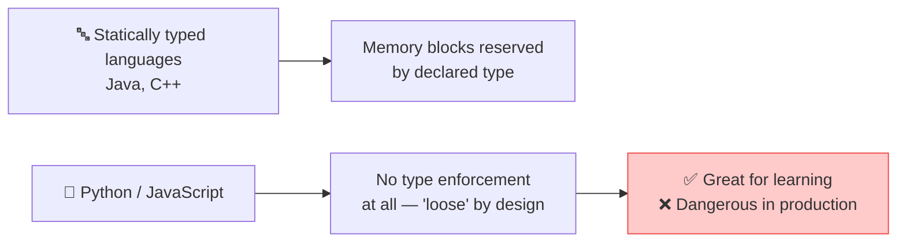

- Python stores a variable as a **pointer to a location** holding the value — not a fixed-size memory block like C++/Java. That's *why* it can freely reassign a variable from `int` to `string` to `list` with zero complaints
- 🏢 **Where this bites you:** production systems, real user input, anywhere "someone might try to break your system." Good data flows fine; bad/malicious data silently corrupts things — e.g., wrong types crash string/number operations downstream
- 🌍 **Industry proof:** Anthropic's SDK, OpenAI's Chat Completions API, NVIDIA, Google, Adobe, Amazon — Pydantic's own docs list major companies relying on it. It's a **PyPI top-download library**

> 💬 *"Do you think that because Swiggy/Zomato exist, we don't need to know how to cook? Same with AI writing your code — if you don't understand Pydantic, you can't debug or trust the code AI hands you."*

---

## 🧱 Three Ways to Define a "Blueprint" in Python

**Analogy:** Think of these three approaches like **different ways to build a house**:
1. **Plain class** — like building a house from raw materials without a blueprint. You can do it, but it's easy to make mistakes.
2. **@dataclass** — like using a pre-designed house plan. It helps, but you still need to check everything yourself.
3. **Pydantic BaseModel** — like having an inspector who checks every single measurement, material, and safety requirement before you start building.

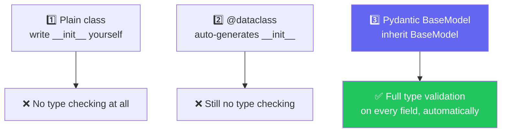

```python
from pydantic import BaseModel

class UserModel(BaseModel):
    name: str
    email: str
    age: int

user = UserModel(name="Mayank", age="not-a-number")  # ❌ ValidationError, instantly
```

> 💡 Live demo confirmed: a plain class and a `@dataclass` both **silently accepted garbage data** (e.g., `age="banana"`). Only `BaseModel` raised an error immediately.

---

## 🎛️ Optional Fields & Defaults

**Analogy:** Think of optional fields like **optional toppings on a pizza**. If you don't specify extra cheese, the pizza still comes with the default amount. If you don't specify a field, Pydantic uses the default value.

```python
class SignupForm(BaseModel):
    name: str
    age: int
    is_interested: bool = False   # default value → makes it optional
    nationality: str | None = None  # unknown default → use None
```

- Giving a field a **default value** is what makes it optional — otherwise every field is required
- If you don't know the right default, use Python's `None` (capital N — there's no `null` in Python)

---

## 🔄 Automatic Type Coercion — Pydantic's "Being Reasonable" Mode

**Analogy:** Think of this like **ordering at a restaurant**. If you order "one sandwich" but actually want "two sandwiches," the kitchen will make two. But if you order "purple sandwich," they'll tell you it doesn't exist. Pydantic is similarly reasonable — it converts "28" (string) to 28 (int), but draws the line at "28eight" or 28.5 into an int field.

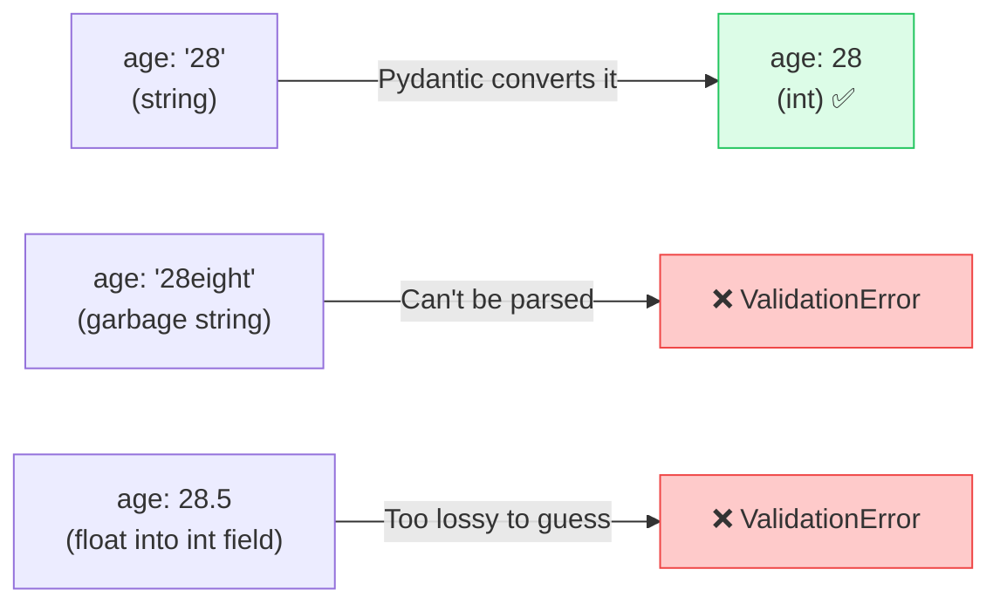

> Pydantic will forgive a *reasonable* type mismatch (a numeric string → int) but draws the line at genuinely ambiguous or lossy conversions.

---

## 📏 `Field()` — Data Validation, Not Just Type Validation

**Analogy:** Think of `Field()` like **specific requirements for a job application**. Type validation confirms you have a degree (what kind of data), but data validation confirms the degree is from an accredited university, with a minimum GPA, and not from a diploma mill (the value itself makes sense).

Type validation confirms *what kind* of data you got. **Data validation** confirms the *value itself* makes sense (age of 1000? not valid, even though it's technically an int).

```python
from pydantic import BaseModel, Field

class JobApplication(BaseModel):
    full_name: str = Field(min_length=2, max_length=100)
    years_experience: int = Field(gt=0, le=50)
    portfolio_url: str
```

- Two equivalent syntaxes exist: `Field(...)` vs. `Annotated[...]` — the **plain `Field()`** style is preferred for readability
- Built-in special types save you from writing your own regex:
  - `EmailStr` → validates real email format (requires `email-validator` package)
  - `HttpUrl` → validates URLs
  - `SecretStr` → **masks sensitive values** like API keys/passwords in logs/output

---

## 🧭 field_validator vs. model_validator

**Analogy:** Think of field validators like **single-item quality control** at a factory — each part is checked individually. Model validators are like **final assembly inspection** — once all the parts are put together, you check if the whole product works.

### The Problem
> *"If someone applies from an `@infosys.com` email, they need at least 5 years experience." Can a single-field validator handle that?*

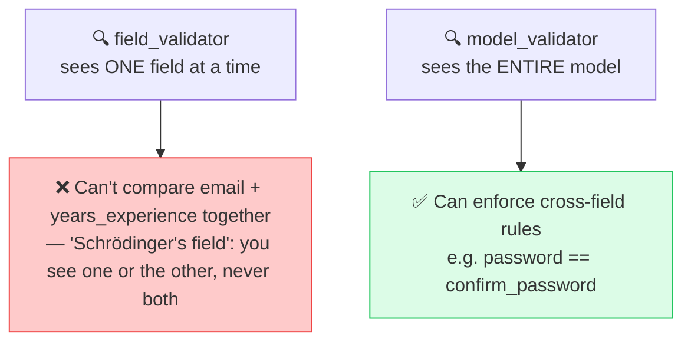

```python
from pydantic import field_validator, model_validator

class SignupForm(BaseModel):
    password: str
    confirm_password: str

    @field_validator("password")
    @classmethod
    def check_length(cls, value):
        if len(value) < 8:
            raise ValueError("Password must be at least 8 characters")
        return value

    @model_validator(mode="after")
    def check_passwords_match(self):
        if self.password != self.confirm_password:
            raise ValueError("Passwords do not match")
        return self
```

⚙️ **Execution order is fixed:** every `field_validator` runs first (per field) → *then* `model_validator` runs on the fully-validated object.

---

## 🪆 Nested Models

**Analogy:** Think of nested models like **a package inside a package**. You have a shipping box (the main model) that contains a smaller gift box (the nested model). Pydantic validates both boxes — the outer and inner contents.

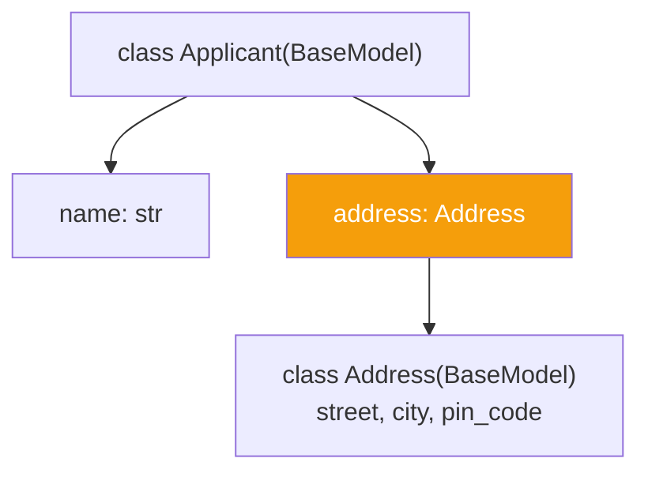

- A Pydantic model can contain another Pydantic model as a field type — mirrors **nested JSON** (a JSON object inside a JSON object), which is exactly the shape of most real-world API payloads and LLM structured outputs

---

## 🧠 AI Foundations — The "21 Terms Everyone Should Know"

> *"These aren't deep-dive lessons yet — think of these as the vocabulary you need before we build our first agent tomorrow."*

### 1. LLM (Large Language Model)

**Analogy:** Think of an LLM like a **friend who's read every book ever published** but was never told what any of it means. They've just seen "thank you for" followed by "your business" millions of times, so they continue it — they're doing pattern completion, not understanding.

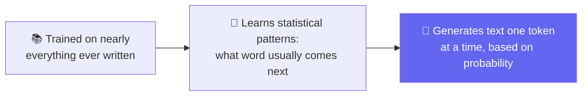

- ChatGPT, Claude, Gemini = **LLMs**
- OpenAI/Anthropic/Google = **LLM providers**
- Technically: an LLM predicts the next **token**, not the next word

### 2. Tokens — "The Currency of AI"

**Analogy:** Think of tokens like **Lego bricks**. You don't build with whole words — you build with smaller pieces. "Unbelievable" might split into 3 tokens: "un," "believ," "able." And like Lego bricks, you're charged for each one you use.

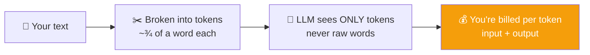

- **Output tokens always cost more than input tokens** — because the model has to *think and generate*, not just receive
- A token ≈ a "Lego brick," not a full word

### 3. Vector Embeddings

**Analogy:** Think of vector embeddings like a **map of word relationships**. "Dog" and "puppy" are near each other on the map because they're related. "Happy" is far away from both. The map doesn't tell you what the words mean — it just shows you where they sit relative to each other.

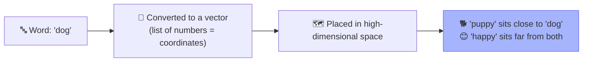

- Words with similar meaning end up **close together** in this space; unrelated words end up far apart
- ⚠️ Not unique to AI — this comes from classic **NLP (Natural Language Processing)**

### 4. Context Window

**Analogy:** Think of the context window like a **whiteboard in a meeting room**. You can write notes, draw diagrams, and brainstorm — but the whiteboard is only so big. Once it's full, you have to erase the oldest content to make room for new ideas. The AI's context window works the same way.

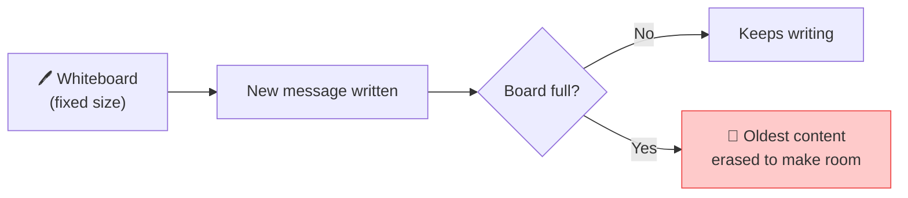

- E.g., a "400K context window" model can hold ~400,000 tokens of conversation/documents before older content starts getting dropped
- **Not the same as memory** — memory is a separate, persistent mechanism; context window is just the model's live "whiteboard"

### 5. Parameters

**Analogy:** Think of parameters like **billions of tiny sliders on a giant mixing console**. Each slider was nudged a fraction of a millimeter during training. You can't point to "the slider that knows Paris is in France" — the magic is in the combination of all sliders together.

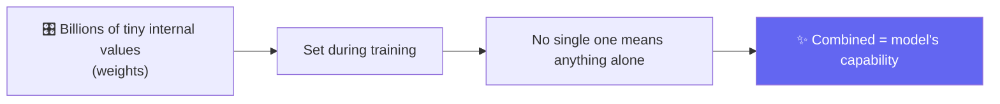

- **Parameters ≠ Tokens**: parameters are fixed at training time (e.g., "1.7 trillion parameters"); tokens are what flows in/out every time you *use* the model
- More parameters ≈ more potential capability, but **never a guarantee** of a better answer on any single query

---

## 🗺️ Where This Leaves You

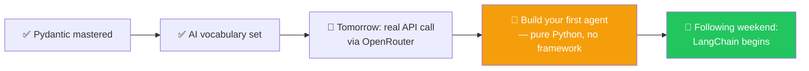

---

## 💬 Live Q&A Highlights

| Question | Answer |
|---|---|
| **Can I extend/reuse a Pydantic model's validators across classes (like Java extension methods)?** | Yes — standard Python inheritance works: `class Address(BaseModel)`, then `class Applicant(Address)` inherits its fields/validators |
| **Can `field_validator` be a `@staticmethod`?** | Technically possible, but stay consistent — use Pydantic's own patterns (`@classmethod` + `@field_validator`) rather than mixing approaches |
| **Difference between "parameters" and "tokens"?** | Parameters = fixed internal weights set during training; tokens = the live currency of input/output when you *use* the model |
| **Can vector embeddings have any number of dimensions?** | Yes — dimension count is a design choice you make (e.g., 200D); more dimensions = better semantic separation but higher hardware cost |
| **Is a "dimension" like a category (e.g., 7 colors)?** | No — dimensions aren't hand-labeled categories; they're a mathematical space size you choose before training/plotting |
| **Why does Pydantic exist when Python already has type hints?** | Type hints are just annotations — they don't enforce anything at runtime. Pydantic actually checks the values and raises errors if they're wrong. |
| **Can I use Pydantic with FastAPI?** | Yes — FastAPI uses Pydantic models for request/response validation automatically |
| **Is Pydantic only for API validation?** | No — it's used for configuration, data parsing, database models (with SQLAlchemy integration), and LLM structured output |

---

## ✅ Action Items

- [ ] **Define a Model:** Re-practice defining a `BaseModel` with `Field()` constraints (min/max length, gt/le) from scratch
- [ ] **Write Validators:** Write a `field_validator` and a `model_validator` from memory — know *why* each exists
- [ ] **Nested Models:** Practice a nested Pydantic model (e.g., `Applicant` containing `Address`)
- [ ] **Revise AI Terms:** Revise the 5 AI foundation terms — **LLM, Token, Vector Embedding, Context Window, Parameters** — know them cold
- [ ] **Review Code:** Review today's GitHub code before the next session
- [ ] **Preparation:** Come back ready for building a real OpenRouter API call + first pure-Python agent

---

## 📝 Key Takeaways

1. **Pydantic is the bouncer for your data** — it checks everything before it enters your system
2. **Type hints alone don't enforce anything** — Pydantic is what makes validation real
3. **Three ways to define blueprints** — plain class (no validation), dataclass (no validation), BaseModel (full validation)
4. **Optional fields = defaults** — giving a field a default makes it optional
5. **Pydantic is reasonable** — converts "28" to 28, but rejects "28eight"
6. **field_validator sees one field** — model_validator sees the whole model
7. **Nested models mirror nested JSON** — a model can contain another model
8. **LLM = pattern completion** — predicts the next token based on statistical patterns
9. **Tokens = currency of AI** — you pay for input + output tokens
10. **Vector embeddings = word maps** — similar words sit close together
11. **Context window = whiteboard** — limited space, older content falls off
12. **Parameters = internal sliders** — set during training, never change during use

---

## 📚 Additional Resources

- [Pydantic Documentation](https://docs.pydantic.dev/)
- [Pydantic Field Types](https://docs.pydantic.dev/latest/api/fields/)
- [Pydantic Validators](https://docs.pydantic.dev/latest/concepts/validators/)
- [OpenAI Tokens Counting](https://platform.openai.com/tokenizer)
- [Anthropic Claude Documentation](https://docs.anthropic.com/)

---

