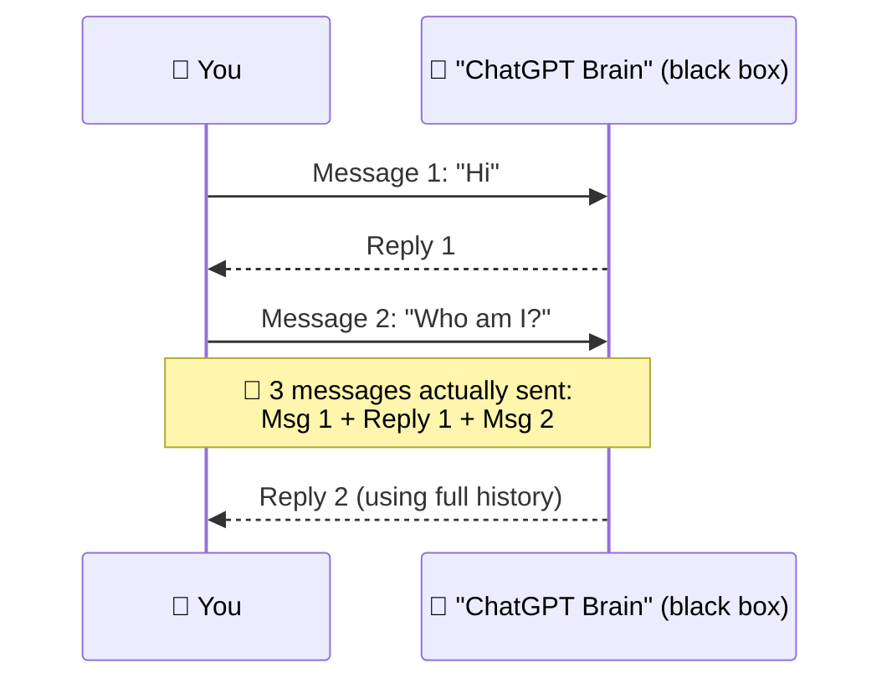
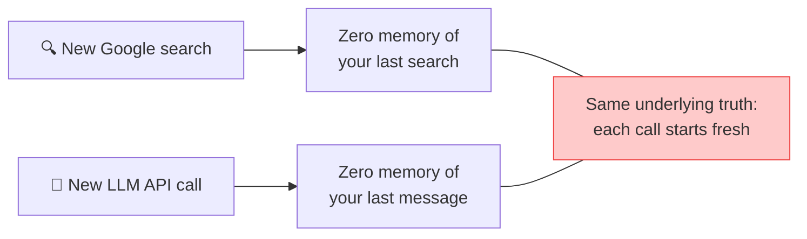
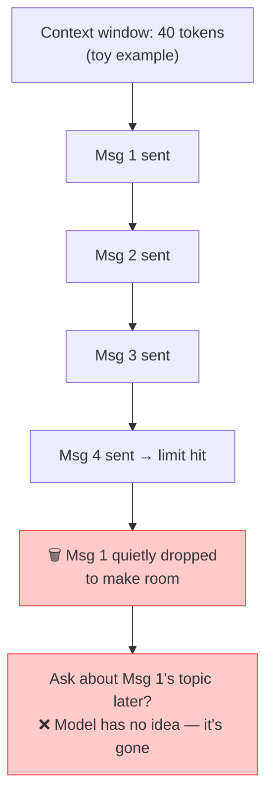
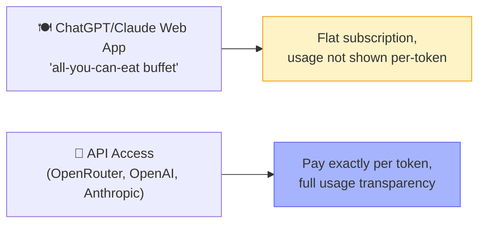
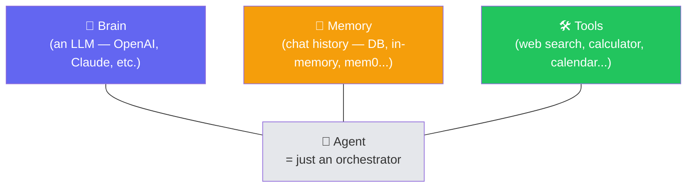
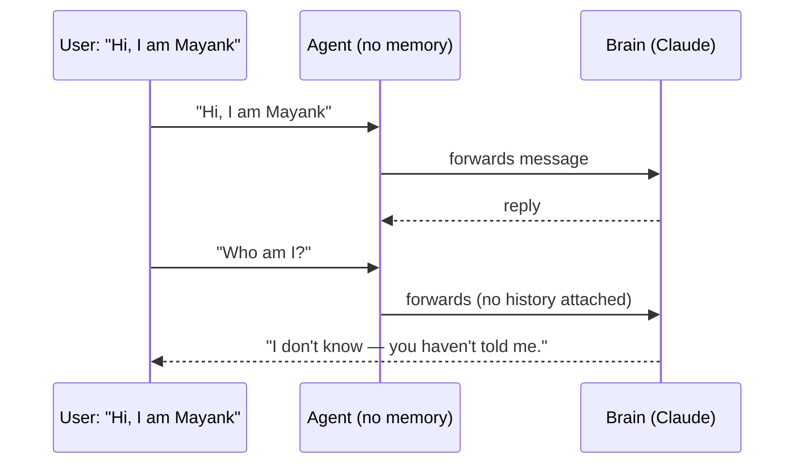
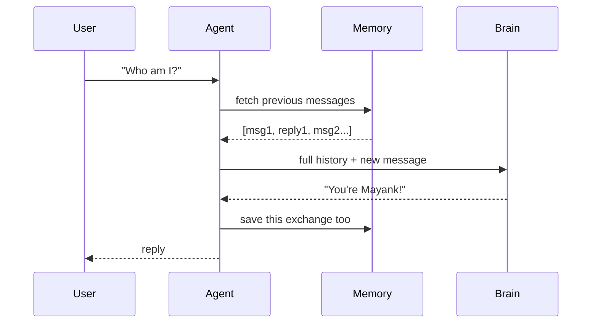
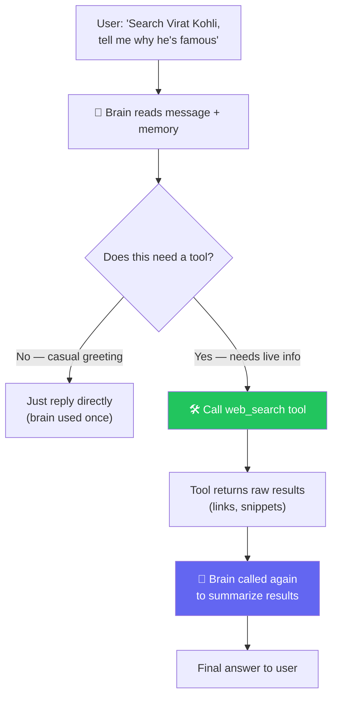
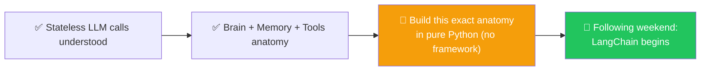

# 🤖 LLMs Are Stateless & The Anatomy of an Agent

**Author:** Pragati
**Course:** Agentic AI Specialization
**Date:** 5 July 2026

---

## 📋 Table of Contents
1. [Quick Recap](#-quick-recap)
2. [The Most Important Idea Today — LLM Calls Are Stateless](#-the-most-important-idea-today--llm-calls-are-stateless)
3. [Web App vs. API — "The Buffet vs. À La Carte"](#-web-app-vs-api--the-buffet-vs-à-la-carte)
4. [The Anatomy of an Agent — Brain, Memory, Tools](#-the-anatomy-of-an-agent--brain-memory-tools)
5. [Where This Leaves You](#-where-this-leaves-you)
6. [Live Q&A Highlights](#-live-qa-highlights)
7. [Action Items](#-action-items)
8. [Key Takeaways](#-key-takeaways)

---

## 🔁 Quick Recap of Class 3

- ✅ **Pydantic** — why it exists, `BaseModel`, `Field()` constraints, `field_validator` vs `model_validator`, nested models
- ✅ **AI vocabulary** — LLM, Tokens, Vector Embeddings, Context Window, Parameters

> 💬 *"You never remember code — you understand concepts. Thanks to AI, syntax is cheap to look up; understanding *why* is what makes you valuable."*

---

## 🧠 The Most Important Idea Today — LLM Calls Are Stateless

**Analogy:** Think of an AI model like a **brilliant person with amnesia**. Every time you ask them a question, it's like they're meeting you for the first time. They don't remember anything you said before, and they don't remember anything they said before. Each conversation starts completely fresh.

### 🎯 Setting It Up
> *"When I send ChatGPT a message, does it just go to a 'brain' sitting on a server, and I get a reply?"*

### 💡 The Core Insight

> **"AI, LLM, ChatGPT, Claude — every single time, you give it an input and it gives you an output. It doesn't remember anything on its own."**

- This is why the term **"stateless"** applies: the model holds no internal state between calls
- What *looks* like memory in a ChatGPT/Claude conversation is really: **the entire chat history gets resent with every single message**
- 🔬 **Live proof:** a Claude session where a single "hi" ballooned to **35,000+ tokens** due to hidden system prompts/MCP context, with token counts climbing steadily as the conversation grew

### 🖊️ Why This Explains "AI Getting Dumb" in Long Chats

**Analogy:** Think of the context window like a **whiteboard in a meeting room**. You can write notes, draw diagrams, and brainstorm — but the whiteboard is only so big. Once it's full, you have to erase the oldest content to make room for new ideas. The AI's context window works the same way.

- Live-demoed with a small custom tool: set context window to 40 tokens, watched earlier messages visibly **gray out** as new ones pushed them out
- This is *exactly* why long conversations get slow, expensive, and forgetful — every single turn resends everything still "in view"
- Practical takeaway: **starting a new chat** isn't just tidiness — it resets the resent-history cost to zero

---

## 🌐 Web App vs. API — "The Buffet vs. À La Carte"

**Analogy:** Think of the web app like an **all-you-can-eat buffet** — you pay one price and eat as much as you want, but you have no idea how much each plate costs. The API is like **à la carte dining** — you pay exactly for what you order, and you see every item's price on the bill.

> *"Companies want you locked into the web app — more people using their model, more stickiness. But when you're building software, you need the API."*

### 🛠️ Live Demo: OpenRouter
- **OpenRouter** = one place to access models from **every** major provider (OpenAI, Anthropic, Google, Mistral, etc.) with a single API key
- Walked through: create an API key → free-tier model → hit the endpoint → confirm the response and **exact token breakdown** (input/output) in the dashboard
- 🎯 Reinforces: tokens are the literal unit you're billed on — visible and countable, unlike the "unlimited-feeling" web app

---

## 🏗️ The Anatomy of an Agent — Brain, Memory, Tools

**Analogy:** Think of an agent like **hiring an intern**:
- **Brain** = The intern's intelligence (how smart they are)
- **Memory** = The intern's notebook (what they've been told)
- **Tools** = The intern's equipment (phone, calculator, internet access)

> *"Once you understand this without any framework or code, LangChain, LangGraph, CrewAI — all of it — becomes trivially easy. They're all doing exactly this, nothing more."*

### 🧠 The Intern Analogy
> *"Think of an agent as hiring an intern. Give them a laptop with no skills (a weak brain) and they can't do much. Give them a great brain but no tools, and they still can't act in the world. The agent itself has zero intelligence — it's just code moving data between the brain, memory, and tools."*

- A weak/cheap model as the "brain" will **fail on complex tasks** — the brain's capability is a hard ceiling on what the agent can do
- **The agent is not smart.** Only the brain (LLM) makes decisions. The agent code is plumbing.

### 🔴 Live Demo — Step by Step

**Step 1 — Brain only, no memory:**

❌ Fails — no memory means no continuity, even in the *same* session.

**Step 2 — Add memory:**

✅ Now it "remembers" — but the brain is hit **once**, memory is read/written around it.

**Step 3 — Add tools (calculator + web search):**

- Each tool has a **description** — this description is what gets sent to the brain so it knows the tool exists and what it's for
- 🔑 **Key realization:** the brain decides *whether* to use a tool at all. A casual "hi" → no tool call. A factual question → tool call, then a second brain call to summarize the raw results

---

## 🗺️ Where This Leaves You

> *"Once your basics are this clear, frameworks like LangChain will feel almost too easy — because you'll recognize they're doing exactly what we just did by hand."*

---

## 💬 Live Q&A Highlights

| Question | Answer |
|---|---|
| **Does GitHub Copilot / Claude send our company's private repo code to a shared external database?** | No — providers don't pool/store your code in some central shared repo across companies |
| **Why are input tokens charged at all if you're "just asking a question"?** | Every token — input or output — has to be processed by the model; a PDF you upload as input still costs tokens |
| **Is a "vector" the same as an "embedding"?** | Practically yes in this context — they're used interchangeably here |
| **Are the LLM model and the embedding model the same thing?** | No — they're different, specialized models |
| **What is cosine similarity?** | A method to measure how "close" two vectors are to each other in that space — used to check semantic similarity |
| **Do parameters change every time a user chats with the model?** | No — parameters are fixed after training; they only change when a new model version is released |
| **Is there a "best" embedding model?** | No universal best — depends entirely on the use case |

---

## ✅ Action Items

- [ ] **Explain Statelessness:** Be able to explain **"LLM calls are stateless"** in your own words, with an example
- [ ] **Practice the Analogy:** Practice explaining the **context window "whiteboard" analogy** to someone else
- [ ] **Get API Key:** Try creating a free **OpenRouter** API key and hitting a model directly (outside the web UI)
- [ ] **Memorize Anatomy:** Memorize the **Brain → Memory → Tools** anatomy — this is the mental model every framework will map onto
- [ ] **Understand Weak Brains:** Revise: why does a weak "brain" model fail even with perfect tools and memory?
- [ ] **Preparation:** Come prepared next class to build this exact agent anatomy in **pure Python**, no framework

---

## 📝 Key Takeaways

1. **LLM calls are stateless** — models remember nothing between calls
2. **Chat history is resent every time** — that's how "memory" works in chatbots
3. **Context windows are like whiteboards** — limited space; oldest content gets erased
4. **Web apps hide token costs** — APIs show you exactly what you're paying
5. **Agent = Brain + Memory + Tools** — the agent itself is just orchestration
6. **The brain decides** — only the LLM makes decisions; the agent just moves data
7. **Tools need descriptions** — the brain needs to know what tools exist
8. **Tool calls use the brain twice** — once to decide, once to summarize results
9. **Weak brain = weak agent** — the brain's capability is the ceiling
10. **Master the fundamentals** — frameworks become trivial afterward

---

## 📚 Additional Resources

- [OpenRouter Documentation](https://openrouter.ai/docs)
- [OpenAI API Documentation](https://platform.openai.com/docs)
- [Anthropic Claude Documentation](https://docs.anthropic.com/)
- [LangChain Introduction](https://docs.langchain.com/)

---
