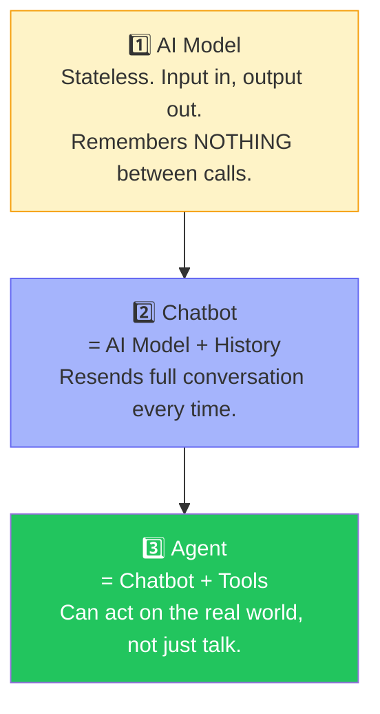
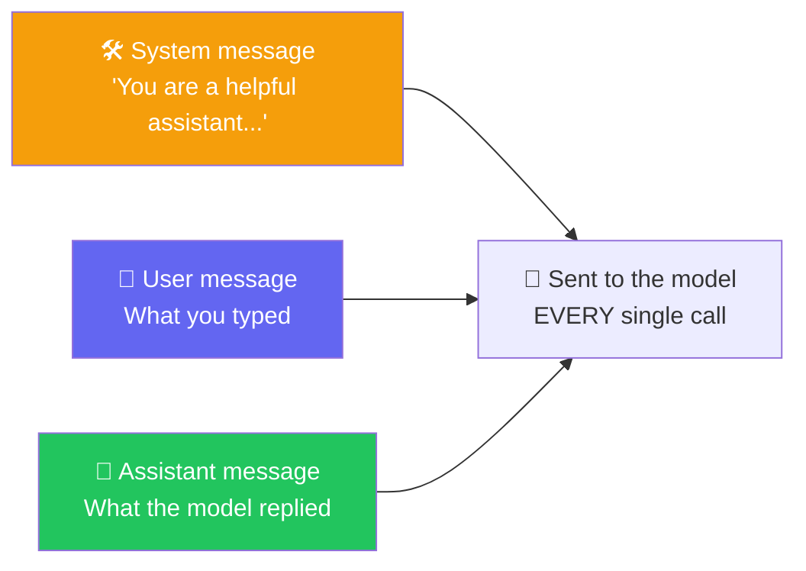
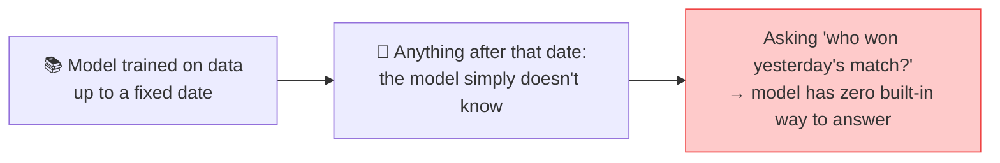
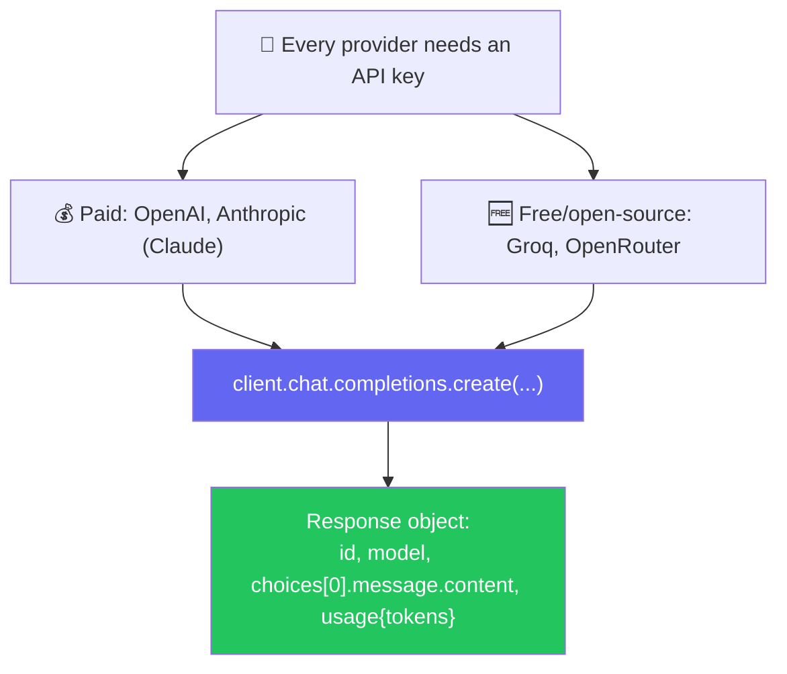
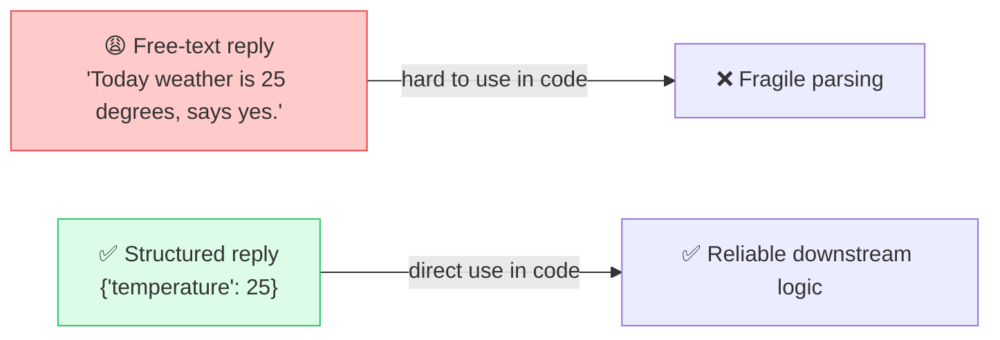
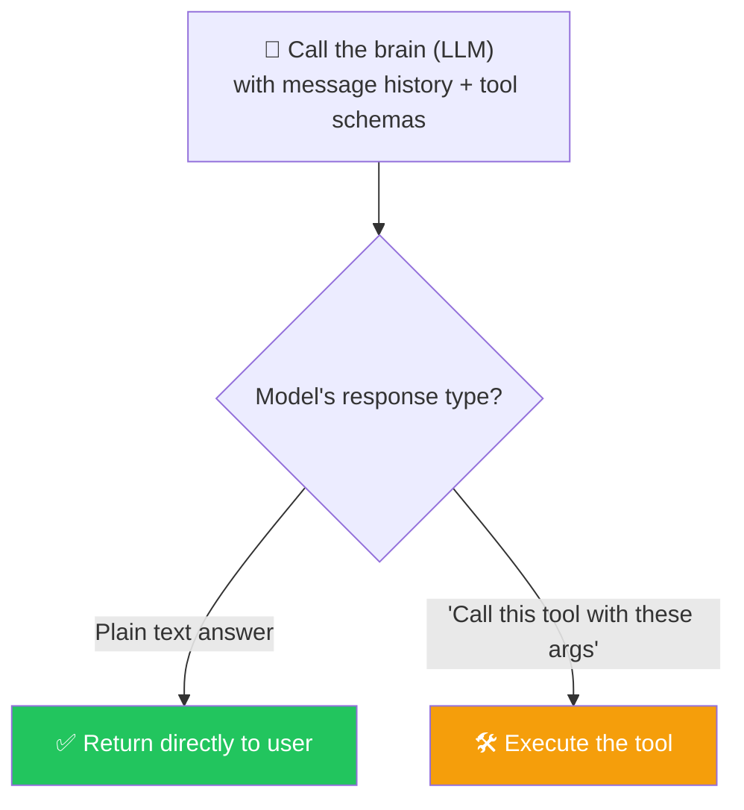
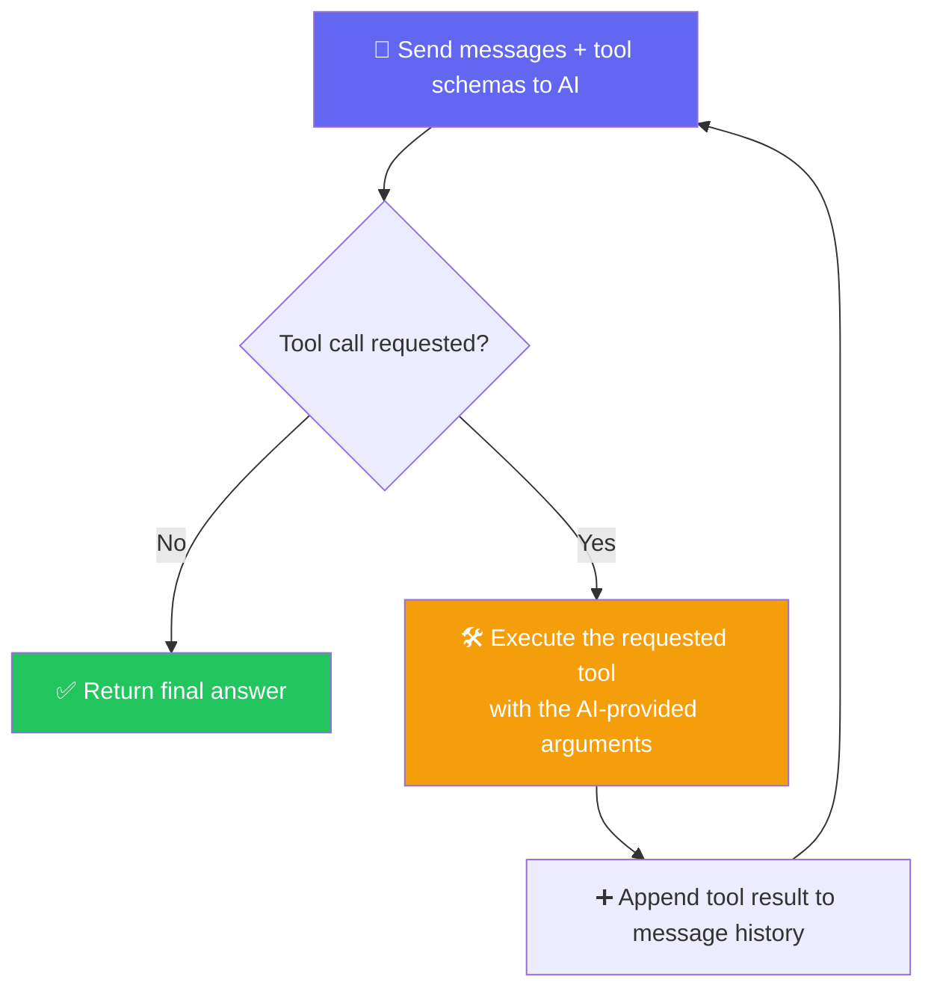
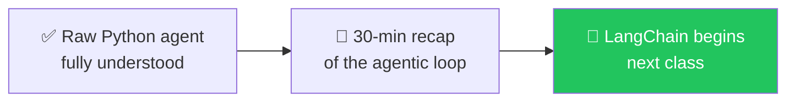

# 🔁 Building Real Agents in Pure Python — The Agentic Loop

**Author:** Pragati  
**Course:** Agentic AI Specialization  
**Date:** 11 July 2026

---

## 📋 Table of Contents
1. [Where This Class Sits](#-where-this-class-sits)
2. [The Three-Layer Hierarchy — AI Model → Chatbot → Agent](#-the-three-layer-hierarchy--ai-model--chatbot--agent)
3. [System / User / Assistant — The 3 Message Roles](#-system--user--assistant--the-3-message-roles)
4. [Knowledge Cutoff — Why Models "Don't Know" Recent Events](#-knowledge-cutoff--why-models-dont-know-recent-events)
5. [Calling Real Models — Paid vs. Free APIs](#-calling-real-models--paid-vs-free-apis)
6. [Structured Output — Why Plain Text Replies Aren't Enough](#-structured-output--why-plain-text-replies-arent-enough)
7. [The Big One — The Agentic Loop](#-the-big-one--the-agentic-loop)
8. [Project Zero — Files Overview](#-project-zero--files-overview)
9. [Where This Leaves You](#-where-this-leaves-you)
10. [Live Q&A Highlights](#-live-qa-highlights)
11. [Action Items](#-action-items)
12. [Key Takeaways](#-key-takeaways)

---

## 📍 Where This Class Sits

**Analogy:** Think of building an agent like learning to cook. You could start with a microwave meal (LangChain), but you wouldn't really understand cooking. This class teaches you to cook from scratch — chopping vegetables, managing heat, understanding flavors. When you later use a microwave, you'll know exactly what it's doing for you.

> *"I know I would have started with LangChain to make everyone happy — but believe me, now you'll actually **appreciate** LangChain instead of just copy-pasting it."*

This class builds a real, working agent using **only vanilla Python** — no frameworks — by progressively unwrapping each layer: AI Model → Chatbot → Agent → Agentic Loop. LangChain formally begins next class.

---

## 🪜 The Three-Layer Hierarchy — AI Model → Chatbot → Agent

**Analogy:** Think of these three levels like **different roles in a company**:
1. **AI Model** = A **brilliant consultant** who answers one question at a time but forgets everything immediately after.
2. **Chatbot** = The consultant with a **personal assistant who keeps notes** — every question and answer is written down and shown to the consultant before each new question.
3. **Agent** = The consultant now has **real tools** — a phone, a calculator, a weather service — and can actually do things, not just talk.



- **AI Model**: *"A single one-shot prediction. Takes a question, returns an answer, remembers nothing before or after."*
- **Chatbot**: *"AI + memory."* Every `.ask()` call appends both the question and answer to `self.history`, and that **entire history** gets resent on the next call.
- **Agent**: Chatbot + **tools** (web search, calculator, currency converter, etc.) — because a raw model **cannot** check anything in the real world; it can only talk with better memory.

> 🔑 **Why this matters commercially:** *"You cannot just tell a client 'let's use ChatGPT inside your app.' The base model has no tools, no live data access — that's exactly the gap agents close."*

---

## 💬 System / User / Assistant — The 3 Message Roles

**Analogy:** Think of these roles like **parts of a conversation at a restaurant**:
- **System message** = The **waiter's training manual** — sets how they should behave, but the customer never sees it
- **User message** = What the **customer says** to the waiter
- **Assistant message** = What the **waiter responds** with



- 🔬 **Live proof:** Sending a single "hi" to a model still resulted in **3 messages** actually transmitted — system + user + assistant reply
- The **system message is optional** — it's good practice, not mandatory
- It's **resent on every single call** because the model is stateless and remembers nothing on its own

---

## 📅 Knowledge Cutoff — Why Models "Don't Know" Recent Events

**Analogy:** Think of a model like a **brilliant historian who only knows events up to a certain date**. Ask them about anything after that date, and they genuinely don't know — not because they're lying, but because they have no information about it.



- Every model card lists a **knowledge cutoff date**
- 🔬 **Live demo:** asked a model about a recent sports result → it honestly admitted no real-time access
- This is precisely *why* agents need **tools**

---

## 🔌 Calling Real Models — Paid vs. Free APIs

**Analogy:** Think of different AI providers like **different phone companies**. Some are premium (more features, higher cost), some are free (good for learning, limited speed). But the phone itself works the same way — you dial the same number, just with different billing.



### 🛠️ Live Demos
- **OpenAI:** created a fresh API key, called `client.chat.completions.create()`, and printed the **raw response object** to show the real shape: `id`, `model`, `choices[0].message.content`, and a `usage` block with `prompt_tokens` / `completion_tokens` / `total_tokens`
- **Groq:** free, high-speed access to open-source models — demoed that **Groq's endpoints are OpenAI-compatible**, meaning the exact same client code works just by swapping the `base_url` and key
- 🎯 Takeaway: *"Every AI model in the world, right now, for you, is just an API call."*
- `max_tokens` caps the **output** length — a safety net against runaway cost

---

## 📦 Structured Output — Why Plain Text Replies Aren't Enough

**Analogy:** Think of structured output like **ordering pizza online**. Instead of calling and saying "I want a pizza" (free text), you fill out a form with fields: size, toppings, crust type, delivery address. The form is something the system can actually process without guessing.

> *"If your app needs to know the temperature, would you rather parse 'Today weather is 25 degrees' out of a sentence, or just receive `{"temperature": 25}`?"*



### Two Ways to Get Structure
1. **Prompt-engineered instruction:** prepend an instruction like *"Reply with only a JSON object in this exact shape"* as part of the **user** message
2. **Pydantic-defined schema:** define a `BaseModel` (e.g., `class WeatherQuery(BaseModel): city: str; wants_fahrenheit: bool`) and reuse it everywhere

> 💬 *"Rather than typing 'reply in JSON with subject and body' every time, just define the model once with Pydantic and reuse it. That's real code reusability."*

---

## 🧠 The Big One — The Agentic Loop

**Analogy:** Think of the agentic loop like a **detective investigating a case**. The detective gets a question, gathers evidence (tools), analyzes it, decides if more evidence is needed, and finally delivers the answer. Each step builds on the previous one, and the detective keeps going until they're confident they have the full picture.

> *"This is very, very difficult to teach — no agentic course starts by explaining this in raw Python. I know it's painful, but this is what makes LangChain finally make sense instead of feeling like magic."*

### Step 1 — AI Decides: Answer or Call a Tool?



- Each tool is described via a **tool schema** — this schema (name, description, expected parameters) is what's sent to the model so it can intelligently decide *whether* and *how* to call it
- 🔬 **Live proof:** asked a question with no matching tool defined → model correctly gave a plain-text answer instead of hallucinating a tool call

### Step 2 — The Loop



```python
for _ in range(max_iterations):  # e.g. max_iterations = 4
    response = call_ai(messages, tools=tool_schemas)
    if response.no_tool_call:
        messages.append({"role": "assistant", "content": response.content})
        return response.content
    else:
        result = call_tool(response.tool_name, response.tool_args)
        messages.append({"role": "tool", "content": result})
        # loop again — AI now sees the tool result and decides the next step
```

> 🎯 **This is the "Agentic Loop"** — the reason it's called that: the AI is repeatedly called in a loop, deciding at each step whether it has enough information to answer, or needs to call another tool first.

### 🧩 Why the Loop Runs *Again* After a Tool Call

After a tool executes and its result is appended to the messages, the **AI must be called again** with that new information — because the AI is stateless and doesn't automatically "know" the tool ran.

---

## 📁 Project Zero — Files Overview

| File | Contents |
|---|---|
| `_01_ai_model_vs_chatbot_vs_agent.py` | Structural comparison of the three, no API calls |
| `_02_calling_the_ai_paid_and_free.py` | Real API calls: OpenAI, Anthropic, Groq, OpenRouter |
| `_03_structuring_with_pydantic.py` | Structured JSON extraction, validated with Pydantic |
| `_04_giving_it_a_tool.py` | A weather tool, called manually |
| `_05_teaching_it_to_choose.py` | Tool schema + the model choosing and calling the tool itself |
| `_06_project_zero_agent.py` | The full loop, terminal chat, one tool |
| `_07_streamlit_app.py` | The full loop with a Streamlit front end, three tools (weather, calculator, currency) |

Each file is independent and can be run on its own. All files require a real API key — there is no offline stand-in.

### Setup
```bash
uv sync
cp .env.example .env
# fill in at least one key -- GROQ_API_KEY is free and fastest to get
```

### Run
```bash
uv run _01_ai_model_vs_chatbot_vs_agent.py
uv run streamlit run _07_streamlit_app.py
```

---

## 🗺️ Where This Leaves You



> *"No one can explain this better without going through Python first. Every framework — LangChain, LangGraph, CrewAI — is doing exactly this loop underneath. Once you've built it by hand, the framework becomes a convenience, not a mystery."*

---

## 💬 Live Q&A Highlights

| Question | Answer |
|---|---|
| **Why call the AI again after the tool already ran?** | The AI is stateless — it doesn't know the tool's result until that result is explicitly appended to the message history and sent back in |
| **Can AI return multiple tool calls at once?** | Yes, that's possible depending on the model/provider |
| **Is response format handled by custom code or by a framework here?** | By hand-written code in this class — LangChain will handle this natively starting next class |
| **Why use Pydantic instead of just writing the JSON instruction directly in the prompt?** | Reusability, defaults, validation, and cleaner code |
| **Is the system message required?** | No — it's optional, just good practice |
| **Do all providers return responses in the same structure?** | No — response structure varies by provider |

---

## ✅ Action Items

- [ ] **Re-run Code:** Re-run and step through **every file** in the Project Zero folder in order (mock → real API → structured output → full agent with loop)
- [ ] **Get API Key:** Get your own free **Groq** API key and confirm you can call it with the OpenAI-compatible client
- [ ] **Explain the Loop:** Be able to explain, unprompted, why the **agentic loop** needs to call the AI again after a tool executes
- [ ] **Practice Pydantic:** Practice defining a Pydantic schema for a structured AI reply (e.g., an email reply with `subject` + `body`)
- [ ] **Revise Hard:** Revise before next class — LangChain will move fast, and this raw-Python foundation is what makes it click
- [ ] **Preparation:** Come ready: next class starts with a 30-minute recap, then **LangChain begins**

---

## 🧩 Core Concepts

### Provider Notes
- **Groq** is stateless — the system message is generated every time because it cannot recall previous interactions

### Knowledge Cutoff
- The AI has a knowledge cutoff date, indicating the date up to which the AI was trained

### Core Components of an Agent
An agent consists of 3 main components:
1. **Memory** — Stores conversation history
2. **AI Model** — Generates responses
3. **Tools** — External functions the AI can invoke

### Pydantic & Structured Responses
- Pydantic helps with a structured approach to getting answers from the AI in a validated format

### AI Decision Making
- **Normal Responses**: For straightforward questions, the AI provides a direct reply
- **Tool Usage**: When a question requires a tool the AI has access to, it can decide to call that tool with the appropriate parameters
- **Schema-Based Approach**: Passing a schema is better than passing individual parameters

### Component Definitions

**Agent** — Wraps `ai_model()` with history AND a set of tools it can choose to use. The `decide_tool()` function here uses simple keyword matching, which is only good enough to illustrate the concept. In reality (as shown in File 5), a real model makes that choice based on meaning, not string matching.

**Chatbot** — Wraps `ai_model()` with conversation history. Each call to `ask()` appends both the question and answer to `self.history`, so the next call can see everything said before. It has no ability to check the real world—only to talk with better memory of the chat.

**AI Model** — A single one-shot prediction. Takes a question, returns an answer, and remembers nothing about previous or future calls. This is the base capability of a raw model with no wrapping.

---

## 📝 Key Takeaways

1. **AI Model = stateless** — remembers nothing between calls
2. **Chatbot = AI Model + History** — resends the full conversation every time
3. **Agent = Chatbot + Tools** — can act on the real world
4. **System/User/Assistant messages** — three roles that structure the conversation
5. **Knowledge cutoff** — models don't know anything after their training date
6. **Every model is just an API call** — provider choice is about billing, not magic
7. **Structured output = reliable parsing** — use Pydantic schemas
8. **Tool schemas tell the model what's available** — the model decides when to use them
9. **The Agentic Loop** — reason → act → observe → repeat until done
10. **Build by hand once** — so frameworks become conveniences, not mysteries

---

## 📚 Additional Resources

- [Groq Documentation](https://console.groq.com/docs)
- [OpenAI API Documentation](https://platform.openai.com/docs)
- [Pydantic Documentation](https://docs.pydantic.dev/)
- [Project Zero GitHub](https://github.com)

---
